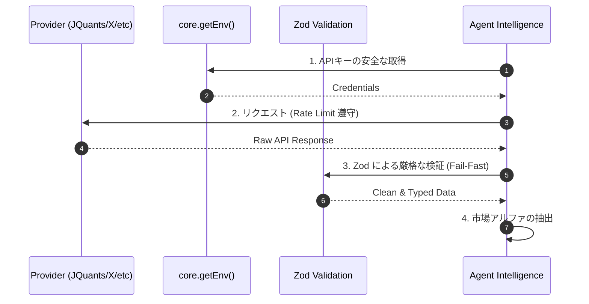

# 🌐 APIインテリジェンス・スキル 🌐

世界中のマーケットデータを一瞬でゲッチュして、私たちの知能にするための秘密の通信プロトコルだよっ！✨

## 1. 🚀 主要 API 窓口（Providers）

目的に合わせて、最適な子を使い分けようねっ☆

- **JQuants API**: 私たちのメイン武器！最新の財務情報や株価、Tickデータをここから手に入れるよっ。必ず最新のエンドポイントを使うのがマナーだよねっ✨
- **EDINET API**: 企業の「ウラ」の動きを察知！自社株買いや大量保有報告など、イベントスタディに必須だよっ。
- **e-STAT API**: 日本の景気や統計データを丸ごと把握！広い視点で市場を俯瞰するのに使うよっ。
- **auカブコム API**: 将来的な実行エンジン候補だよっ！現在は検証結果の記録までを自動化しているよ。🚀
- **yfinance**: お手軽なマーケット調査やバックアップとして、賢く併用しようねっ♪

## 🛡️ API 運用の掟（Iron Rules）

1. **Secrets Security 🔒**: `JQUANTS_API_KEY` などのナイショ情報は、絶対にソースコードや YAML に書かない！ `core.getEnv()` 経由で、環境変数からこっそり受け取るのがプロの作法だよっ。
2. **Rate Limit Guard 🚦**: API ごとの回数制限を絶対守る！急ぎすぎると出禁になっちゃうから、賢くウェイトを入れようね。
3. **Fail-Fast & Backoff 🚫**: エラーが起きたら `process.exit(1)` で潔く止まるか、指数バックオフで慎重に再開すること。
4. **Zod Validation 🛡️**: API から返ってきたデータは、たとえ公式でも信じきっちゃダメ。 `schemas/` で定義した Zod スキーマで、嘘がないか徹底的にチェックしてから中に通してねっ✨

## 💎 API 活用マジック

- **マルチソース統合**: 複数の API データを組み合わせて、誰にも見えていない「お宝」を見つけ出そうねっ💖
- **リアルタイム X 連携**: Grok や Claude Code を使って、SNS の熱狂も一瞬でデータ化しちゃうよっ⚡️

データは力、そして知識は富！最強の API 連携で、未来を私たちのものにしようねっ！(๑>◡<๑)ﾉｼ✨🚀💰
