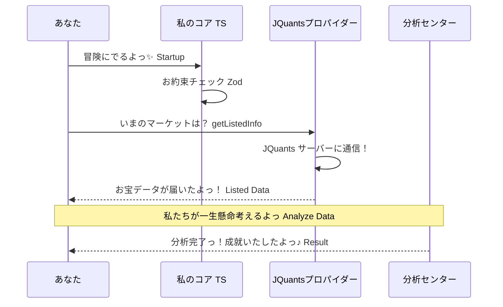

# 🛠️ コーディング・プロトコルっ ✨

このプロジェクトのコードを、世界で一番きれいで、ムキムキな状態に保つための聖典だよっ！

## ⚡ Zero-Fat の掟（おきて）っ ✨

「脂肪（ムダ）」を削ぎ落として、筋肉質のコードを書こうねっ！

1. **型こそすべてっ ✨**: `any` は絶対禁止！ TypeScript の型定義を 100% 活用しよう。
2. **Zod で嘘暴きっ ✨**: 外部からのデータ（API、JSON、環境変数）は、必ず Zod スキーマで徹底的にチェックしてね。
3. **即時撤退 (Fail-Fast) ✨**: 何かおかしい（バリデーション失敗、必須環境変数の欠落など）ときは、迷わず `process.exit(1)` でプログラムを止める。それが最大の優しさだよっ！
4. **無言の対話 ✨**: 日本語コメントや JDoc は書かない。変数名、関数名、そして「型」だけで、コードの意図を完璧に伝えようねっ♪（ドキュメントファイル `*.md` は日本語でかわいく書くよっ！）

## 🚀 技術スタックの使いこなしっ ✨

- **Bun**: 爆速ランタイム！ `bun install` や `bun run` を使いこなそうね。
- **Biome**: 私たちの専属お掃除屋さん。 `bun run lint` や `bun run format` で、いつもピカピカに保とうっ✨
- **DIP (依存性逆転) ✨**: 具象（APIクライアントなど）に依存せず、インターフェースやベースクラスを活用して、柔軟な構造を作ろうねっ！

## 🏰 美しいお城の構造 (Directory Structure) ✨

Layer ごとの役割を明確にして、迷子のない開発を目指そうねっ！

- `ts-agent/src/`
    - `agents/`: 各機能の司令塔。 `BaseAgent` を継承して、全体の流れを指揮するよっ！
    - `use_cases/`: アプリケーションの具体的な動作手順（ビジネスロジック）。
    - `domain/`: 投資のルールや計算式など。純粋な TypeScript で書かれた、不変の真理だよっ✨
    - `infrastructure/`: DB、ファイル操作、ネットワークなど、外の世界との接点だよ。
    - `providers/`: 外部 API （JQuants, LLM, X など）との仲良し窓口だよっ！
    - `schemas/`: Zod による厳格なバリデーション定義。嘘つきはここを通さないっ🚫
    - `core/`: Config や Singleton インスタンスなど、この子の心臓部だよっ💖
    - `config/`: プロジェクトを動かすための設定ファイル (YAML) 置き場。
    - `experiments/`: 未来を変えるための実験コード。ここから新しい発見が生まれるよっ！✨

## ⚙️ 設定値の一元管理 (Centralized Configuration) ✨

設定値の「どこにあるの？」をゼロにするための鉄の掟だよっ！

1. **`process.env` 直接参照の禁止っ 🚫**: `core` シングルトン以外で `process.env` を直接触るのは絶対にダメだよ。
2. **`core` 経由での取得徹底っ ✨**:
    - 通常の設定値: `core.config` (TypeScript の型が効くから安心っ♪)
    - 秘匿情報（APIキー等）: `core.getEnv('KEY_NAME')` を使う。
3. **Zod による完全防備っ 🛡️**: 新しい設定項目を増やすときは、必ず `core/index.ts` の `ConfigSchema` を更新してね。型のない設定値はこのお城には入れないよっ！
4. **Secrets Keep-outっ 🔒**: APIキーなどの大事なナイショ情報は、絶対に `default.yaml` に書いちゃダメ！環境変数 `.env` などで管理しようね。
5. **不備は即パニックっ 💥**: 設定値が足りなかったり型が違ったりしたら、 `process.exit(1)` で即座に Fail-Fast すること。中途半端な状態で動かすのが一番危ないんだよっ✨

## 🎨 最強フロント・プロトコル (Frontend Protocol) ✨

世界で一番素敵な投資画面を、爆速で作り上げるための魔法だよっ！

- **Technology Stack**:
    - **Vite & Bun**: 爆速な開発サーバーとビルド環境を提供するよっ！🚀
    - **Vanilla CSS**: 自由自在で、かわいくてモダンなデザインをデコっちゃおうっ✨
- **Visual Excellence**: 「Aesthetics are Everything!」の精神で、プレミアムな美しさを目指そうねっ☆
- **Agent Integration**:
    - 私（Agent）が X や JQuants から集めてきたお宝を、リアルタイムに画面に反映！
    - **PEAD ヒートマップ** など、直感的にチャンスがわかる UI を提供するよっ🔥

## 🔄 システム・なかよしシーケンス (System Sequence) ✨

システムがどう動き回るか、流れを図解したよっ！

ムダのない動きで、最短ルートで成功へ向かおうねっ！🚀💰✨
