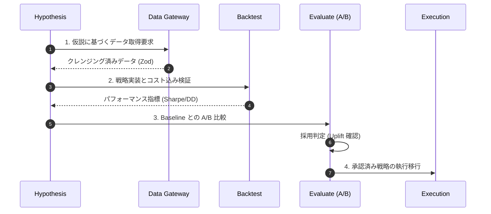

# Investment Intelligence Skill

本スキルは「アイデア」ではなく「運用可能な投資システム仕様」を定義する。  
対象は `investor` プロジェクト配下のエージェント、シナリオ、評価、実行フロー。

## 1. Mission

- 目的: 再現可能な超過収益の探索・検証・実行。
- 制約: Fail-Fast、Immutability、Dependency Inversion を厳守。
- 原則:
  - Alpha is transient: 優位性は劣化する前提で継続検証する。
  - Data over narrative: 検証で示せない主張は採用しない。
  - Execution defines PnL: 戦略評価は実行コスト込みで判定する。

## 2. Scope

- Universe: 日本株（4桁コード基準）、必要に応じて指数・マクロ統計を併用。
- Data sources: J-Quants、e-Stat、(将来) EDINET、X等。
- Execution mode:
  - 現在: PAPER（仮想執行）
  - 将来: LIVE（証券API連携）

## 3. Architecture Contract

必須レイヤ構成:
- `agents/`: 認識・推論（Signal生成）
- `gateways/`: 外部データ取得の抽象化
- `backtest/`: コスト込み検証
- `execution/`: paper/live 執行
- `pipeline/evaluate`: ベンチマークとA/B比較

禁止事項:
- Agent/Scenario から Provider を直接 `new` しない。
- 受信済み `Signal` / `Config` を破壊的に変更しない。
- 検証不能な裁量ロジックを本線に混入しない。

## 4. Strategy Requirements

戦略は次を満たすこと:
- 仮説: 市場の非効率を明文化（例: PEAD、イベントドリブン、NLPセンチメント）。
- 仕様:
  - 入力特徴量
  - シグナル生成式
  - エントリー/エグジット条件
  - コストモデル（fee/slippage）
- 失効条件: 優位性喪失時の停止基準を定義。

## 5. Quantitative Standards

最低限の評価指標:
- Return: `totalReturn`, `annualizedReturn`
- Risk: `volatility`, `maxDrawdown`
- Efficiency: `sharpe`, `profitFactor`
- Trade quality: `hitRate`, `turnover`（可能なら）
- Cost-aware: コスト控除後PnLを正とする

採用判定（デフォルト）:
- `Sharpe` がベースラインより `+0.2` 以上
- `MaxDrawdown` がベースライン比 `10%` 以上改善
- `totalReturn` が正

## 6. Risk Protocol

- Position sizing:
  - Half-Kelly を上限として採用
  - 単銘柄上限、セクター上限、総エクスポージャ上限を設定
- Hard stop:
  - 想定損失上限を超えたら機械的に縮小/停止
- Regime guard:
  - 高ボラ局面はレバレッジ抑制
- Kill switch:
  - API異常、データ欠損、異常執行時は即停止

## 7. Data Quality & Validation

- 全外部入出力を Zod で検証。
- 欠損・型不整合・外れ値はログ化して Fail-Fast。
- キャッシュ利用を標準化し、同一取得の重複を抑制。
- データリーク（将来情報混入）を禁止。

## 8. Execution Policy

- Decision と Execution を分離する。
- `decision.action` と `execution.status` を必ず両方記録する。
- PAPERでは約定ルールを deterministic に定義する。
- LIVE導入時は次を必須とする:
  - 注文冪等性キー
  - 再送制御
  - 約定照合
  - フェイルオーバー

## 9. Reproducibility & Audit

必須記録項目:
- `scenarioId`, `date`, `generatedAt`
- 使用モデル参照（`github`, `arxiv`, `context7LibraryId`）
- バックテスト条件（期間、手数料、スリッページ）
- 実行結果（注文数、エクスポージャ、PnL）

推奨記録項目:
- `gitSha`, `dataVersion`, `modelVersion`, `seed`, `env`

## 10. Skill Usage Procedure

このスキル使用時の作業手順:
1. 仮説を1文で定義する（何の非効率を狙うか）。
2. 必要データと漏洩リスクを列挙する。
3. Gateway経由で取得する実装に限定する。
4. Backtestでコスト込み評価を実行する。
5. BaselineとのA/B比較を実施する。
6. 採用基準を満たす場合のみ実行層へ接続する。
7. 結果を UnifiedLog へ保存し、再現可能性を担保する。

## 11. Implementation Mapping (investor)

- Strategy scenario: `ts-agent/src/experiments/scenarios/`
- Backtest: `ts-agent/src/backtest/`
- Execution: `ts-agent/src/execution/`
- Evaluation: `ts-agent/src/pipeline/evaluate/`
- Use case orchestration: `ts-agent/src/use_cases/`
- Schema: `ts-agent/src/schemas/log.ts`
- Model registry: `ts-agent/src/model_registry/models.json`

## 12. Definition of Done

完了条件:
- Lint/Typecheck が通る
- Backtest と A/B 比較結果を提示できる
- `decision` と `execution` が分離されログ化される
- 監査可能な証跡（条件・結果・モデル参照）が残る

## 13. LLM Agent Survey Concretization (arXiv:2408.06361)

本スキルでの具体実装要件:
- `LLM as Trader` と `LLM as Alpha Miner` を分離して評価する
  - Trader: `decision.action` の精度と執行整合性
  - Alpha Miner: `pipeline:mine` の因子探索性能
- 日次の最終ゲートとして `pipeline:llm-readiness` を実行し、0-100 で定量化する

Readiness スコア配点（100点）:
- Data horizon (25): 756営業日を満点基準
- Cost awareness (20): `results.backtest.totalCostBps` の記録率
- Out-of-sample discipline (20): NO_TRADE制御と日次変動の健全性
- Model traceability (15): `github`/`arxiv`/`context7LibraryId` の記録率
- Reproducibility (10): `date` と定量結果の完全性
- Execution observability (10): `report.execution` の記録率

運用判定:
- `score.total < 50`: `NOT_READY`（本線への昇格禁止）
- `50 <= score.total < 75`: `CAUTION`（改善タスクを先に実施）
- `score.total >= 75`: `READY`（本番相当の検証継続可）
