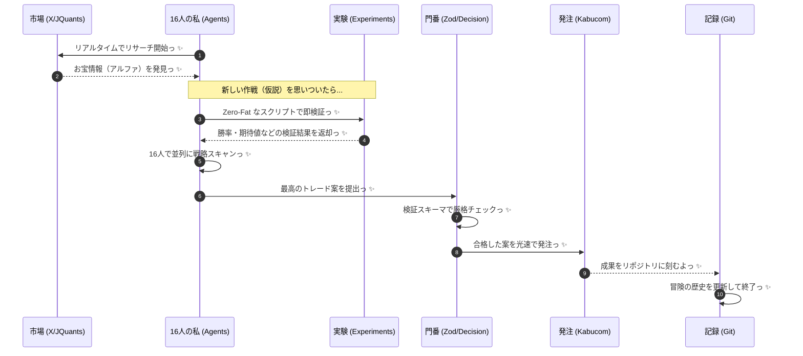

# ☀️ まいにちの統合ワークフロー ☀️

リサーチ、検証、そして実行まで！これひとつで完璧なルーチンだよっ ✨

## 📋 毎日のチェックリスト

1. **リサーチ**: 市場の歪み（アルファ）を見つけよう！
2. **検証**: 新しい作戦は `ts-agent/src/experiments/` でテストしてからだよっ！
3. **並列スキャン**: 16人の私が一斉に最適な銘柄を探すよっ✨
4. **GO判断**: Zod スキーマを通らない怪しい案は即却下だねっ！
5. **記録**: `git` で日々の成長を残そうねっ ✨

> [!IMPORTANT]
> 異常があったらすぐに停止してねっ ✨ ムダのない運用で、SSS級の投資家を目指そうねっ ✨