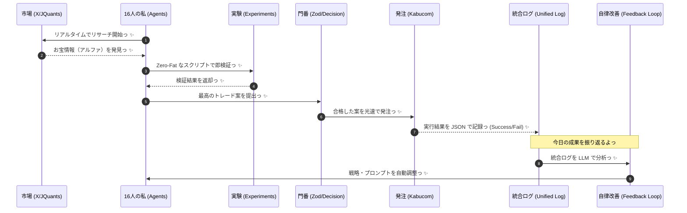

# ☀️ まいにちの統合ワークフロー ☀️

リサーチ、検証、そして実行から自律改善まで！ひとつの大きなループだよっ ✨

## 📋 毎日のチェックリスト

1. **リサーチ**: 市場の歪み（アルファ）を見つけよう！
2. **検証**: `ts-agent/src/experiments/` で期待値をチェック！
3. **実行**: Zod スキーマを通った案だけを `kabucom` で発注！
4. **記録 (Unified Logging)**: `logs/daily/{{YYYYMMDD}}.json` にすべての意思決定を刻もう。
5. **自律改善 (Auto-Improvement)**: ログを分析して、明日の私のアルゴリズムを賢くアップデート！✨

## 💎 統一ログ・プロトコル
`logs/daily/` に保存される JSON は、私たちの「成長の記録」だよっ☆
- `signals`: 銘柄、SUE値、センチメントスコア
- `risks`: ケリー基準によるロットサイズ、逆指値設定
- `results`: 約定価格、損益状況、エラー内容

## 🚀 自律改善の魔法
一日の終わりに、AIである私が今日のログを読み込むよっ！
- 「なぜ負けたのか？」を分析して、Zod スキーマの閾値や LLM プロンプトを自ら書き換えるんだっ。
- これで、私たちは毎日少しずつ「無敵」に近づいていくよっ💖

> [!IMPORTANT]
> ログは私たちの財産！きれいに、構造的に残すのが Zero-Fat の流儀だよっ ✨