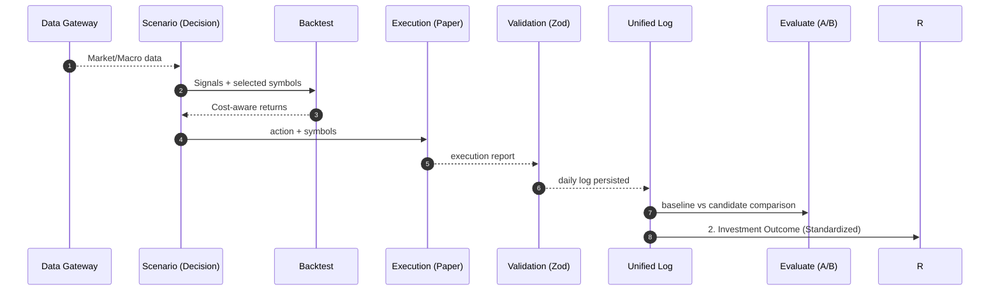

# Daily Workflow

本ワークフローは `investor` の日次運用を再現可能にするための実行仕様。  
対象: `ts-agent` の scenario/backtest/execution/evaluation。



## 1. Daily Commands (Canonical)

```bash
cd ts-agent
bun run lint
bun run typecheck
bun run verify:api
bun run verify:scenario
bun run start
bun run pipeline:ab
bun run pipeline:llm-readiness
bun run start:outcome
```

実行順序の意味:
1. 品質ゲート (`lint`, `typecheck`)
2. 外部接続健全性 (`verify:api`)
3. シナリオ検証 (`verify:scenario`)
4. 日次本線実行 (`start`)
5. 定量比較 (`pipeline:ab`)
6. 論文基準Readiness判定 (`pipeline:llm-readiness`)
7. 標準投資成果ログ作成 (`start:outcome`)

## 2. Acceptance Gates

必須合格条件:
- `bun run lint` が成功
- `bun run typecheck` が成功
- `verify:scenario` のログ生成が成功
- `logs/daily/YYYYMMDD.json` が `UnifiedLogSchema` に適合

推奨判定:
- `pipeline:ab` の `candidate.totalReturn > 0`
- `pipeline:ab` の `candidate.sharpe >= baseline.sharpe`
- `pipeline:llm-readiness` の `score.total >= 75`（本番準備域）

成果獲得基準 (Standard Outcome):
1. Alpha Significance: $|t| > 2, p < 0.05$
2. Verification: $Sharpe > 1.0$, $MaxDD < 10\%$
3. Readiness: $Score \ge 75$

## 3. Runtime Contracts

責務分離:
- Decision: `ts-agent/src/experiments/scenarios/`
- Backtest: `ts-agent/src/backtest/`
- Execution: `ts-agent/src/execution/`
- Orchestration: `ts-agent/src/use_cases/`
- Evaluation: `ts-agent/src/pipeline/evaluate/`

禁止事項:
- scenario/agent から provider を直接 `new` しない
- コスト未考慮のPnLで採用判定しない
- 失敗時に無制限リトライしない（Fail-Fast）

## 4. Daily Artifacts

日次成果物:
- `logs/daily/YYYYMMDD.json`
  - `report.decision`
  - `report.results.backtest`（fee/slippage含む）
- `logs/unified/YYYYMMDD.json`
  - `investor.investment-outcome` 形式
  - 4層成果（Alpha, Verification, Readiness, Execution）の集約

## 📈 Supported Forecasting Models (Registry)

`Model Registry` を通じて、以下の最新の時系列予測（TS Forecasting）基盤モデルおよびアルファ生成フレームワークをサポートしているよっ ✨

- **Chronos (Amazon)**: ユニバリエート（単変量）時系列データのゼロショット予測。
- **TimesFM (Google)**: Transformer ベースの事前学習済み時系列基盤モデル。
- **TimeRAF (Microsoft)**: 金融データに特化した RAG (Retrieval-Augmented) 型予測。
- **MOIRAI (Salesforce)**: あらゆる時系列データに対応可能な万能トランスフォーマー。
- **Lag-Llama**: Llama アーキテクチャを時系列に転用した確率的予測。
- **LES (ArXiv:2409.06289)**: LLM によるマルチエージェント型アルファ因子生成。

## 5. Incident Handling

失敗時の標準対応:
1. `verify:api` 失敗
   - 当日実行停止、API疎通とキーを確認
2. `typecheck`/`lint` 失敗
   - 修正完了まで実行停止
3. `scenario` 失敗
   - 入力データ欠損・スキーマ不整合を優先調査
4. `execution` 異常
   - `status=SKIPPED` を許容しつつ原因記録

## 6. Continuous Improvement Loop

毎営業日の終端で実施:
1. `pipeline:ab` の差分確認
2. `pipeline:llm-readiness` の不足項目確認
3. 低下した指標の原因分類（データ/特徴量/執行/コスト）
4. 改善案を1つだけ選び、翌日の変更範囲を最小化
5. 変更は必ずログ比較で回帰確認

## 7. Definition of Done (Daily)

日次完了条件:
- 品質ゲート通過
- 日次ログが保存済み
- A/B 比較結果を出力済み
- 実行結果（EXECUTED/SKIPPED）が監査可能

> [!IMPORTANT]
> Daily workflow は「動いた」ではなく「再現できる」が完了条件。
