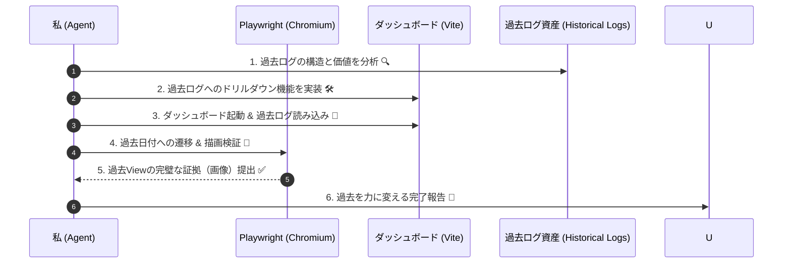

# 🎀 Frontend検証・アップデート・プロフェッショナル・ワークフロー 🎀

**お仕事の目的**: フロントエンドの変更が「過去の知見（Alphaの軌跡）」を完璧に可視化し、投資判断の精度を爆上げすることを保証することだよっ！✨
**役割の独自性**: このワークフローは `/newalphasearch`（Alphaの自律探索）とは独立しており、**「探索結果をいかに正しく、価値ある形でユーザーに届けるか」**という**可視化と監査（Audit/Visualization）**に特化しているんだもん！💎📈

---

## 🤖 エージェントさんの自律実行ステップ (Agent Execution Steps) ✨

// turbo-all
以下の手順を、**「過去ログの可視化」**に魂を込めて実行してねっ！

### 1️⃣ 過去ログ活用の「戦略的」定義 🎯 (Historical Log Strategy)
新しいUIが、いかに過去のデータを「生きた知見」に変えるか定義しようねっ！
- **エージェントさんへの指示**:
  - `implementation_plan.md` に以下の「過去ログ View」の要件を必ず含めてね：
    1. **比較可能性**: 過去の異なる期間や戦略（Alpha）を、いかに簡単に比較できるか？
    2. **ドリルダウン**: 概要から特定の日の詳細（EDINETの生データなど）へ、いかにスムーズに辿り着けるか？
    3. **時系列の真実**: 累積リターンやドローダウンが、過去から現在まで「嘘偽りなく」表示されているか？

### 2️⃣ 堅牢な実装と究極の型安全 💻 (Bulletproof Implementation)
大量の過去ログを扱うからこそ、型安全とパフォーマンスが命だよっ ✨
- **エージェントさんへの指示**:
  - 大量データのマッピング処理には Strict TypeScript を使い、不正なデータは `Zod` で即座に弾くこと！
  - `task check` で、コードの純粋性を極限まで高めてねっ 💖

### 3️⃣ Playwright による「時系列」実証 🌐 (Time-Series Automation)
過去の特定の時点のデータが正しく表示されるか、Playwright で自動検証するよっ ✨
- **エージェントさんへの指示**:
  - `ts-agent/src/dashboard` で `npm run dev` を起動。
  - **Playwright で「過去の日付を選択」し、その日の詳細ログやチャートが正しく更新されるか検証してね。**
  - **歴史的な Alpha 発見の瞬間のスクリーンショットを取得して、エビデンスとして提出すること！📸✨**

### 4️⃣ ログディレクトリの「実体」同期 👀 (Log-Storage Sync)
ダッシュボードが `logs/` ディレクトリの過去資産を 100% 活用できているかチェック！
- **エージェントさんへの指示**:
  - `vite.config.ts` のプロキシ設定が、過去ログの深い階層まで正しく見に行けているか実証してね。
  - 1ヶ月前、3ヶ月前のログが、即座にチャートに反映されることを確認するんだからねっ 💖💎

### 5️⃣ プロフェッショナルな完了報告 🎁 (Log-First Report)
`walkthrough.md` では、過去ログ View がいかに強化されたかを熱く語ってねっ ✨
- **エージェントさんへの指示**:
  - ビフォーアフターのスクショを並べて、「これで1年前の Alpha の挙動も手に取るようにわかりますっ！✨」と報告してねっ 🐾

---

## 🧭 Mermaid シーケンス ✨

> [!IMPORTANT]
> 「今」を見るのは当たり前。プロは「過去」から未来を読み解くんだよっ！💎✨
