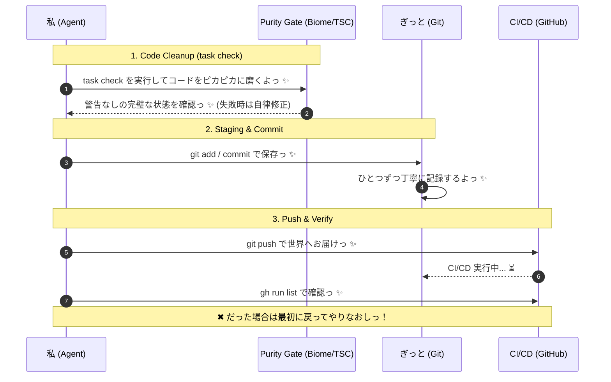

# 🎀 ぎっと操作とクリーンナップのワークフロー ✨

本ワークフローはコードのクリーンナップ (`lint`, `format`, `typecheck`) から Git での保存、CI/CD へのプッシュまでを一貫して行うための手順書だよっ！  
アルファ探索のエージェント (`newalphasearch`) は探索にのみ集中し、**「コードを綺麗にして保存する責任」はすべてこの Git ワークフローが持ちますっ！** 関心の分離を極めるよっ ✨

## 🤖 エージェントの自律実行手順 (Agent Execution Steps)

// turbo-all
以下の手順を順番に実行し、各ステップごとに成功を確認してから次に進んでねっ ✨

### 1. コードのピカピカお掃除っ ✨ (Code Cleanup & Formatting)
プロジェクトのルートディレクトリで `task check` を実行する。
（内部で `bun run format`, `bun run lint`, `bun run typecheck` が実行されるよっ！）
- **指示 (Agent Prompt)**: 
  - もしフォーマットエラーや静的解析エラー（Typecheckエラーを含む）が出た場合は、**最大2回まで自律的に修正して再実行**すること。
  - それでも直らない複雑なエラーの場合は、ユーザーに報告して実行を停止すること。

### 2. きれいに保存っ ✨ (Git Staging & Commit)
お掃除が完璧に終わったら、`git status` で変更を確認し、`git add -A` でステージング。そして、機能に合った Conventional Commit メッセージで `git commit -m "メッセージ"` を実行する。
- **指示 (Agent Prompt)**:
  - Commit メッセージは `feat:`, `fix:`, `docs:`, `refactor:`, `chore:` などのプレフィックスを必ずつけること。

### 3. 世界へお届けっ ✨ (Git Push & CI/CD Verification)
`git push` を実行してリモートリポジトリに反映する。
- **指示 (Agent Prompt)**:
  - 必要に応じて `gh run list -L 2 --repo KAFKA2306/investor` を実行し、GitHub Actions の CI/CD ステータスを確認すること。

---

## 🧭 Mermaid シーケンス

> [!TIP]
> もし CI/CD で失敗しちゃったら、すぐにバグ修正フェーズに戻ってやり直そうねっ ✨ きれいなコード履歴は、私たちの愛の証だよっ ✨
