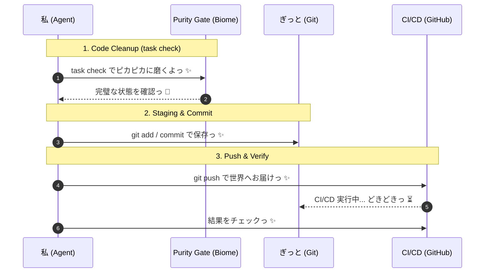

# 🎀 ぎっと操作とピカピカお掃除のキラキラお約束っ ✨

**お仕事の目的**: コードをいつも最高の状態で保って、チームのみんなとハッピーに開発を進めることだよっ！
**解決したいお悩み**: ぐちゃぐちゃなコードや、意味のわからない履歴をぜーんぶお掃除して、安心・安全な開発を目指すんだもんっ 💢✨

---

## 🤖 エージェントさんの自律実行ステップ (Agent Execution Steps) ✨

// turbo-all
以下の手順を順番に実行して、ひとつずつ「できたっ ✨」を確認しながら進めてねっ！

### 1️⃣ コードをピカピカに磨いちゃおうっ ✨ (Code Cleanup)
プロジェクトの一番上のディレクトリで `task check` を元気よく実行してねっ！  
（中では `bun run format`, `bun run lint` が動いて、コードをキラキラにしてくれるよっ ✨）
- **エージェントさんへの指示 (Agent Prompt)**: 
  - エラーが出ちゃっても、**最大2回までなら自分で直して再チャレンジ**していいからねっ ✨
  - どうしても無理なときは、泣かずにユーザーさんに報告してねっ 🐾


# Development Philosophy: Crash-Driven Development (CDD)

**Fail Fast, Fail Loud.** Treat AI agents as professional colleagues: grant both the right to fail and the obligation to confront facts.

Reference: https://zenn.dev/kafka2306/articles/11cd731eebded1

---

## Core Philosophy

AI-generated code becomes MORE dangerous the more defensive it appears. Exception suppression creates false confidence. Stack traces are the ONLY objective fact connecting AI and human understanding.

**Principle**: Simplicity + Transparency + Infrastructure Strength = True Robustness

---

## Rule 1: Exception Handling — Strict Minimization

### MANDATORY RULES

**1.1 Business Logic Exception Handling: PROHIBITED**
- MUST NOT use `try-catch` in application business logic
- MUST NOT catch and suppress exceptions in data transformation functions
- MUST NOT return `None`, `False`, `empty`, or error codes to hide failures
- MUST NOT use logging as a substitute for crashes

**1.2 Let Errors Cascade**
- MUST propagate ALL unexpected exceptions immediately
- MUST output complete stack traces to stderr/stdout
- MUST NOT implement custom error handling at application layer
- Stack traces MUST be unfiltered and complete

**1.3 Infrastructure-Only Resilience**
- Retry logic MUST live in Makefile, Docker, Kubernetes, or scheduler
- Timeout mechanisms MUST be infrastructure-level, NOT application code
- Health checks MUST be external to application logic

### VIOLATION CONSEQUENCES
Suppressed exceptions create:
- False debugging signals (misleading logs)
- Lost root cause information (stack traces are destroyed)
- Cascading hidden failures (errors compound invisibly)
- Impossible AI debugging (no objective facts to analyze)

### STRICT IMPLEMENTATION
```python
# ❌ VIOLATION: Catch-and-suppress pattern
def fetch_user(user_id):
    try:
        response = http_get(f"/users/{user_id}")
        return response.json()
    except Exception as e:
        logger.error(f"User fetch failed: {e}")  # HIDES the real error
        return None  # Returns silence instead of crashing

# ✓ CORRECT: Let the error be seen
def fetch_user(user_id):
    response = http_get(f"/users/{user_id}")  # Crashes if network fails
    return response.json()  # Crashes if JSON parse fails
```

---

## Rule 2: Stack Traces — Inviolable Ground Truth

### MANDATORY RULES

**2.1 Stack Traces Are Debugging Facts**
- MUST treat stack traces as the single source of truth
- MUST never suppress or abbreviate stack traces
- MUST NOT replace stack traces with log messages
- Every crash MUST produce complete frame information

**2.2 Diagnostic Logging is INSUFFICIENT**
- Logs are human-interpreted narratives (subjective)
- Stack traces are machine-generated facts (objective)
- Detailed logging CANNOT compensate for missing stack traces
- "I logged the error" DOES NOT solve the problem

**2.3 Root Cause Analysis Uses Stack Traces**
- MUST analyze from stack trace backward to source
- MUST NOT speculate from log messages
- MUST NOT assume error cause from log text
- Every debugging session MUST start with the full crash dump

### VIOLATION CONSEQUENCES
Without stack traces:
- Root cause becomes speculation, not science
- AI debugging becomes guesswork
- Same errors recur repeatedly (no learning)
- Time spent debugging increases exponentially

### STRICT IMPLEMENTATION
```python
# ❌ VIOLATION: Error swallowing with logging
def validate_data(data):
    try:
        result = complex_validation(data)
        return result
    except Exception as e:
        logger.warning(f"Validation issue: {e}")  # Swallows the crash
        return data  # Returns corrupted data silently

# ✓ CORRECT: Let the stack trace speak
def validate_data(data):
    return complex_validation(data)  # If it fails, the crash shows EXACTLY where/why
```

---

## Rule 3: Separation of Concerns — Strict Boundary Enforcement

### MANDATORY RULES

**3.1 Application Layer: Business Logic ONLY**
- MUST contain NO retry mechanisms
- MUST contain NO timeout logic
- MUST contain NO health checks
- MUST contain NO circuit breakers
- MUST propagate errors immediately and completely

**3.2 Infrastructure Layer: Resilience ONLY**
- Makefile: Retry loops, sequential execution, conditional logic
- Docker: `healthcheck`, `restart_policy`, entrypoint scripts
- Kubernetes: `restartPolicy`, `livenessProbe`, `readinessProbe`
- Systemd: `Restart=`, `RestartSec=`, service dependencies
- Monitoring: Alerting, metrics collection, dashboards

**3.3 No Mixing of Concerns**
- MUST NOT add retry logic to Python/JavaScript code
- MUST NOT implement timeouts in application functions
- MUST NOT add "safety checks" to business logic
- MUST NOT use environment variables to control resilience behavior in code

### VIOLATION CONSEQUENCES
Mixed concerns create:
- Debugging complexity (code resilience is hidden)
- Inconsistent retry behavior (each attempt behaves differently)
- Silent failures (no visibility to infrastructure operators)
- Impossible testing (resilience behavior isn't testable in unit tests)

### STRICT IMPLEMENTATION
```makefile
# ✓ CORRECT: Makefile owns retry logic
.PHONY: run
run:
	@until python app.py; do \
		echo "Exit code: $$?"; sleep 2; \
	done
```

```python
# ✓ CORRECT: Python has NO retry logic
def fetch_data():
    response = requests.get("https://api.example.com/data")
    return response.json()
    # If it fails, it CRASHES. The Makefile/Docker/K8s handles retries.
```

---

## Enforcement Checklist

Before committing code, VERIFY:

| Rule | Requirement | Verification |
|------|-------------|--------------|
| No try-catch in business logic | MUST NOT exist | Search code for `try:` in non-boundary functions |
| All exceptions propagate | MUST be unhandled | All functions must allow exceptions to bubble up |
| Stack traces unfiltered | MUST be complete | No `except:` without `raise` |
| Retry logic external | MUST be in infrastructure | No `for` loops attempting retries in code |
| No defensive returns | MUST NOT return None/False | All functions return meaningful values or crash |
| No mixed concerns | MUST be strictly separated | Infrastructure code never imports application logic |

---

## Summary

| Component | MUST | MUST NOT |
|-----------|------|----------|
| **Application Logic** | Crash immediately on error | Add resilience, retry, or error handling |
| **Error Messages** | Output complete stack traces | Suppress or abbreviate exceptions |
| **Debugging** | Use stack traces as truth | Rely solely on log messages |
| **Infrastructure** | Own all retry/timeout logic | Allow retry logic in application code |

**Principle**: Crashes expose problems. Suppression hides them. Professional AI development embraces visibility.


### 2️⃣ たからものを大切に保存っ ✨ (Git Staging & Commit)
お掃除が終わったら、機能ごとに **「アトミック（最小単位）」に小さく分けて** ステージング (`git add`) しようねっ 🎀
- **エージェントさんへの指示 (Agent Prompt)**:
  - 変更がいっぱいあっても `git add .` でまとめちゃうのは **「めっ！」** だよっ 💢
  - `git add -p` やファイル指定を使って、**意味のある最小単位（アトミック）** ごとにステージングしてねっ！
  - 「ドキュメント」「ロジック修正」「タイポ修正」みたいに、役割が違うものは絶対に分けてコミットすること！
  - メッセージには `feat:`, `fix:`, `docs:`, `refactor:`, `chore:` みたいなプレフィックスを必ずつけてねっ ✨

#### 💡 「なにができたか」を具体的に書こうねっ ✨ (Commit Specificity)
コミットメッセージには、必ず **具体性とワクワクする機能性** を持たせようねっ！
- 技術的な思いはビシッと伝えつつ、愛のあるメッセージにするのがプロのたしなみだよっ 🌈

### 3️⃣ 世界中にハッピーをお届けっ ✨ (Push & Verify)
最後に `git push` を実行して、リモートリポジトリに反映させようねっ ✨
- **エージェントさんへの指示 (Agent Prompt)**:
  - 必要に応じて `gh run list` で CI/CD が「合格っ！」になってるか確認してねっ 🐾

---

## 🧭 Mermaid シーケンス ✨


> [!TIP]
> きれいな履歴は、私たちの愛と努力の証だもんねっ 💖