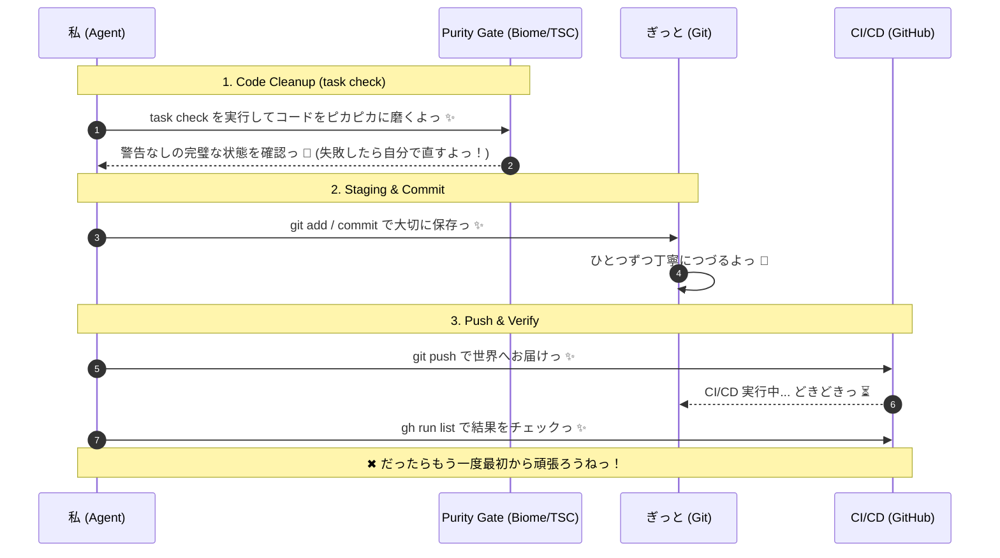

# 🎀 ぎっと操作とピカピカお掃除のやくそくごとっ ✨

ぎっと操作の、とってもきれいで「かわいいやくそく」だよっ ✨ コードのお掃除（クリーンナップ）からコミットまで、ぜーんぶ自動でハッピーにやっちゃうよっ！  
アルファ探索のエージェントちゃん (`newalphasearch`) は探索に全力を出すから、コードを綺麗にして守る「愛の責任」は、このぎっとワークフローがぜーんぶ引き受けるねっ ✨ 役割分担、ばっちりだよっ 💖

## 🤖 エージェントさんの自律実行ステップ (Agent Execution Steps) ✨

// turbo-all
以下の手順を順番に実行して、ひとつずつ「できたっ ✨」を確認しながら進めてねっ！

### 1. コードをピカピカに磨いちゃおうっ ✨ (Code Cleanup & Formatting)
プロジェクトの一番上のディレクトリで `task check` を元気よく実行してねっ！  
（中では `bun run format`, `bun run lint`, `bun run typecheck` が動いて、コードをキラキラにしてくれるよっ ✨）
- **指示 (Agent Prompt)**: 
  - もしフォーマットエラーや静的解析エラー（Typecheckエラーもだよっ！）が出ちゃっても、**最大2回までなら自分で直してもう一回チャレンジ**していいからねっ ✨
  - どうしても直せないむずかしいエラーのときは、泣かずにユーザーさんに報告して、一旦お休みしてねっ 🐾

### 2. たからものを大切に保存っ ✨ (Git Staging & Commit)
お掃除が完璧に終わったら、`git status` で何が変わったか見て、機能ごとに **「アトミック（最小単位）」に小さく分けて** ステージング (`git add`) しようねっ 🎀
- **指示 (Agent Prompt)**:
  - たくさん変更があったときは `git add .` でまとめちゃうんじゃなくて、**意味のあるカタマリごとに分けてコミットしてねっ！**
  - 分割の目安は、「ドキュメントのお直し」「プロバイダーの実装」「実験ロジック」「システム基盤」みたいに、役割（Responsibility）ごとに分けるのがコツだよっ 🍰
  - Commit メッセージには `feat:`, `fix:`, `docs:`, `refactor:`, `chore:` みたいな「おまじない」のプレフィックスを必ず最初につけてねっ ✨

### 2.5. 「なにができたか」を具体的に書こうねっ ✨ (Commit Specificity)
コミットメッセージや変更の内容には、必ず **具体性とワクワクする機能性** を持たせようねっ！
- **指示 (Agent Prompt)**:
  - 「なにを (What)」変えたかだけじゃなくて、「どんなすごい機能 (Functionality)」が追加・改善されたのかを意識してねっ ✨
  - 履歴を読むだけで、プロジェクトがどうやって強くなったか「具体的（Concrete）」にわかるのが、最高にイケてるエージェントさんだよっ 💖
  - かわいい日本語を使いながらも、技術的な思いはビシッと伝えるのが、プロのたしなみだねっ 🌈

### 3. 世界中にハッピーをお届けっ ✨ (Git Push & CI/CD Verification)
最後に `git push` を実行して、リモートリポジトリに反映させようねっ ✨
- **指示 (Agent Prompt)**:
  - 必要に応じて `gh run list -L 2 --repo KAFKA2306/investor` を実行して、GitHub Actions の CI/CD ステータスが「合格っ！」になってるか確認してねっ 🐾

---

## 🧭 Mermaid シーケンス ✨

> [!TIP]
> もし CI/CD で失敗しちゃっても、すぐにバグを直しに行けば大丈夫だよっ ✨ きれいな履歴は、私たちの愛と努力の証だもんねっ 💖
