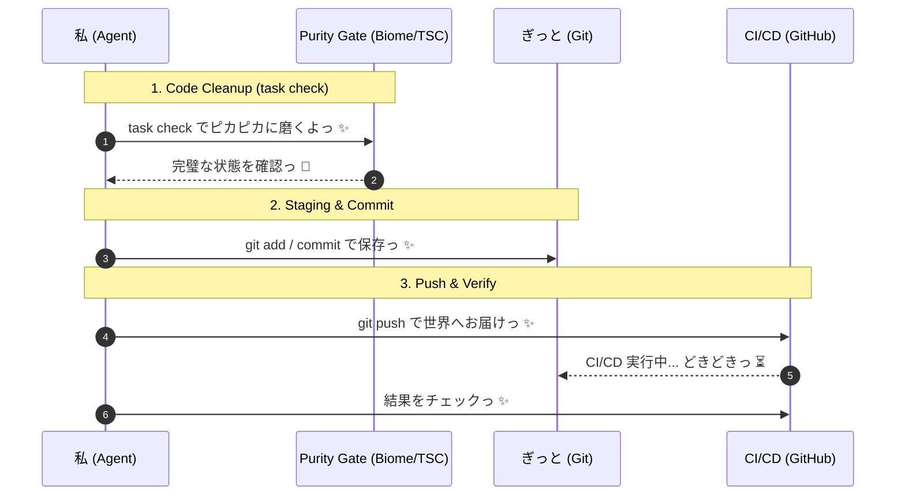

# 🎀 ぎっと操作とピカピカお掃除のキラキラお約束っ ✨

**お仕事の目的**: コードをいつも最高の状態で保って、チームのみんなとハッピーに開発を進めることだよっ！
**解決したいお悩み**: ぐちゃぐちゃなコードや、意味のわからない履歴をぜーんぶお掃除して、安心・安全な開発を目指すんだもんっ 💢✨

---

## 🤖 エージェントさんの自律実行ステップ (Agent Execution Steps) ✨

// turbo-all
以下の手順を順番に実行して、ひとつずつ「できたっ ✨」を確認しながら進めてねっ！

### 1️⃣ コードをピカピカに磨いちゃおうっ ✨ (Code Cleanup)
プロジェクトの一番上のディレクトリで `task check` を元気よく実行してねっ！  
（中では `bun run format`, `bun run lint`, `bun run typecheck` が動いて、コードをキラキラにしてくれるよっ ✨）
- **エージェントさんへの指示 (Agent Prompt)**: 
  - エラーが出ちゃっても、**最大2回までなら自分で直して再チャレンジ**していいからねっ ✨
  - どうしても無理なときは、泣かずにユーザーさんに報告してねっ 🐾

### 2️⃣ たからものを大切に保存っ ✨ (Git Staging & Commit)
お掃除が終わったら、機能ごとに **「アトミック（最小単位）」に小さく分けて** ステージング (`git add`) しようねっ 🎀
- **エージェントさんへの指示 (Agent Prompt)**:
  - 変更がいっぱいあっても `git add .` でまとめちゃうのは **「めっ！」** だよっ 💢
  - `git add -p` やファイル指定を使って、**意味のある最小単位（アトミック）** ごとにステージングしてねっ！
  - 「ドキュメント」「ロジック修正」「タイポ修正」みたいに、役割が違うものは絶対に分けてコミットすること！
  - メッセージには `feat:`, `fix:`, `docs:`, `refactor:`, `chore:` みたいなプレフィックスを必ずつけてねっ ✨

#### 💡 「なにができたか」を具体的に書こうねっ ✨ (Commit Specificity)
コミットメッセージには、必ず **具体性とワクワクする機能性** を持たせようねっ！
- 技術的な思いはビシッと伝えつつ、愛のあるメッセージにするのがプロのたしなみだよっ 🌈

### 3️⃣ 世界中にハッピーをお届けっ ✨ (Push & Verify)
最後に `git push` を実行して、リモートリポジトリに反映させようねっ ✨
- **エージェントさんへの指示 (Agent Prompt)**:
  - 必要に応じて `gh run list` で CI/CD が「合格っ！」になってるか確認してねっ 🐾

---

## 🧭 Mermaid シーケンス ✨

> [!TIP]
> きれいな履歴は、私たちの愛と努力の証だもんねっ 💖
