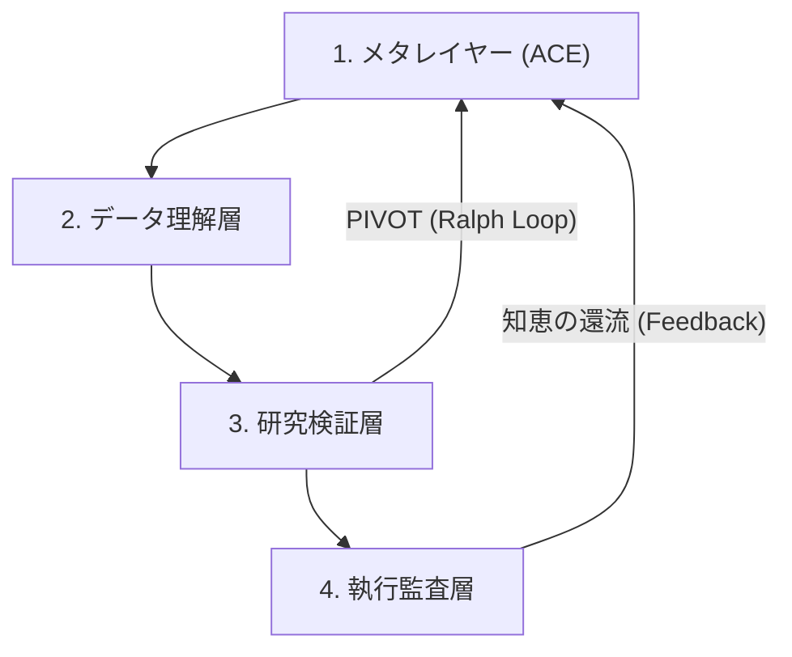

# 🎀 きらきらっ！自律アルファ探索ワークフローちゃん (AAARTS準拠) ✨

**お仕事の目的**: AAARTS（Autonomous Agentic Alpha Trade System）の知能循環を使って、世界に一つだけの最強「直交アルファ」をいーっぱい掘り当てて、システムを自律進化させることだよっ！🌀💎

**解決したいお悩み**: 「アルファ探しを手作業でやるのは疲れちゃう…💦」そんな願いをかなえて、自動で賢くアルファを見つけ続け、市場に適応し続けるよっ 💖🚀

---

## 🏗️ AAARTS：4つのガードレール 🏗️

このワークフローは、以下の4つの論理層をぐるぐる回して、最高品質のアルファを届けるよっ！✨

---

## 🚀 Entrypoints 🚀

- 🏃‍♀️ **いつもの入り口**: `task run:newalphasearch` (ループ必須だよっ！)
- ♾️ **止まらない進化ループ**: `task run:newalphasearch:loop`
- 🗣️ **おしゃべり入り口**: `task run:newalphasearch:nl NL_INPUT="ここに指示"`

> [!IMPORTANT]
> どの入口から入っても、実行経路は `run:newalphasearch -> run:newalphasearch:loop -> run:newalphasearch:cycle` で統一するよっ！✨

---

## ⚖️ Audit：GO / HOLD / PIVOT ⚖️

各サイクルでは、以下の8つの視点でアルファを厳しくチェック（Audit）するよっ！💢💖

1. **観測**: データはちゃんと最新（PIT）かな？ 🕵️‍♀️
2. **解釈**: 統計的にヘンなところはない？ 📊
3. **仮説**: 因果関係はばっちり？ 🧠
4. **前提**: 市場が変わっても大丈夫？ 頑健（ロバスト）？ 🛡️
5. **制約**: 執行コストや流動性を無視してない？ 💸
6. **リスク**: 前に失敗した「禁止領域」に近づいてない？ ⚠️
7. **次の一手**: ダメになった時のシナリオはある？ 📝
8. **判定**: **GO (実行), HOLD (追加検証), PIVOT (方向転換)**

> [!TIP]
> **Ralph Loop**: 連続で失敗（HOLD）が続くと、システムは自律的に「今のドメインは飽和した！」って判断して、新しいドメインへ **PIVOT** するよっ 🔄💎

---

## 🎀 Loop Controls 🎀

以下の「環境変数」で、ループの動きを可愛くコントロールできるよっ！🎀

| 環境変数 | 既定値 | なにするの？ |
| :--- | :--- | :--- |
| `ALPHA_LOOP_MAX_CYCLES` 🔄 | `3` | `N` サイクルまわったら、お利口に停止するねっ！ |
| `ALPHA_LOOP_SLEEP_SEC` 😴 | `0` | サイクルが終わるたびに、何秒ねんねするか決めるよっ 💤 |
| `ALPHA_LOOP_MAX_FAILURES` 💦 | `1` | 失敗（No New Alpha）が続いたら、PIVOT または停止するよっ 🛑 |

---

## 💎 Required Outputs 💎

ループが終わるたびに、これらが新しくなってることを期待しちゃうぞっ！わくわくっ✨

- `logs/unified/alpha_discovery_*.json` 📜 (Audit結果入り！)
- `ts-agent/data/VERIF_*.png` 📈 (物理コスト換算の証拠！)
- `ts-agent/data/playbook.json` 📖 (最新の戦術書！)

---

## 🛡️ Safety Policy 🛡️

- 失敗がいっぱい重なったら、自動で「めっ！」って止まるか、ドメインを再構築するよっ🛑
- なんで止まったのかは、標準出力でちゃんとお話しするからねっ！💬
- もう一回やりたいときは、同じコマンドをまたぽちっとしてねっ！待ってるよっ✨
