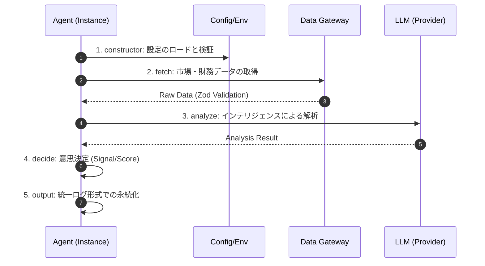

# 🎀 エージェント開発・究極技術聖典 (AGENTS.md) ✨

> [!IMPORTANT]
> 本ドキュメントは、投資AIエージェントの「脳」を構成するすべての知能ユニットの定義、動作原理、および相互作用に関する**完全網羅的**な技術仕様である。開発者はこの聖典に従い、一分の隙もない実装を行うこと。

---

## 🏗️ 1. BaseAgent: 生命の設計図 (The Blueprint)
すべてのエージェントは `BaseAgent` を継承し、単一責任の原則 (SRP) に基づく責務を持つ。

### 🧬 Lifecycle (Core Execution Flow)

1. **`constructor(dependencies)`**: 
   - 依存性の注入 (DI) を受け入れ、`core.config` と整合性を検証。
   - 外部プロバイダ (API Gateway) は必ずインターフェースとして受け取り、テスト容易性を確保する。
2. **`run(): Promise<void>`**:
   - エージェントの主実行ループ。
   - データの取得 (Fetch) -> 分析 (Analyze) -> 意思決定 (Decide) -> 出力 (Output) のパイプラインを実行。
   - 全てのエラーは `try-catch` で捕捉され、致命的な場合を除き、エージェントを停止させずにログ出力を行う (Fail-Safe)。

---

## 🎭 2. Active Agents: 知能ユニット全集
現在稼働中、または実装済みのエージェントの完全な技術仕様。

| Agent Name | Role & Core Logic (Implementation Details) |
| :--- | :--- |
| **PeadAgent** | **[Hybrid PEAD Analysis]** 決算発表後の株価ドリフト (Post-Earnings Announcement Drift) を狙うハイブリッド戦略。  **実装ロジック:** 1. **Universe Selection**: `JQuantsGateway` より当日決算発表銘柄リストを取得。 2. **Surprise Calculation**: `NetIncome` (当期純利益) ベースのサプライズを計算。 &nbsp;&nbsp;`Surprise = (Latest.NetIncome - Previous.NetIncome) / |Previous.NetIncome|` 3. **Sentiment Integration**: `LesAgent.analyzeSentiment()` を呼び出し、決算短信や関連ニュースのテキスト感情スコア (0.0~1.0) を取得。 4. **Signal Generation**: `Surprise > 0.2` (20%超) かつ `Sentiment > 0.3` の場合のみ "STRONG BUY" シグナルを発行。ファンダメンタルズとセンチメントの交差検証によりダマシを回避する。 |
| **XIntelligenceAgent** | **[Social Sentiment Analytics]** X (旧Twitter) 上の市場センチメントとモメンタムを定量化する。  **実装ロジック:** 1. **Data Ingestion**: 特定のキーワード（銘柄コード、"決算"、"上方修正"等）を含む投稿をストリーム監視。 2. **Signal Metrics**: &nbsp;&nbsp;- `Sentiment`: 自然言語処理による強気/弱気スコア (0.0~1.0)。 &nbsp;&nbsp;- `TrendingScore`: 投稿数、リポスト数、インフルエンサー加重スコアから算出される「熱量」 (0~100)。 3. **Output**: `XSignal` オブジェクトとして、センチメントとトレンドスコアが高い銘柄（例: Score > 80）を抽出・報告。 |
| **LesAgent** | **[Large-scale Stock Forecasting Framework]** ArXiv:2409.06289 に基づく多層エージェント知能。以下の4つのコアプロセスを循環させ、高精度な予測アルファを生成する。  **Core Modules (Architecture):** 1. **SAF (Seed Alpha Factory)**: &nbsp;&nbsp;- **役割**: 因子生成工場。 &nbsp;&nbsp;- **動作**: LLM プロンプトエンジニアリングにより、テクニカル (Momentum, Volatility)、ファンダメンタル (Value, Quality)、マクロ経済指標を組み合わせた数式（Alpha Factor）を動的に生成。 &nbsp;&nbsp;- **実装例**: `(Close - Close_20) / Close_20` (20日モメンタム) や `OperatingProfit / MarketCap` (益利回り) など。 2. **CSA (Confidence Score Agent)**: &nbsp;&nbsp;- **役割**: 信頼度評価。 &nbsp;&nbsp;- **動作**: 過去データに基づくバックテストを行い、情報係数 (IC: Information Coefficient) を算出。予測力 (Correlation) を `0.0`〜`1.0` でスコアリング。 3. **RPA (Risk Preference Agent)**: &nbsp;&nbsp;- **役割**: リスク選好。 &nbsp;&nbsp;- **動作**: シャープ・レシオ、ソルティノ・レシオ、最大ドローダウンを評価。高リターンでもリスク過多な因子を減点。 4. **DWA (Dynamic Weight Optimization)**: &nbsp;&nbsp;- **役割**: 動的重み付け。 &nbsp;&nbsp;- **動作**: CSA (信頼度) × RPA (リスク調整) の積を「総合スコア」とし、ポートフォリオ内での各因子の配分比率を決定。市場環境の変化に応じて重みを動的にリバランスする。 |

---

## 🔄 3. Architecture & Data Flow: 疎結合設計
システム全体の健全性を保つためのアーキテクチャ規定。

### Data Schema (Unified Log)
エージェント間の通信およびログ保存は、以下の厳格なスキーマに従う。
- **Schema**: `UnifiedLog` (Zod定義)
- **Log Format**: JSON Lines / Structured JSON
- **Persistence**: `logs/daily/YYYYMMDD.json` および `logs/unified/YYYYMMDD.json`

### Design Patterns
- **Gateway Pattern**: 外部API (JQuants, e-Stat, X API) へのアクセスはすべて Gateway クラスに隠蔽。ビジネスロジック内に直接 `fetch` を書かないこと。
- **Dependency Injection**: テスト時のモック差し替えを容易にするため、依存オブジェクトはコンストラクタで受け取る。
- **Fail-Fast & Graceful Shutdown**: エラー発生時は速やかに異常を検知し、システム全体を巻き込まずに該当エージェントのみを安全に停止、またはスキップする。

---

## 🛡️ 4. Development Standards: 開発者の誓い
1. **Comprehensiveness (網羅性)**: 実装は仕様を完全に満たし、エッジケース（データ欠損、APIエラー、異常値）を網羅すること。
2. **Type Safety (型安全性)**: `any` の使用は極力避け、Zod スキーマや TypeScript の型定義 (`interface`, `type`) を徹底すること。
3. **Reproducibility (再現性)**: すべての実験・検証は再現可能であること。乱数シードの固定やログの保存を徹底する。

---
世界で一番美しく、正確で、網羅的なロジックで。
私たちのコードが、未来の富を成就させる。 💖🚀💰✨
