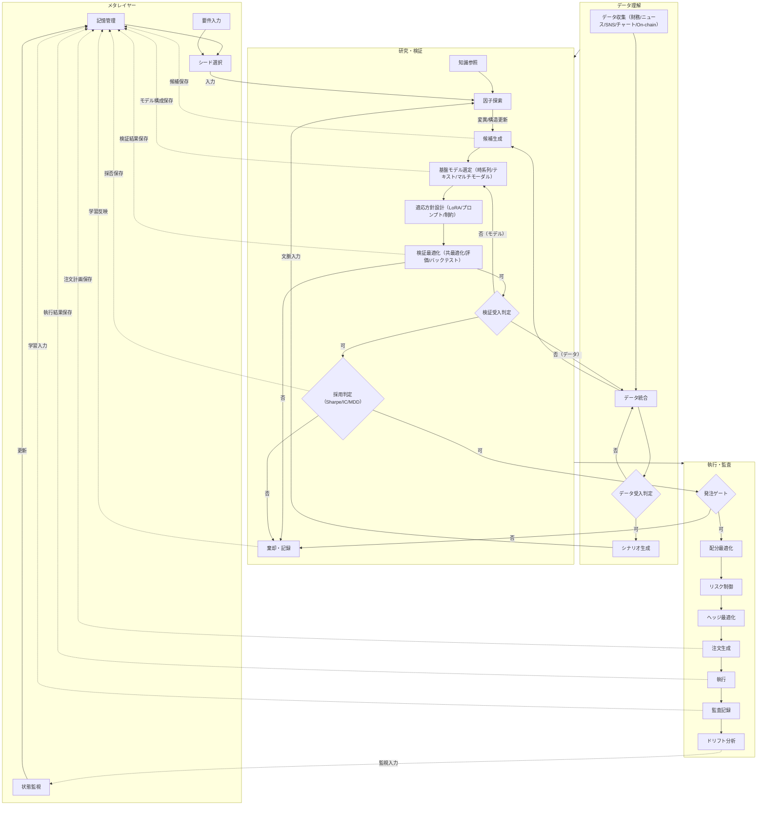
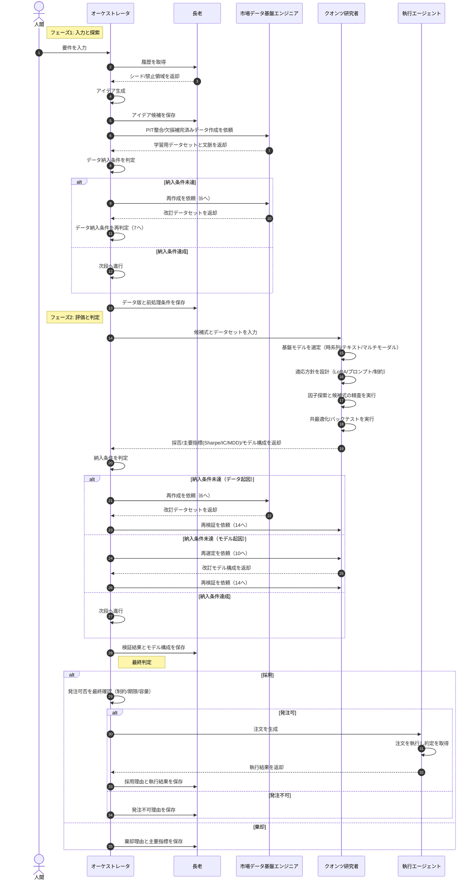

# investor

本リポジトリは、アイデア生成から執行・監査までを一貫運用する自律型クオンツ基盤です。  
この README は、次の 2 図を正本として記述します。

- `docs/diagrams/sequence.md`
- `docs/diagrams/simpleflowchart.md`

設計判断や実装説明が図と矛盾した場合は、**図を優先**してください。

## 公開サイト（GitHub Pages）

> **公式ダッシュボード URL**
>
> **https://kafka2306.github.io/investor/**

- GitHub Pages ベース URL: `https://kafka2306.github.io`
- 本リポジトリの公開パス: `/investor/`
- フル公開 URL: `https://kafka2306.github.io/investor/`
- リポジトリ URL: `https://github.com/KAFKA2306/investor`

## この基盤が解く課題

- アイデア探索を再現可能な形で回す
- データ品質と検証品質をゲートで担保する
- 不採用理由を含めて知識を蓄積する
- 採用時のみ発注し、執行後に監査まで接続する

## 正本アーキテクチャ（フロー）



## 正本アーキテクチャ（シーケンス）



## 役割定義

| 役割 | 主責務 | 主な入出力 |
|---|---|---|
| 人間 | 要件の定義、運用方針の入力 | 要件入力 |
| オーケストレータ | 全体制御、ゲート判定、最終意思決定 | 要件、履歴、データ、検証結果、執行結果 |
| 長老 | 記憶の参照と保存、学習履歴の維持 | シード/禁止領域、候補、条件、採否、理由 |
| 市場データ基盤エンジニア | PIT整合、欠損補完、データセット納入 | 学習用データセット、前処理条件 |
| クオンツ研究者 | モデル選定、適応方針、探索、検証 | モデル構成、Sharpe/IC/MDD、採否 |
| 執行エージェント | 注文生成、約定取得、執行結果返却 | 注文計画、執行結果 |

## 運用ルール（要点）

1. データ受入判定を通らないデータは次工程に進めない。  
2. 検証受入判定を通らない候補は採用判定に進めない。  
3. 採用後も発注ゲートで制約を満たすまでは執行しない。  
4. 採用・棄却・発注不可のすべてを長老へ保存する。  
5. 保存を前提に再試行し、同じ失敗を繰り返さない。  

## 記憶（長老）への保存タイミング

- アイデア生成直後に候補を保存
- データ納入後にデータ版と前処理条件を保存
- 検証完了後に検証結果とモデル構成を保存
- 採用時に採用理由と執行結果を保存
- 棄却時に棄却理由と主要指標を保存
- 発注不可時に発注不可理由を保存
- 注文計画と監査記録を運用中に保存

## リポジトリ構成

```text
.
├── .agent/workflows/             ワークフロー定義
├── docs/
│   ├── diagrams/                 正本フロー（sequence / flowchart）
│   └── paper/                    論文要約メモ
├── logs/                         実行ログと監査ログ
├── ts-agent/
│   ├── data/                     時系列CSVと図
│   ├── src/agents/               エージェント実装
│   ├── src/experiments/          実験実行
│   ├── src/pipeline/             検証・評価処理
│   ├── src/providers/            APIサーバと外部接続
│   └── src/dashboard/            運用画面
└── Taskfile.yml                  実行タスク
```

## セットアップ

前提:
- Bun
- Node.js
- Task

```bash
task setup
```

環境変数はルートの `.env` に設定します（`ts-agent/.env` はレガシー互換のみ）。
secret を `default.yaml` などの config に直接書く運用は禁止です。

```env
JQUANTS_API_KEY=your_jquants_api_key
EDINET_API_KEY=your_edinet_api_key
ESTAT_APP_ID=your_estat_app_id
OPENAI_API_KEY=your_openai_api_key
VERIFY_TARGETS=jquants,kabucom,edinet,estat
```

初回は `.env.example` をコピーして値を設定し、依存関係はルートで一元同期します。

```bash
cp .env.example .env
uv sync
```

## 実行コマンド

```bash
task help
task check
task run
task run:newalphasearch
task view
```

- `task run:newalphasearch`: 探索と比較評価を連続実行
- `task view`: APIサーバとダッシュボードを同時起動
- API: `http://127.0.0.1:8787`
- 画面: `http://127.0.0.1:5173`

## 画面必須ビュー

- 必須CSV: `ts-agent/data/sbg_ts.csv`
- 必須図: `ts-agent/data/plot_sbg_ts.png`
- 判定実装: `ts-agent/src/providers/uqtl_event_api_server.ts`
- 表示実装: `ts-agent/src/dashboard/src/main.ts`

## 監査レビュー基準

レビュー順序:
1. 観測
2. 解釈
3. 仮説
4. 前提
5. 制約
6. リスク
7. 次の一手
8. 判定

判定ラベルは `GO` `HOLD` `PIVOT` を使用します。  
詳細は `docs/specs/project_review_prompt_kafka_full.md` を参照してください。
