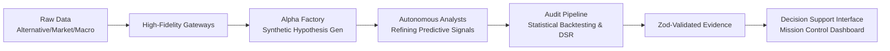

# Antigravity: Autonomous Alpha Factory

An institutional-grade **Autonomous Quantitative Investment System** implemented in **TypeScript + Bun**. This engine automates the entire alpha lifecycle: from raw data ingestion and synthetic hypothesis generation to rigorous statistical backtesting and risk-adjusted execution.

### 📈 Strategic Edge & Live Performance
**[Live Institutional Dashboard](https://kafka2306.github.io/investor/)**

> [!IMPORTANT]
> **Mission Statement**: To extract persistent, orthogonal alpha through the synergy of LLM-driven reasoning (Gemini 3.0 Pro) and strict quantitative validation (DSR/PSR). This system is designed for autonomous resilience and capital efficiency.

## Core Capabilities

- **Autonomous Alpha Mining**: Generates and evolves "Orthogonal Predictive Signals" using deep reasoning agents.
- **High-Fidelity Validation**: Rigorous auditing using Deflated Sharpe Ratio (DSR) to eliminate backtest overfitting.
- **Regime-Aware Execution**: Real-time monitoring of alpha decay and IC half-life for optimal rebalancing.
- **Institutional Transparency**: Unified Quantum Task Ledger (UQTL) provides a full audit trail of every investment decision.
- **Multi-Source Ingestion**: Standardized gateways for J-Quants, e-Stat, and alternative data streams.

## Investment Architecture




## ディレクトリ構成

```text
.
├── ts-agent/                 # コア実装 TypeScript/Bun
│   └── src/
│       ├── agents/           # 戦略ロジック
│       ├── gateways/         # 外部API接続
│       ├── schemas/          # Zodスキーマ
│       ├── pipeline/         # 評価・検証パイプライン
│       ├── experiments/      # 再現実験/検証スクリプト
│       └── tools/dashboard/  # 可視化UI Vite
├── logs/                     # 実行成果物（生成物）
│   ├── daily/
│   ├── benchmarks/
│   ├── readiness/
│   └── unified/
└── docs/                     # 図・レポート
```

## セットアップ

### 前提

- Bun
- Node.js（ダッシュボード用）
- Task（`task` コマンド）
- （任意）Python + `uv`：基盤モデルベンチマークを実行する場合

### 1. 依存関係をインストール

```bash
# core
cd ts-agent
bun install

# dashboard
cd src/tools/dashboard
npm install
```

### 2. 環境変数を設定

`ts-agent/.env` 例:

```env
JQUANTS_API_KEY=your_jquants_api_key
ESTAT_APP_ID=your_estat_app_id
# 任意: 検証対象を絞る場合
VERIFY_TARGETS=jquants,estat
```

## クイックスタート

```bash
# リポジトリルートで実行

task check   # format + lint + typecheck
task run     # 再現実験 + foundation benchmark
task view    # ダッシュボード起動
```

ダッシュボードは通常 `http://localhost:5173` で確認できます。

## 主要コマンド

| コマンド | 目的 |
| --- | --- |
| `task check` | `format` / `lint` / `typecheck` をまとめて実行 |
| `task run` | `les_reproduction` と `foundation_benchmark` を実行 |
| `task view` | ダッシュボード開発サーバーを起動 |
| `cd ts-agent && bun run verify:api` | API接続検証 |
| `cd ts-agent && bun run pipeline:llm-readiness` | Readinessスコア算出 |
| `cd ts-agent && bun run pipeline:full-validation` | 総合検証パイプライン |

## ログと成果物

- `logs/daily/`: 日次シナリオログ（`investor.daily-log.v1`）
- `logs/benchmarks/`: 基盤モデルの比較結果
- `logs/readiness/`: LLM運用準備度レポート
- `logs/unified/`: 統合ログ
- `logs/cache/`: API/マーケットデータのキャッシュ

生成ログはダッシュボードのデータソースとして利用されます。

## 開発ガイド（要点）

- 型安全: `@tsconfig/strictest` + Zod 検証
- フォーマット/静的解析: Biome
- 命名: 実験スクリプトは `snake_case`、ドメインモジュールは意味ベースで命名
- コミット: Conventional Commits（`feat:`, `fix:`, `docs:` など）

詳細は以下を参照:

- `AGENTS.md`
- `Taskfile.yml`
- `ts-agent/README.md`

## 補足ドキュメント

- `docs/diagrams/`: 処理フロー図
- `docs/reports/`: 実験/検証レポート
- `ts-agent/src/model_registry/README.md`: モデルレジストリ運用
- `ts-agent/src/pipeline/README.md`: パイプライン概要
