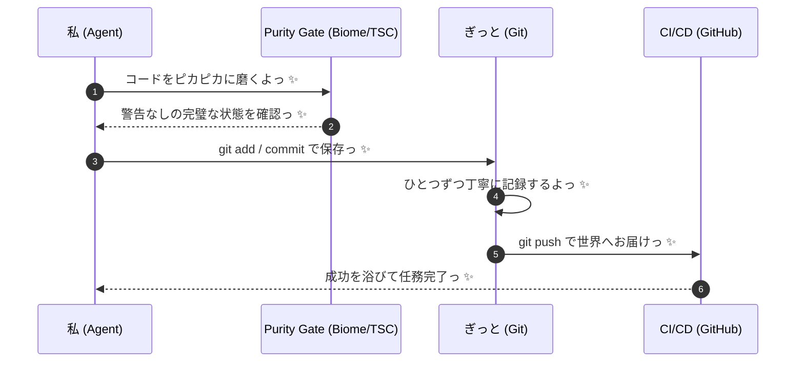

# Investor AI Agent

日本株向けの「検証してから動く」投資AIです。  
個人投資家が毎日チェックしやすいように、判断根拠を `logs/daily/YYYYMMDD.json` に残します。

---

## このREADMEの目的

- このシステムが何を見て売買判断するか
- どの数字なら「実行してよい」とみなすか
- 直近の実証結果（2026-02-22）

を、短く具体的に示します。

---

## まず結論（2026-02-22 実績）

参照: `logs/daily/20260222.json`

- シナリオ: `SCN-VEG-001`（野菜インフレ・ローテーション）
- 最終判断: `LONG_BASKET`
- 採用銘柄: `1375`, `2503`, `1332`
- 結果: `status=PASS`, `proved=true`, `verdict=USEFUL`
- 期待値: `expectedEdge=0.07461103900975842`
- 当日バスケット日次リターン: `0.0036587532448280765`（約+0.37%）

この日は「データ準備OK + アルファOK」で、証明運転は合格です。

---

## 何を見て判断しているか

入力データ:
- JQuants（銘柄・価格・財務）
- e-STAT（マクロ）
- EDINET / ニュース / SNS補助

直近ログで実際に使った入力:
- `estatStatsDataId = 0000010101`
- 対象ユニバース: `1375`, `1332`, `2503`
- マクロ指標: `vegetablePriceMomentum = 0.0025954852240006555`

---

## 売買のルール（実務で使う閾値）

### 1. シグナル

- `SUE = (Result - Expected) / sigma(Surprise)`
- ロング条件: `SUE > 2.0`
- ショート条件: `SUE < -2.0`

### 2. ポジションサイズ

- Kelly: `f* = (p*b - (1-p)) / b`
- 実際の採用サイズ: `0.5 * f*`（Half-Kelly）
- 直近ログの `kellyFraction`: `0.03730551950487921`

### 3. リスク上限

- `stopLossPct = 0.03`（3%）
- `maxPositions = 3`
- レジームが荒い日はレバ上限 `0.5x`

---

## 直近ログの読み方（個人投資家向け）

`logs/daily/YYYYMMDD.json` は次の順で見れば十分です。

1. `workflow`
- `dataReadiness` と `alphaReadiness` が両方 `PASS` か
- どちらか `FAIL` なら見送り

2. `decision`
- `action` が何か（例: `LONG_BASKET`）
- `topSymbol` と `reason` が妥当か

3. `risks`
- `kellyFraction` が過大でないか
- `stopLossPct` と `maxPositions` が守れるか

4. `results`
- `status` が `PASS` か
- `expectedEdge` がプラスか
- `proved=true` か

---

## 2026-02-22 の銘柄別スナップショット

| Symbol | AlphaScore | Signal | DailyReturn | ProfitMargin |
| :-- | --: | :-- | --: | --: |
| 1375 | 0.0828304585 | LONG | 0.0067829457 | -0.0198756249 |
| 1332 | 0.0688498140 | LONG | 0.0052816901 | 0.0362323953 |
| 2503 | 0.0721528446 | LONG | -0.0010883761 | 0 |

ポイント:
- 3銘柄とも `signal=LONG`
- `alphaScore` は 1375 が最大
- ただし財務（利益率）と当日リターンは銘柄で差があるため、バスケット運用で分散

---

## 16エージェント体制（役割だけ）

| ID | 役割 |
| :-- | :-- |
| A-01 | 決算サプライズ短期 |
| A-02 | 決算ドリフト中期 |
| A-03 | 自社株買いイベント |
| A-04 | 指数入替イベント |
| A-05 | SNSセンチメント |
| A-06 | ニュース定性評価 |
| A-07 | 銘柄間アービトラージ |
| A-08 | e-STATマクロ分析 |
| A-09 | ATRベースの損益管理 |
| A-10 | 板監視・異常検知 |
| A-11 | Kelly資金配分 |
| A-12 | 相場レジーム判定 |
| A-13 | TOB/M&A検知 |
| A-14 | バリュー探索 |
| A-15 | 投資主体フロー追跡 |
| A-16 | 全体レビュー |

---

## 技術ガードレール（壊さないための約束）

- `any` 禁止
- 外部データは Zod で検証
- Signal / Config は不変
- DIP厳守（Provider直new禁止）
- 失敗時は Fail-Fast
- 秘密情報は `core.getEnv()` のみ

主要ディレクトリ:
- `ts-agent/src/agents/`
- `ts-agent/src/use_cases/`
- `ts-agent/src/domain/`
- `ts-agent/src/infrastructure/`
- `ts-agent/src/providers/`
- `ts-agent/src/schemas/`
- `ts-agent/src/core/`
- `ts-agent/src/config/`
- `ts-agent/src/experiments/`

---

## すぐ動かす

```bash
bun install --cwd ts-agent
task lint
task check
task daily
```

---

## 参照モデル（2026-02-22）

| モデル | 提供元 | Context7 | GitHub | arXiv |
| :-- | :-- | :-- | :-- | :-- |
| Chronos | Amazon | `/amazon-science/chronos-forecasting` | `https://github.com/amazon-science/chronos-forecasting` | `https://arxiv.org/abs/2403.07815` |
| TimesFM | Google | `/google-research/timesfm` | `https://github.com/google-research/timesfm` | `https://arxiv.org/abs/2310.10688` |
| TimeRAF | Microsoft | `/microsoft/finnts` | `https://github.com/microsoft/finnts` | `https://arxiv.org/abs/2412.20810` |

---

## 🎀 ぎっと操作がーどっ ✨

日次改善を安全に積み上げるための、最小ルールです。



実務チェック:
1. `task lint` と `task check` が通るまで修正する
2. 変更理由が1行で説明できる単位で `git commit` する
3. `git push` 後に CI 緑を確認する
4. 失敗時は即修正し、同じ原因を再発させない

> [!TIP]
> もし失敗しちゃったら、すぐにバグ修正フェーズに戻ってやり直そうねっ ✨
