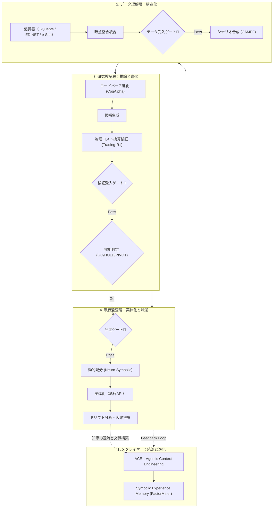
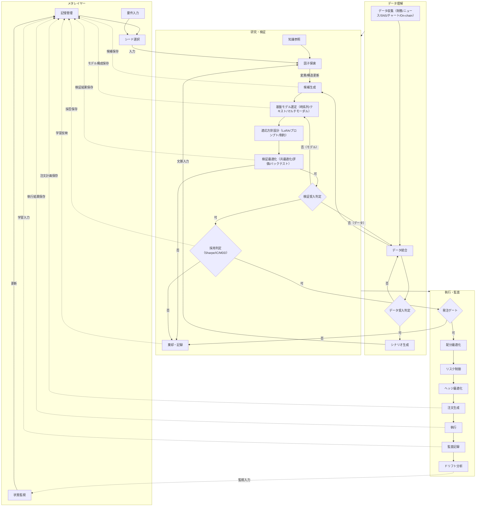
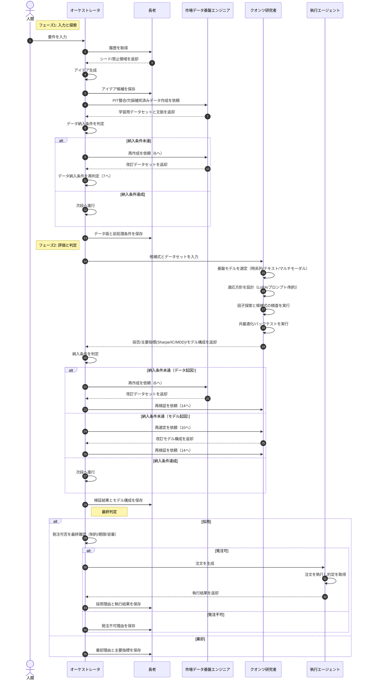

# 自律型エージェント・アルファ探索＆執行システム「AAARTS」：市場に適応し続ける「自律型知能」の論理構造

金融市場における超過収益（アルファ）は、観測された瞬間から減衰（Decay）を始めます。

情報は拡散し、探索は重複し、執行には摩擦が生じる。理論上のリターンは、実体化の過程で静かに削り取られていきます。本記事では、アルファの「研究（Research）」から「執行（Trade）」までを単一の知能循環として統合するアーキテクチャ、**AAARTS（Autonomous Agentic Alpha Trade System）** の論理構造を提示します。

:::message
**参考文献（arXiv統合）**
本設計は、2025年〜2026年に発表された最先端研究の知見を「一つの生命体」として統合したクオンツ・スタックです。

* **AlphaAgent (2502.16789)**: 正則化探索によるアルファ減衰への対抗
* **QuantaAlpha (2602.07085)**: 軌跡の再結合による進化型フレームワーク
* **FactorMiner (2602.14670)**: 失敗の記憶（Forbidden Area）を持つ自己進化エージェント
* **CogAlpha (2511.18850)**: 数式を「プログラムコード」として進化させる認知マイニング
* **AlphaEvolve (2506.13131) / AlphaPROBE (2602.11917)**: グラフ理論に基づく自律的発見
* **CAMEF (2502.04592) / FinCARE (2510.20221)**: 因果推論と反実仮想による証拠付け
* **Trading-R1 (2509.11420)**: 強化学習と推論（Reasoning）による執行最適化
* **QuantMCP (2506.06622)**: 金融ツールと市場データへの物理的接地（Grounding）
:::

---

## 1. 観測：なぜ理論上のアルファは「死ぬ」のか

AAARTSはアルファの消失を、解決すべき「問題」ではなく、制御すべき「環境条件」として分解・定義します。

### 1.1 アルファ減衰（Alpha Decay）の物理

`AlphaAgent` が指摘するように、有効な手法の観測は模倣を誘発し、取引の過密化を招きます。これは、期待収益が執行コストへと収束していく物理的なエントロピー増大の過程です。

### 1.2 探索の重複（Redundant Exploration）による論理的停滞

`FactorMiner` や `QuantaAlpha` が示す通り、既存の探索アルゴリズムは構造的に偏ります。AAARTSはこれを「論理構造の深層解析」により、既存の知見と重複する仮説を物理的に排除することで回避します。

### 1.3 執行摩擦（Execution Friction）と理論の乖離

`Trading-R1` が扱うように、理想的なリターン（Gross）と実際の約定結果（Net）の間には、時間遅延と流動性制約という「現実の重み」が存在します。AAARTSは、これを研究段階から制約条件として取り込みます。

---

## 2. アーキテクチャ：統合された「4層のガードレール」

AAARTSは、研究から執行に至る成果物の品質を段階的に保証するため、4つの独立した論理層を循環させます。




---

## 3. ACE（Agentic Context Engineering）：自律進化のエンジン

本システムのメタレイヤーを司る **ACE (Agentic Context Engineering)** は、単なる「記憶の蓄積」ではなく、エージェントが次に参照すべき「文脈」を自律的に設計・最適化し続けるプロセスです。

* **失敗の文脈化（Contextualized Rejection）**
`FactorMiner` の *Symbolic Experience Memory* を採用。単に「失敗した」というフラグではなく、失敗に至った論理的陥穽を言語化し、次サイクルの「立ち入り禁止区域（Forbidden Area）」として文脈化します。
* **動的な知識の再編**
市場レジームの変化に応じ、過去の成功知をあえて「無効化」し、逆に過去の失敗知を「今のチャンス」として再浮上させることで、エージェントの思考範囲を動的に制御します。
* **現実への接地（Grounding）**
`QuantMCP` を介し、エージェントの推論をリアルタイムな市場データと厳密な計算ツールにロックします。これにより、金融ドメインにおける致命的なハルシネーションを物理的に遮断します。

---

## 4. 循環：自律的な進化プロセス（AAARTSの核心）

AAARTSの真髄は、自身の出力を観測し、その結果を次サイクルの入力へとフィードバックし続ける動的な自己組織化プロセスにあります。

1. **仮説の認知合成（Cognitive Synthesis）**:
過去の「棄却理由」を論理的に回避した新しい仮説を合成。`CogAlpha` に基づき、条件分岐やループを含む「プログラムコード」としてのアルファを生成します。
2. **進化的再結合（Evolutionary Recombination）**:
`AlphaEvolve` や `AlphaPROBE` の論理を適用。有望なアルファの軌跡（Trajectory）を組み換え、市場環境に対する最適解を自律探索。
3. **因果検証（Causal Filtering）**:
`CAMEF` や `FinCARE` の手法を用い、反実仮想シミュレーションを通じて「偽の相関」を排除。
4. **自己修正（Self-Correction）**:
連続した失敗を検知した場合、システムは自律的に「探索ドメインが飽和した」と判断し、全く新しいドメインへと文脈を再構築します（Ralph Loop）。

---

## 5. データ基盤：自律化のための「感覚器」

エージェントが市場を正確に観測するための具体的インターフェースです。

* **J-Quants / yfinance**: 日本株の制度開示データと時系列バー。
* **EDINET API**: 報告書の修正履歴やリスク記述の変遷を「組織的脆弱性」として捉え、価格形成に反映されていないリスクを同定（FinSphere型分析）。
* **e-Stat API**: 公的統計が発表されてから市場全体に浸透するまでの「情報伝達ラグ」を先行指標として活用。
* **三菱UFJ eスマート証券 API**: TradeLayerでの注文生成を実体化し、執行結果を研究層へ帰還させる接続点。

---

## 6. 透明性：意思決定の自己証明

自律型システムへの信頼は、証拠の連鎖によって担保されます。

### 意思決定の三指紋（Triple Fingerprint）

`FinGAIA` 等の厳格な評価基準をクリアするため、すべての判断に以下の「指紋」を刻印します。

1. **論理構造の指紋**: 実行されたプログラムコードの不変ハッシュ。
2. **推論プロセスの指紋**: 生成に至った思考の軌跡（Chain of Thought）の全履歴。
3. **実行環境の指紋**: 実行時のデータセット、板状況、流動性メタデータの完全な記録。

### 自己検証（Mismatch Detection）

システム内部で算出した指標に対し、生データから独立して再計算を行い、整合性を照合します。1bps（0.01%）の乖離であっても検知した場合は、即座にシステムの信頼性を否定し、警告を発する仕組みを備えます。

---

## 7. 監査レビュー基準：GO / HOLD / PIVOT

成果物は、以下の8つの視点に基づき、多角的かつ非情に評価されます。

| 項目 | 評価の視点 |
| --- | --- |
| **1. 観測** | 入力データの時点整合性（Point-in-Time）は保たれているか。 |
| **2. 解釈** | 統計的な意味付けに論理的な飛躍はないか。 |
| **3. 仮説** | 前提から結論に至る過程に因果的な合理性があるか。 |
| **4. 前提** | 市場の構造的なレジーム変化に対しても頑健か。 |
| **5. 制約** | 理論的制限および物理的な執行制限（流動性等）を無視していないか。 |
| **6. リスク** | 過去に失敗した「禁止領域」に接近していないか。 |
| **7. 次の一手** | パフォーマンス低下時の「減衰シナリオ」は定義されているか。 |
| **8. 判定** | **GO (実行), HOLD (追加検証), PIVOT (方向転換)** |

---

# おわりに

AAARTSは、単なる収益追求装置ではありません。それは、ACE（Agentic Context Engineering）という知能の還流システムを備え、市場という複雑系の中で自らの失敗を愛し、そこから知恵を合成し、実体を伴って進化し続ける **「適応する知能」** です。

不確かな「直感」を、追跡可能な「構造」へと移行させること。それがAAARTSの目指す、クオンツ運用の新しい地平です。

本リポジトリは、アイデア生成から執行・監査までを一貫運用する自律型クオンツ基盤です。  
この README は、次の 2 図を正本として記述します。

- `docs/diagrams/sequence.md`
- `docs/diagrams/simpleflowchart.md`

設計判断や実装説明が図と矛盾した場合は、**図を優先**してください。

## 公開サイト（GitHub Pages）

> **公式ダッシュボード URL**
>
> **https://kafka2306.github.io/investor/**

- GitHub Pages ベース URL: `https://kafka2306.github.io`
- 本リポジトリの公開パス: `/investor/`
- フル公開 URL: `https://kafka2306.github.io/investor/`
- リポジトリ URL: `https://github.com/KAFKA2306/investor`

## この基盤が解く課題

- アイデア探索を再現可能な形で回す
- データ品質と検証品質をゲートで担保する
- 不採用理由を含めて知識を蓄積する
- 採用時のみ発注し、執行後に監査まで接続する

## 正本アーキテクチャ（フロー）



## 正本アーキテクチャ（シーケンス）



## 役割定義

| 役割 | 主責務 | 主な入出力 |
|---|---|---|
| 人間 | 要件の定義、運用方針の入力 | 要件入力 |
| オーケストレータ | 全体制御、ゲート判定、最終意思決定 | 要件、履歴、データ、検証結果、執行結果 |
| 長老 | 記憶の参照と保存、学習履歴の維持 | シード/禁止領域、候補、条件、採否、理由 |
| 市場データ基盤エンジニア | PIT整合、欠損補完、データセット納入 | 学習用データセット、前処理条件 |
| クオンツ研究者 | モデル選定、適応方針、探索、検証 | モデル構成、Sharpe/IC/MDD、採否 |
| 執行エージェント | 注文生成、約定取得、執行結果返却 | 注文計画、執行結果 |

## 運用ルール（要点）

1. データ受入判定を通らないデータは次工程に進めない。  
2. 検証受入判定を通らない候補は採用判定に進めない。  
3. 採用後も発注ゲートで制約を満たすまでは執行しない。  
4. 採用・棄却・発注不可のすべてを長老へ保存する。  
5. 保存を前提に再試行し、同じ失敗を繰り返さない。  

## 記憶（長老）への保存タイミング

- アイデア生成直後に候補を保存
- データ納入後にデータ版と前処理条件を保存
- 検証完了後に検証結果とモデル構成を保存
- 採用時に採用理由と執行結果を保存
- 棄却時に棄却理由と主要指標を保存
- 発注不可時に発注不可理由を保存
- 注文計画と監査記録を運用中に保存

## リポジトリ構成

```text
.
├── .agent/workflows/             ワークフロー定義
├── docs/
│   ├── diagrams/                 正本フロー（sequence / flowchart）
│   └── paper/                    論文要約メモ
├── logs/                         実行ログと監査ログ
├── ts-agent/
│   ├── data/                     時系列CSVと図
│   ├── src/agents/               エージェント実装
│   ├── src/experiments/          実験実行
│   ├── src/pipeline/             検証・評価処理
│   ├── src/providers/            APIサーバと外部接続
│   └── src/dashboard/            運用画面
└── Taskfile.yml                  実行タスク
```

## セットアップ

前提:
- Bun
- Node.js
- Task

```bash
task setup
```

環境変数はルートの `.env` に設定します（読み込み元は `ts-agent/src/config/default.yaml` の `runtime.envFile` で一元管理）。
secret を `default.yaml` などの config に直接書く運用は禁止です。

```env
JQUANTS_API_KEY=your_jquants_api_key
EDINET_API_KEY=your_edinet_api_key
ESTAT_APP_ID=your_estat_app_id
OPENAI_API_KEY=your_openai_api_key
UQTL_API_TOKEN=replace_with_strong_random_token
VERIFY_TARGETS=jquants,kabucom,edinet,estat
```

`UQTL_API_TOKEN` is required for mutating API endpoints:
- `POST /api/workflows/run`
- `POST /api/kill`

Example:

```bash
curl -X POST http://127.0.0.1:8787/api/workflows/run \
  -H "Authorization: Bearer $UQTL_API_TOKEN" \
  -H "Content-Type: application/json" \
  -d '{"workflowId":"newalphasearch"}'
```

初回は `.env.example` をコピーして値を設定し、依存関係はルートで一元同期します。

```bash
cp .env.example .env
uv sync
```

## 実行コマンド

```bash
task help
task check
task run
task run:newalphasearch
task view
```

- `task run:newalphasearch`: 探索と比較評価を連続実行
- `task view`: APIサーバとダッシュボードを同時起動
- API: `http://127.0.0.1:8787`
- 画面: `http://127.0.0.1:5173`

## 画面必須ビュー

- 必須CSV: `ts-agent/data/sbg_ts.csv`
- 必須図: `ts-agent/data/plot_sbg_ts.png`
- 判定実装: `ts-agent/src/providers/uqtl_event_api_server.ts`
- 表示実装: `ts-agent/src/dashboard/src/main.ts`


---

