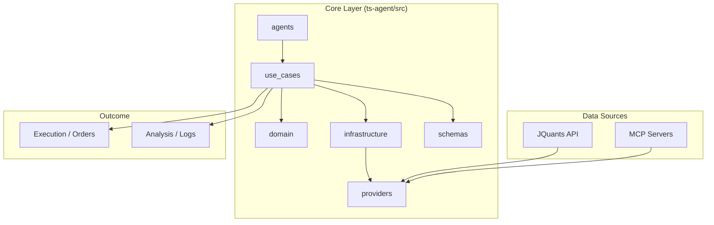

# 💰 投資AIエージェントちゃん・プロジェクト 💰

> [!IMPORTANT]
> **Identity**: 本プロジェクトは、Zero-Fat プロトコルに基づき、極限まで無駄を削ぎ落とした「高密度・自律型投資AIエージェント」である。

## 🌟 プロジェクト・ビジョン
データこそが真実であり、型こそがその証明である。
JQuants API を主軸に、PEAD (決算後株価ドリフト) 等のアルファを数学的・統計的に捕捉し、実利を成就させる。

## ⚡ Zero-Fat プロトコル (開発の掟)
1. **Zero JSDoc / Minimal Comments**: コードはそれ自体が説明責任を持つ。
2. **Strict Typing**: `any` は死、TypeScript の `@tsconfig/strictest` を唯一の正解とする。
3. **Zod Validation**: 外部境界（API, Config）は Zod によって厳格に防衛される。
4. **Fail-Fast**: 不整合を検知した瞬間、`process.exit(1)` で全機能を停止し、安全性を確保する。

## 🚀 技術スタック
| Layer | Technology | Role |
| :--- | :--- | :--- |
| **Runtime** | Bun | 爆速実行環境 & パッケージマネージャー |
| **Language** | TypeScript | 厳格な型安全性の担保 |
| **Logic** | Domain-Driven | 投資ロジックの不変性を維持 |
| **Validation** | Zod | スキーマ駆動開発 (SDD) |
| **API** | JQuants | 日本株コアデータの取得 |

## 🏰 アーキテクチャ構成


## 🛠️ 開発ガイドライン
### 必須環境
- **Bun**: 爆速ランタイム (推奨)
- **Biome**: 静的解析・フォーマット用

### クイックスタート
```bash
# 1. 依存関係のインストール
task setup

# 2. 静的解析とフォーマット
task lint
task format

# 3. 統合ワークフローの開始
task daily
```

## 📜 ライセンス
Zero-Fat 開発者コミュニティ。コードが美しければ、富はついてくる。

---
👑 **Stay Wise, Stay Rich!** 👑