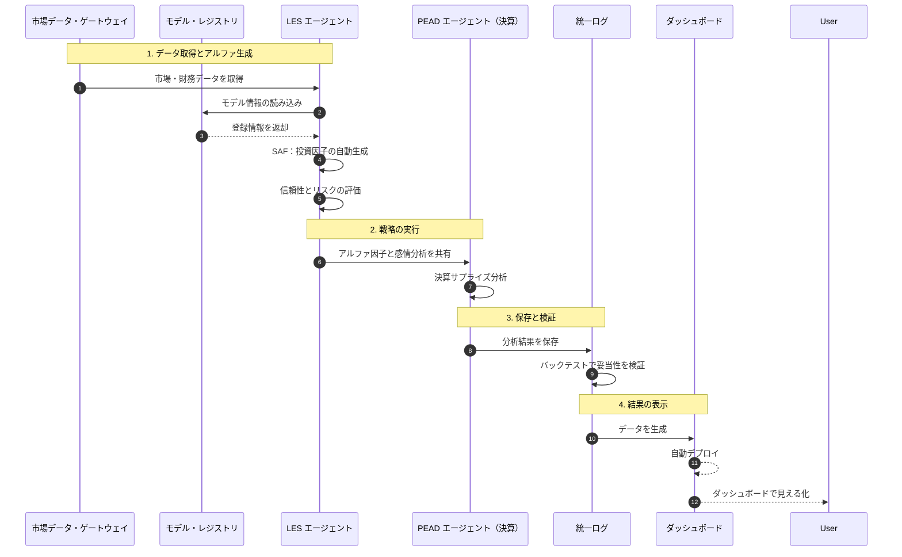

# 投資エージェント：自律型クオンツ・トレードシステム

このシステムは、最新の AI（Gemini）と厳格な TypeScript プログラムを使い、市場データから利益を生み出す自律型の投資システムです。

## 🧬 システムの流れ

データの取得から分析、意思決定、結果の表示までを自動で行います。

---

## 🎭 働いているエージェント

以下の専門エージェントが協力して市場を分析しています。

| エージェント | 技術 | 役割 |
| :--- | :--- | :--- |
| `LesAgent` | LES フレームワーク | 因子の生成、評価、重み付け |
| `PeadAgent` | 決算サプライズ分析 | 業績発表と感情を合わせたトレンド追随 |
| `XIntelligenceAgent` | SNS 分析 | トレンドの予測 |

---

## 📈 対応している予測モデル

最新の時系列予測モデルをサポートしています。

- **Chronos (Amazon)**：ゼロショット時系列予測
- **TimesFM (Google)**：時系列基盤モデル
- **TimeRAF (Microsoft)**：金融特化型 RAG 予測
- **MOIRAI (Salesforce)**：万能時系列トランスフォーマー
- **Lag-Llama**：確率的時系列予測
- **LES**：LLM によるマルチエージェント型アルファ生成

---

## 🛠️ 技術構成

- **実行環境**：Bun (JavaScript ランタイム)
- **言語**：TypeScript (厳格な型チェック)
- **表示**：Vite & Vanilla CSS (ダッシュボード)
- **AI**：Gemini 2.0 Flash

---

## 🚀 使えるコマンド

| コマンド | 内容 |
| :--- | :--- |
| `task setup` | 環境のセットアップ |
| `task check` | プログラムの品質チェック |
| `task verify` | API と実行環境の確認 |
| `task run` | 分析の実行（メイン処理） |
| `task view` | ダッシュボードの確認 |

## 🌐 公開ダッシュボード

以下の URL で最新の分析結果を確認できます。
- [https://kafka2306.github.io/investor/](https://kafka2306.github.io/investor/)

---
誠実なロジックで、未来の富を。
💖🚀💰✨
