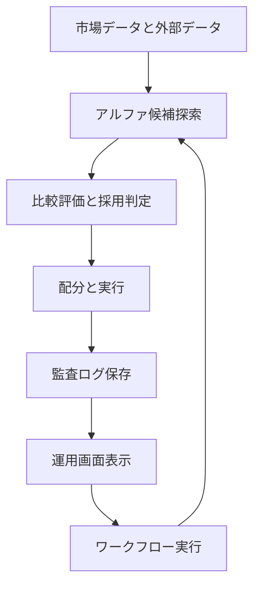

# investor

自律アルファ探索と検証と監査を一体で運用するための実装基盤です。  
最高品質の運用基準を前提に設計し、機能を明示し、再現可能な手順で実行できます。

## 公開サイト（GitHub Pages）

> **公式ダッシュボード URL**
>
> **https://kafka2306.github.io/investor/**

- GitHub Pages ベース URL: `https://kafka2306.github.io`
- 本リポジトリの公開パス: `/investor/`
- フル公開 URL: `https://kafka2306.github.io/investor/`
- リポジトリ URL: `https://github.com/KAFKA2306/investor`

`/` 直下ではなく、**`/investor/` が正規パス**です。

## 目的

- 新規アルファ候補を自律探索する
- 既存基準と比較して優位性を判定する
- 実行結果を監査可能な形で保存する
- 運用画面から探索ワークフローを直接実行する

## 全体像



## 機能

- 自律探索
  - `ts-agent/src/experiments/discover_alpha_factors.ts` で候補を生成
  - `bun run experiments:alpha-discovery` で実行
- 比較評価
  - `ts-agent/src/pipeline/evaluate/compare_daily_log_performance.ts` で比較
  - `bun run pipeline:ab` で実行
- 運用画面からワークフロー実行
  - `.agent/workflows/*.md` を一覧化
  - `newalphasearch` を含むワークフローを画面から実行
  - 実装: `ts-agent/src/providers/uqtl_event_api_server.ts`
- 時系列ビュー表示
  - `ts-agent/data/*_ts.csv` と `plot_*.png` を表示
  - `sbg_ts.csv` を必須ビューとして検査
  - 実装: `ts-agent/src/dashboard/src/main.ts`
- 監査ログ集約
  - `logs/daily` `logs/benchmarks` `logs/readiness` `logs/unified` を統合表示

## ディレクトリ

```text
.
├── .agent/workflows/             ワークフロー定義
├── docs/                         仕様と図
├── logs/                         実行ログ
├── ts-agent/
│   ├── data/                     時系列CSVと図
│   ├── src/agents/               探索ロジック
│   ├── src/experiments/          実験実行
│   ├── src/pipeline/             評価処理
│   ├── src/providers/            APIサーバと外部接続
│   └── src/dashboard/            運用画面
└── Taskfile.yml                  実行タスク
```

## 前提環境

- Bun
- Node.js
- Task

## セットアップ

```bash
task setup
```

環境変数は `ts-agent/.env` に設定します。

```env
JQUANTS_API_KEY=your_jquants_api_key
ESTAT_APP_ID=your_estat_app_id
VERIFY_TARGETS=jquants,estat
```

## 実行コマンド

```bash
task help
task check
task run
task run:newalphasearch
task view
```

- `task run:newalphasearch`
  - `.agent/workflows/newalphasearch.md` と同等の探索を実行
  - `experiments:alpha-discovery` と `pipeline:ab` を連続実行
- `task view`
  - APIサーバと運用画面を同時起動
  - API `http://127.0.0.1:8787`
  - 画面 `http://127.0.0.1:5173`

## 必須ビュー要件

運用画面では `sbg_ts.csv` を必須ビューとして扱います。  
該当ファイルまたは図が不足すると、画面に欠落警告が表示されます。

- 必須CSV: `ts-agent/data/sbg_ts.csv`
- 必須図: `ts-agent/data/plot_sbg_ts.png`
- 判定実装: `ts-agent/src/providers/uqtl_event_api_server.ts`
- 表示実装: `ts-agent/src/dashboard/src/main.ts`

## 時系列CSVの生成元

`*_ts.csv` の生成スクリプトは次です。

- `ts-agent/src/experiments/generate_standardized_alpha_timeseries.ts`
- 実行: `cd ts-agent && bun run experiments:alpha-timeseries`

補足:
- このスクリプトは標準モジュールとして動作し、銘柄固定ではありません
- 出力ファイル名は銘柄名から自動生成されます

## 監査とレビュー運用

レビューは次の順で実施します。

1. 観測
2. 解釈
3. 仮説
4. 前提
5. 制約
6. リスク
7. 次の一手
8. 判定

判定は `GO` `HOLD` `PIVOT` を使います。  
詳細は `docs/specs/project_review_prompt_kafka_full.md` を参照してください。
