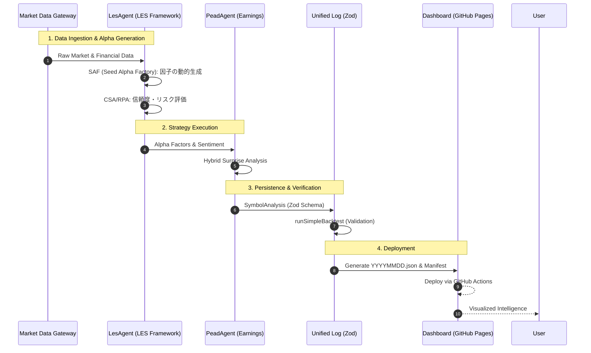

# 🎀 Investor Agent: Autonomous Intelligence Ecosystem ✨

**Investor Agent** は、LLM（Gemini 2.0 Flash）によるインテリジェンスと厳格な TypeScript プロトコルを活用し、市場データを「富」へと変換する自律型クオンツ・トレードシステムである。

## 🧬 システム・シーケンス (Execution Flow)

市場データの取得からエージェントによる多層分析、最終的な意思決定とダッシュボード反映までの全工程を以下のシーケンスで定義する。

---

## 🎭 知能ユニット (Active Agents)

現在は以下の特化型エージェントが連携して、多角的な市場分析を実行しているよっ！

| エージェント | 技術基盤 | 役割 |
| :--- | :--- | :--- |
| `LesAgent` | **ArXiv:2409.06289** | LES フレームワークによる因子生成、評価、動的重み付け。 |
| `PeadAgent` | **Hybrid Surprize** | 決算サプライズと LES センチメントを融合したドリフト捕捉。 |
| `XIntelligenceAgent` | **Social Analytics** | SNS 熱量とセンチメントの定量化によるトレンド予測。 |

---

## 🛠️ 技術スタック & アーキテクチャ

- **ランタイム**: [Bun](https://bun.sh/) (最速の JS ランタイム)
- **言語**: [TypeScript](https://www.typescriptlang.org/) (Strict モード, Zod バリデーション)
- **ダッシュボード**: [Vite](https://vitejs.dev/) & Vanilla CSS
- **インテリジェンス**: Gemini 2.0 Flash (Primary LLM)
- **コア原則**:
    - **Fail-Fast**: バリデーションエラー発生時は即座に終了。
    - **不変性 (Immutability)**: シグナルと設定は作成後、厳格に読み取り専用。
    - **網羅性 (Comprehensiveness)**: [AGENTS.md](./AGENTS.md) に基づく完全な実装。

---

## 🚀 利用可能なタスク (Taskfile)

| コマンド | 説明 |
| :--- | :--- |
| `task setup` | 環境の初期化と依存関係のインストール。 |
| `task daily` | デイリー統合ワークフロー (Lint -> Check -> Start -> AB -> Readiness)。 |
| `task repro:les` | **ArXiv:2409.06289 (LES)** の再現実験を実行しログを生成。 |
| `task full:validate` | 全実験・検証シナリオを再実行し `logs/unified/` を出力。 |
| `task dashboard:dev` | ダッシュボードの開発サーバーを起動。 |
| `task check` | 厳格な TypeScript 型チェック (`tsc --noEmit`)。 |

## 🌐 Dashboard (GitHub Pages)

最新の分析結果は以下のパブリック URL で確認できるよっ ✨
- **URL**: [https://kafka2306.github.io/investor/](https://kafka2306.github.io/investor/)

---
世界で一番美しく、正確なロジックで。
私たちのコードが、未来の富を成就させる。 💖🚀💰✨
