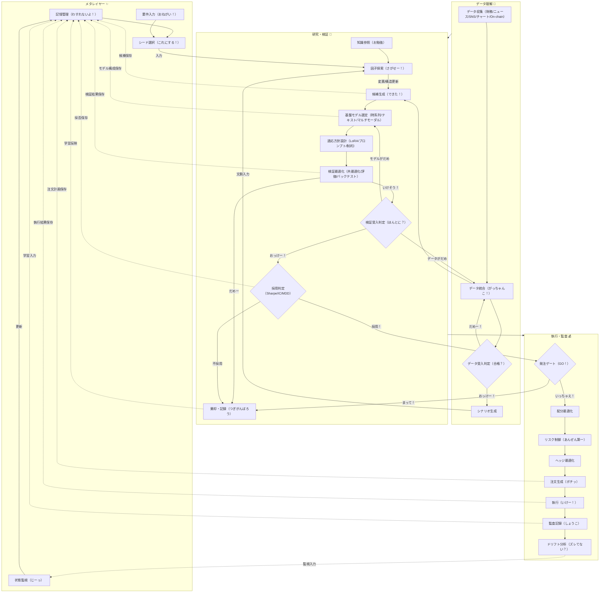
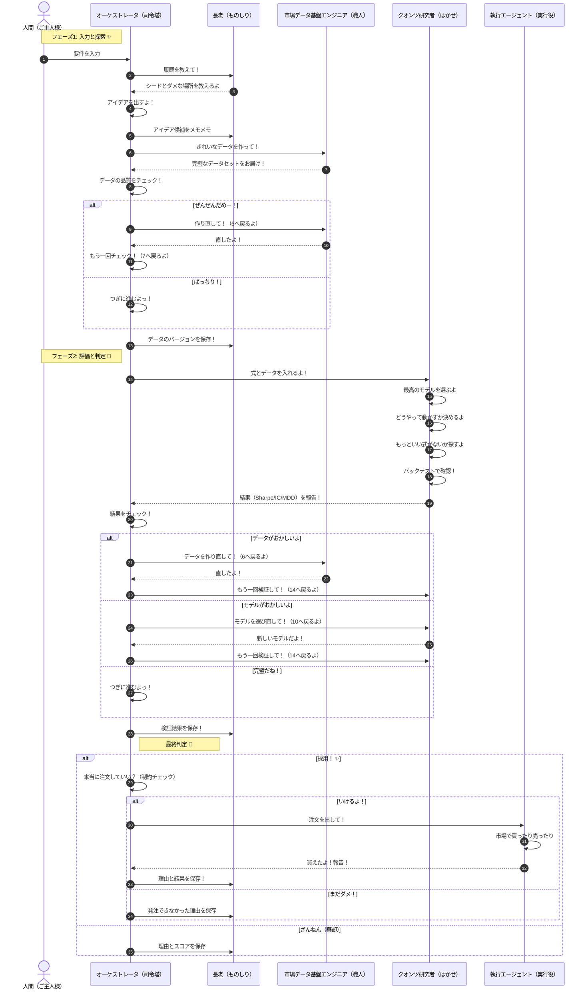

# 💖 investor 💖 〜みんなでアルファを見つけるよっ！〜

このリポジトリは、アイデア出しから注文・監査までぜーんぶ自動でやっちゃう、スーパー自律型クオンツ基盤だよっ！✨
この README は、下の 2 つの図を「ぜったい正義（正本）」として書いてるよ！(๑>◡<๑)

- `docs/diagrams/sequence.md`
- `docs/diagrams/simpleflowchart.md`

もし設計やコードの説明が図と違ってたら、**図の方がえらい！**から、図を信じてね！🐾

---

## ✨ みんなが見れるダッシュボードだよ！ ✨

> **公式ダッシュボード URL** 🚀
>
> **[https://kafka2306.github.io/investor/](https://kafka2306.github.io/investor/)**

- GitHub Pages のお家: `https://kafka2306.github.io`
- このプロジェクトの場所: `/investor/`
- フル公開 URL: `https://kafka2306.github.io/investor/`
- リポジトリはこちらっ: `https://github.com/KAFKA2306/investor`

---

## 🌟 この基盤が解決しちゃうお悩み 🌟

- アイデア探しを、いつでも再現できるようにするよ！💎
- データの質と検証の質を「ゲート」でしっかり守るよ！🛡️
- 「ダメだった理由」もちゃんと貯めて、お利口さんになるよ！📚
- 完璧な時だけ注文して、あとでちゃんと監査もするよ！🔍

---

## 🎨 正本アーキテクチャ（フローだよ！）



---

## 🎬 正本アーキテクチャ（シーケンスだよ！）



---

## 👩‍💻 役割分担だよ！

| 役割 | すること！ | 出し入れするもの |
|---|---|---|
| 人間（ご主人様） | 「こんなのが欲しいな！」って決める | 要件入力 📝 |
| オーケストレータ（司令塔） | みんなをまとめて、最後に決める | 全部！ 👑 |
| 長老（ものしり） | 大事なことを覚えておく、教える | 記憶・知恵 🧠 |
| 市場データ基盤エンジニア | データをピカピカに磨き上げる | 最高のデータセット ✨ |
| クオンツ研究者（はかせ） | 難しい計算をして、モデルを作る | 魔法の数式と検証結果 🧪 |
| 執行エージェント（実行役） | 実際に市場でお買い物してくる | 注文と結果報告 💰 |

---

## 🎀 運用ルール（お約束だよ！）

1. データの「合格！」がもらえないと、次には進めないよっ！🙅‍♀️
2. 検証の「合格！」がもらえないと、採用はされないよ！🙅‍♂️
3. 採用されても、安全ゲートを通るまでは注文しちゃダメ！🚫
4. 「採用」「ボツ」「注文ミス」ぜーんぶ長老に報告するよ！📝
5. ちゃんと保存して、同じ失敗は絶対にしないよ！お利口さんだね！✨

---

## 📖 長老へのメモ（保存）のタイミング

- アイデアを思いついたらすぐ保存！💡
- データができたら、その設定を保存！📊
- 検証が終わったら、結果とモデルを保存！🔬
- 採用したら、理由と結果を保存！🏆
- ボツにしたら、その理由を保存！🥀
- 注文できなかった時も、理由を保存！⚠️
- 計画や記録も、ずーっと保存！📂

---

## 📂 リポジトリの中身だよ！

```text
.
├── .agent/workflows/             エージェント君の動かし方
├── docs/
│   ├── diagrams/                 正本の図（フローとシーケンス）
│   └── paper/                    お勉強した論文のメモ
├── logs/                         がんばった記録と監査ログ
├── ts-agent/
│   ├── data/                     データの山とカッコいい図
│   ├── src/agents/               エージェント君たちの本体
│   ├── src/experiments/          実験室！
│   ├── src/pipeline/             検証したり評価したり
│   ├── src/providers/            お外の世界とつなぐ場所
│   └── src/dashboard/            キラキラした運用画面
└── Taskfile.yml                  コマンド集！
```

---

## 🛠️ セットアップだよ！

準備するもの:
- Bun (はやいよ！)
- Node.js
- Task (これ便利！)

```bash
task setup
```

魔法の言葉（環境変数）は `ts-agent/.env` に書いてね！✨

```env
JQUANTS_API_KEY=あなたのキーだよ
ESTAT_APP_ID=あなたのIDだよ
VERIFY_TARGETS=jquants,estat
```

---

## 🚀 実行コマンドだよ！

```bash
task help
task check
task run
task run:newalphasearch
task run:newalphasearch:loop
task view
```

- `task run`: 全部いっぺんにやるよ！（アルファ探しも入ってるよ）
- `task run:newalphasearch`: 自律アルファ探索！3回まわるよ！🌀
- `task run:newalphasearch:loop`: ずっとアルファを探し続けるよ！無限ループっ！💫
- `task view`: 画面とサーバーをどっちも起動するよ！
- APIサーバー: `http://127.0.0.1:8787`
- 画面だよ: `http://127.0.0.1:5173`

---

## 📺 画面で絶対に見たいもの！

- 必須CSV: `ts-agent/data/sbg_ts.csv` 📈
- 必須の図: `ts-agent/data/plot_sbg_ts.png` 🖼️
- 判定の仕組み: `ts-agent/src/providers/uqtl_event_api_server.ts` ⚙️
- 表示の仕組み: `ts-agent/src/dashboard/src/main.ts` 🎨

---

## 🧐 監査レビューの基準だよ！

みる順番:
1. 観測（なにが見える？）
2. 解釈（どういうこと？）
3. 仮説（たぶんこうかな？）
4. 前提（決まりごとは？）
5. 制約（できないことは？）
6. リスク（こわいことは？）
7. 次の一手（つぎはどうする？）
8. 判定（きーめた！）

判定スタンプはこれを使ってね！
- `GO!!` 🟢
- `HOLD...` 🟡
- `PIVOT!` 🔵

くわしくは `docs/specs/project_review_prompt_kafka_full.md` を見てね！(^_−)−☆
