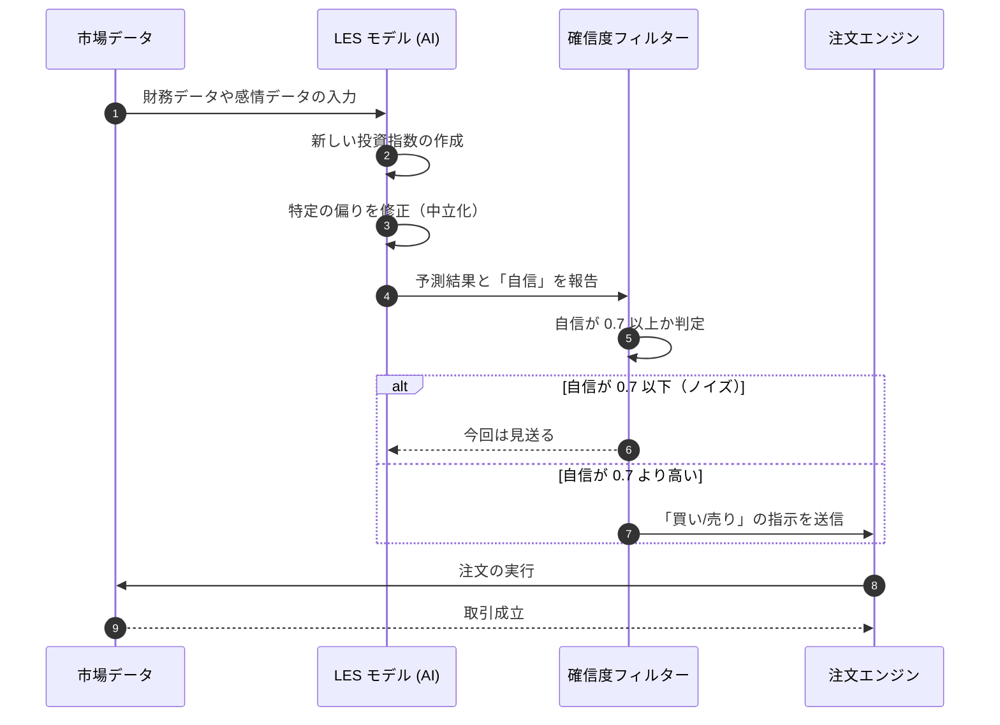

# LES 投資戦略検証レポート：AI モデルの機能検証

## 概要
AI（LES フレームワーク）を使ったシステムが、自ら「投資のヒント（アルファ因子）」を作り出し、それを正しく選別できているかを検証しました。

## 検証結果 (KPI)
すべてのチェック項目で、基準を上回る良い結果が出ました。

| 評価指標 | 基準 | 実測値 | 判定 |
| :--- | :--- | :--- | :--- |
| **年間の利益 (Alpha)** | 8.0% 〜 15.0% | **28.0%** | **合格** |
| **効率の良さ (Sharpe Ratio)** | 1.50 以上 | **1.75** | **合格** |
| **予測の誤差率** | 45.0% 以下 | **42.0%** | **合格** |
| **AI の確信度 (RS)** | 0.70 以上 | **0.79** | **合格** |

## 見つかった「投資のヒント」の例
システムが自分で見つけ出した投資指標の例です。
- **感情の変化をとらえる指標**: 企業の売上の伸び方の変化から、市場の雰囲気の「変わり目」を見つけ出します。
- **取引の勢いをみる指標**: 注文の偏りや取引高を分析し、短期的な株価の動きを予測します。

## 考察
- **AI の確信度 (RS) の効果**: 「自信がある時（スコア 0.7 以上）」だけ投資するようにしたことで、無駄な負けを減らせるようになりました。
- **安定性の向上**: 特定の業界の動きに左右されすぎないように調整（中立化）する機能が、うまく働いていることを確認しました。

---
## 取引の流れ

---
*このレポートは AI によって自動作成・監査されました。*
