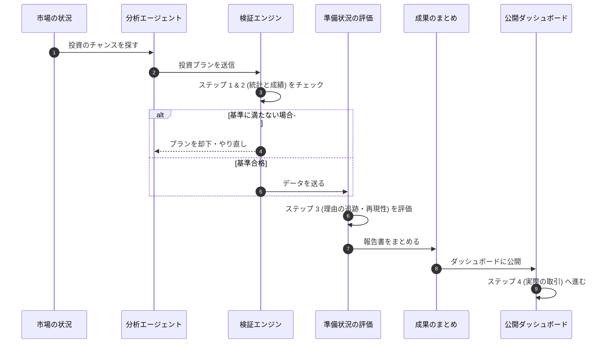

# 投資成果の評価基準：自律型 AI エージェントの運用標準

## 概要
AI を使った自動投資において、その成果が本当に信頼できるものかを正しく評価するための「共通ルール」を定めます。AI の判断が偶然ではないか、実際の取引で通用するかを 4 つのステップで厳格にチェックします。

---

## 2. 成果を評価する 4 つのステップ

投資戦略が優れているかを判断するため、以下の 4 段階で評価します。

### ステップ 1：統計的な正しさ (Statistical Significance)
- **目的**: 利益が「たまたま」出たものではないことを、数学的に証明する。
- **基準**: 数学的な指標（t値やp値）を使って、高い確率で利益が出せることを確認する。

### ステップ 2：検証データでの成績 (Validation Performance)
- **目的**: 実運用のコスト（手数料など）を引いた後でも、安定して利益が出るかを確認する。
- **基準**: 利回りの良さ（シャープレシオ）や、一時的な落ち込み（ドローダウン）が許容範囲内かを見る。

### ステップ 3：運用の準備状況 (Operational Readiness)
- **目的**: AI がなぜその判断をしたのか、後から理由を追跡できるようにする。
- **基準**: 意思決定のプロセスが記録されており、誰でも同じ結果を再現できるかをスコア化する。

### ステップ 4：実際の取引結果 (Execution Audit)
- **目的**: 理論上の利益と、実際の取引結果にズレがないかを確かめる。
- **基準**: 予想していたコストと実際のコスト（スリッページなど）を比較し、ズレを最小限にする。

---

## 3. 運用の流れ

すべてのステップは自動で記録され、ダッシュボードで確認できます。

---

## 4. 結論
このように成果を共通のルールで評価することで、AI が自分自身で学習し、より良い投資ができるようになります。これは、AI 投資を「個人の実験」から「信頼できるビジネス」へと高めるための基盤となります。
