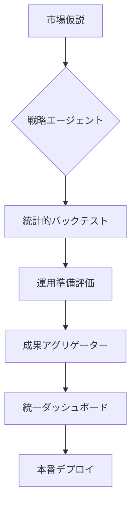

# 自律型LLMベース・クオンツ・エージェントにおける投資成果の標準化

**要約:**  
LLMベースの自律型投資エージェントの評価は、モデルの非決定性や市場のノイズにより困難を極める。本論文では、戦略固有のロジックから評価指標を分離する4層の「標準投資成果（Standardized Outcome）」フレームワークを提案する。 (1) アルファの統計的有意性、(2) バックテストの堅牢性、(3) 運用準備状況、(4) 執行忠実度、を定量化することで、AI駆動型クオンツ戦略の継続的な自己改善と監査を可能にする統一プロトコルを定義する。

---

## 1. 序論

従来のクオンツシステムは、バックテストによって検証された固定的なルールに基づいている。対して、自律型投資エージェントはLLMを活用し、推論や意思決定を非決定的に行う。このため、「成果（Result）」に標準的な定義が欠如していると、発見されたアルファが統計的に妥当か、運用上安全かという「Readiness（準備状況）」の判断が曖昧になる。

## 2. 4層の成果評価フレームワーク

我々は、Post-Earnings Announcement Drift（PEAD）や平均回帰など、異なる戦略間での結果を比較可能にするため、統一された `StandardOutcome` スキーマを提案する。

### Tier 1: アルファの有意性（統計的証明）
発見されたパターンが運ではないことを、統計学的に担保する。
- **t値 ($|t| > 2$):** リターンの平均がゼロから有意に離れていることを確認。
- **p値 ($p < 0.05$):** 純粋な偶然によって結果が生じる確率を定量化。

### Tier 2: 検証パフォーマンス（バックテスト品質）
手数料やスリッページを考慮した上で、エッジが存続しているかを確認する。
- **シャープレシオ ($\ge 1.0$):** リスク調整後リターンの基準。
- **最大ドローダウン ($\le 10\%$):** 資本保護の許容限界。

### Tier 3: 運用準備（システム成熟度）
再現性と観測可能性を0-100のスコアで評価する。
- **トレーサビリティ:** 全ての取引がLLMの推論とデータスナップショットまで遡及可能か。
- **再現性:** 同じ入力から同じ監査証跡を生成できるか。

### Tier 4: 執行監査（実効性の完全性）
ペーパートレードや本番環境の結果を理論値と比較する。
- **スリッページ影響:** 理論的なコストと実際の約定コストの比較。
- **トラッキングエラー:** 「戦略決定」と「最終約定」の間の乖離。

## 3. 実装: 自律型サイクル

本実装では、全てのステージが中央集中型のログストリームに出力される `UnifiedLogSchema` を採用している。「メタ戦略」シナリオは、各ステージの結果を集約し、単一の「投資成果レポート」を生成する。

### 3.2 Supported Forecasting Models (Foundation Models)

エージェントは以下の最新の時系列予測基盤モデルおよびアルファ生成フレームワークを `Model Registry` 経由で活用できる。

- **Chronos (Amazon)**: ユニバリエート（単変量）時系列データのゼロショット予測。
- **TimesFM (Google)**: Transformer ベースの事前学習済み時系列基盤モデル。
- **TimeRAF (Microsoft)**: 金融データに特化した RAG (Retrieval-Augmented) 型予測。
- **MOIRAI (Salesforce)**: あらゆる時系列データに対応可能な万能トランスフォーマー。
- **Lag-Llama**: Llama アーキテクチャを時系列に転用した確率的予測。
- **LES (ArXiv:2409.06289)**: LLM によるマルチエージェント型アルファ因子生成。

## 4. 結論

「成果」を戦略に依存しないインターフェースとして形式化することで、自律型エージェントが自らの性能を継続的に改善することが可能となった。このフレームワークは、アルファ発見の速度とシステムの成熟度の向上を比較可能にし、AI投資管理を場当たり的な実験から、厳格で監査可能なエンジニアリングの規律へと昇華させる。

---
*キーワード: 自律型エージェント, クオンツファイナンス, LLM, 運用準備状況, アルファ発見*
