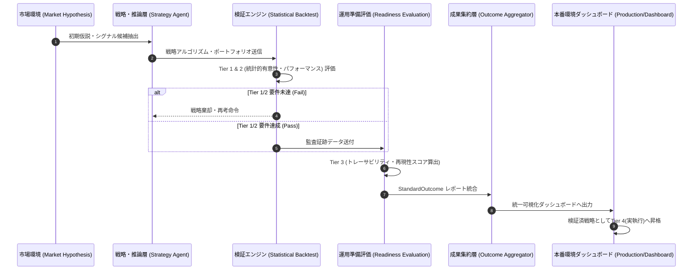

# 自律型LLMベース・クオンツ・エージェントにおける投資成果の標準化 (Standardization of Investment Outcomes)

## エグゼクティブ・サマリー (Executive Summary)
本ホワイトペーパーは、LLM（大規模言語モデル）をベースとした自律型投資エージェントのパフォーマンス評価に関する提言です。モデルの推論における非決定性や市場ノイズといった課題を克服するため、戦略固有のロジック評価から切り離された4段階（Tier）の「標準投資成果（Standardized Outcome）」フレームワークを導入し、AI主導のクオンツ戦略における自己改善・監査可能な統一プロトコルを定義します。

## 1. 序論・導入の背景 (Background & Introduction)
旧来のクオンツシステムは、静的ルールに基づくバックテスト検証に依存していました。一方、自律型投資エージェントはLLMの動的推論に依存するため、「成果（Result）」の定義を標準化・厳密化しなければ、発見されたアルファの統計的妥当性や運用に向けた「準備状況（Readiness）」の評価が曖昧となり、資本配分リスクの増大を招きます。

## 2. 4階層・成果評価フレームワーク (4-Tier Standardized Outcome Framework)
異なる投資戦略間での成果比較を可能とするため、一元化された `StandardOutcome` スキーマを提唱します。

- **Tier 1: アルファの有意性 (Statistical Significance of Alpha)**
  - 目的: 発見されたリターンが偶然の産物ではないことを統計学的に証明する。
  - 基本要件: t統計量（t-Stat: $|t| > 2$）、p値（$p < 0.05$）
- **Tier 2: 検証パフォーマンス (Validation Performance & Robustness)**
  - 目的: 実稼働環境での手数料・スリッページを織り込んだ上でのエッジの持続性を評価する。
  - 基本要件: リスク調整後収益（Sharpe Ratio: $\ge 1.0$）、最大ドローダウン制限（Max Drawdown: $\le 10\%$）
- **Tier 3: 運用準備・システム成熟度 (Operational Readiness & System Maturity)**
  - 目的: システムの監査可能性（0-100スコア）を定量化する。
  - 評価軸: 推論プロセスのトレーサビリティ（Traceability）、および同一入力からの監査証跡の再現性（Reproducibility）。
- **Tier 4: 執行監査 (Execution Audit & Fidelity)**
  - 目的: ペーパートレード・本番稼働での理論値と実力値の乖離を測定する。
  - 評価軸: 推定コスト vs. 実約定コスト（スリッページ影響）、および意思決定から約定までの時間・価格遅延（トラッキングエラー）。

## 3. 自律運用アーキテクチャ実装 (Autonomous Operational Architecture)
全ステージは単一の監査ストリームに統合され、`UnifiedLogSchema` に基づく「投資成果報告」として集約されます。

### 運用ライフサイクル・シーケンス (Operational Lifecycle Sequence)

### 予測基盤モデル (Supported Foundation Models)
エージェントは `Model Registry` を介し、先端の時系列予測・生成モデルの活用が可能です。
- **Chronos (Amazon)**、 **TimesFM (Google)**、 **TimeRAF (Microsoft)**、 **MOIRAI (Salesforce)**、 **Lag-Llama**、 **LES (ArXiv:2409.06289; マルチエージェント型)**

## 4. 結語 (Conclusion)
パフォーマンスの「成果」を戦略アーキテクチャ非依存のインターフェースとして形式化・統合することで、自律型エージェントの継続的なメタ学習と最適化が可能となります。本フレームワークは、AI投資運用業務を「実験的試行」から「厳格で監査・スケール可能なエンジニアリングプロセス」へと昇華させるためのプロトコル基盤として機能します。

---
*Key Terms: Autonomous Agents, Quantitative Finance, Foundation Models (LLM), Operational Readiness, Alpha Discovery*
