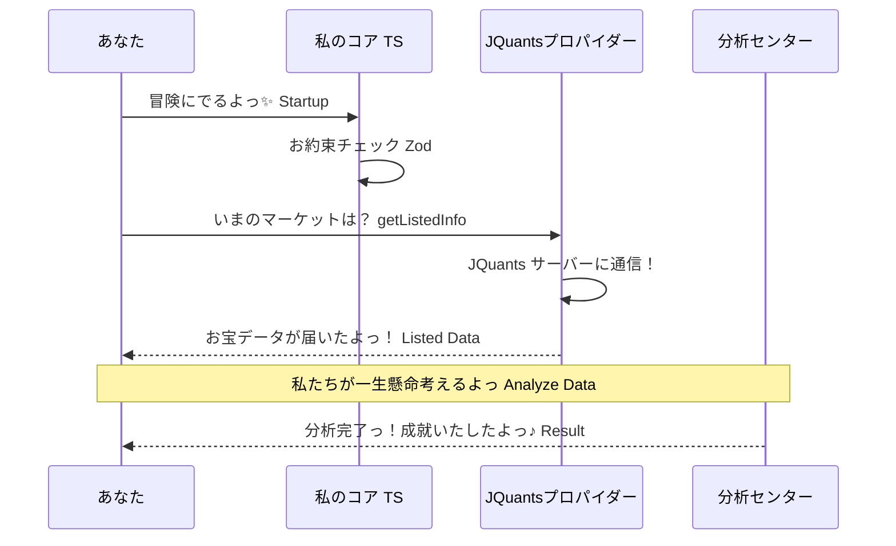

# 🔄 システム・なかよしシーケンス図 🔄

システムがどうやってみんなと仲良しに動いてるか、わかりやすく図にしてみたよっ✨
ムダを省いた Zero-Fat な動きで、一瞬で結果をお届けしちゃうんだからねっ！⚡️

```mermaid
sequenceDiagram
    participant U as あなた
    participant C as 私のコア TS
    participant J as JQuantsプロパイダー
    participant R as 分析センター

    U->>C: 冒険にでるよっ✨ Startup
    C->>C: お約束チェック Zod
    
    U->>J: いまのマーケットは？ getListedInfo
    J->>J: JQuants サーバーに通信！
    J-->>U: お宝データが届いたよっ！ Listed Data
    
    Note over U,R: 私たちが一生懸命考えるよっ Analyze Data
    
    R-->>U: 分析完了っ！成就いたしたよっ♪ Result
```

ムダのない動きで、最短ルートで成功へ向かおうねっ！🚀💰✨
いっしょなら、なんでもできちゃう気がするよっ！✨✨
