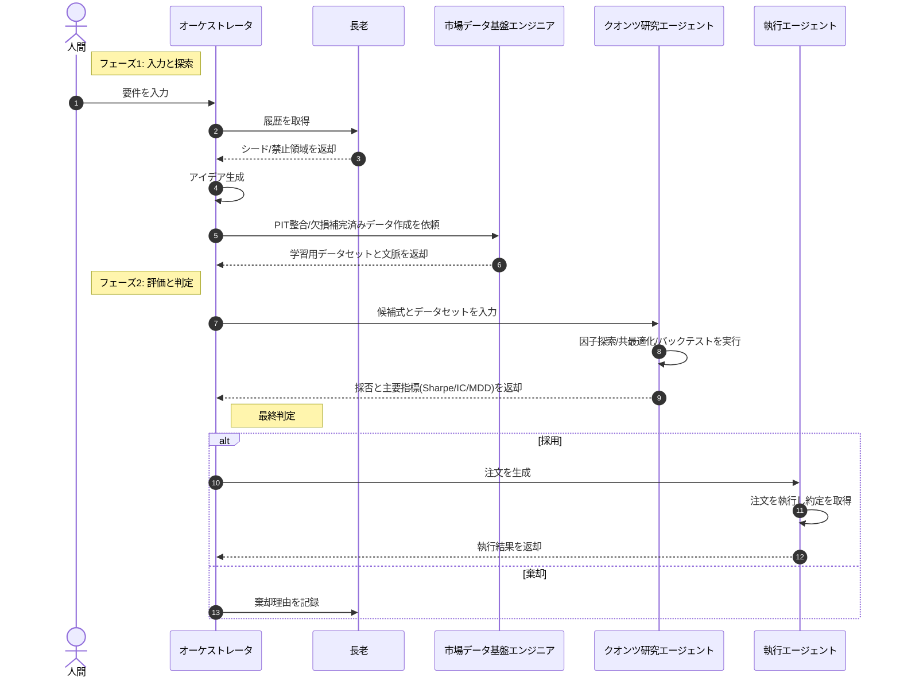

# 自律型クオンツ・ロジック・シーケンス

```mermaid
sequenceDiagram
    autonumber
    actor 人間 as 人間
    participant 統括 as オーケストレータ
    participant 記憶 as 長老
    participant データ as 市場データ基盤エンジニア
    participant 分析 as クオンツ研究エージェント
    participant 執行 as 執行エージェント

    Note left of 統括: フェーズ1: 入力と探索
    人間->>統括: 要件を入力
    統括->>記憶: 履歴を取得
    記憶-->>統括: シード/禁止領域を返却
    統括->>統括: アイデア生成
    統括->>データ: PIT整合/欠損補完済みデータ作成を依頼
    データ-->>統括: 学習用データセットと文脈を返却
    
    Note left of 統括: フェーズ2: 評価と判定
    統括->>分析: 候補式とデータセットを入力
    分析->>分析: 因子探索/共最適化/バックテストを実行
    分析-->>統括: 採否と主要指標(Sharpe/IC/MDD)を返却
    
    Note right of 統括: 最終判定
    
    alt 採用
        統括->>執行: 注文を生成
        執行->>執行: 注文を執行し約定を取得
        執行-->>統括: 執行結果を返却
    else 棄却
        統括->>記憶: 棄却理由を記録
    end
```
