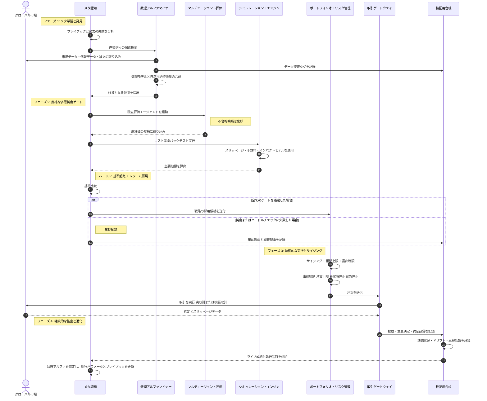

# 自律型クオンツ・ロジック・シーケンス

```mermaid
sequenceDiagram
    autonumber
    actor 市場 as グローバル市場
    participant メタ as メタ認知
    participant マイナー as 数理アルファマイナー
    participant 評価 as マルチエージェント評価
    participant シミュレータ as シミュレーション・エンジン
    participant リスク as ポートフォリオ・リスク管理
    participant 実行 as 取引ゲートウェイ
    participant 監査 as 検証用台帳

    Note left of メタ: フェーズ 1: メタ学習と発見
    メタ->>メタ: プレイブックと過去の失敗を分析
    メタ->>マイナー: 直交信号の探索指示
    マイナー->>市場: 市場データ・代替データ・論文の取り込み
    マイナー->>監査: データ監査タグを記録
    マイナー-->>マイナー: 数理モデルと自然言語特徴量の合成
    マイナー->>メタ: 候補となる仮説を提出

    Note left of メタ: フェーズ 2: 厳格な多層純度ゲート
    メタ->>評価: 独立評価エージェントを起動
    Note right of 評価: 不合格候補は棄却
    評価-->>メタ: 高評価の候補に絞り込み
    
    メタ->>シミュレータ: コスト考慮バックテスト実行
    シミュレータ->>シミュレータ: スリッページ・手数料・インパクトモデルを適用
    シミュレータ-->>メタ: 主要指標を算出
    
    Note right of メタ: ハードル: 基準超え + レジーム再現
    メタ->>メタ: 基準比較
    
    alt 全てのゲートを通過した場合
        メタ->>リスク: 戦略の採用候補を送付
    else 純度またはハードルチェックに失敗した場合
        Note right of メタ: 棄却記録
        メタ->>監査: 棄却理由と減衰理由を記録
    end

    Note left of リスク: フェーズ 3: 防御的な実行とサイジング
    リスク->>リスク: サイジング + 相関上限 + 露出制限
    リスク->>リスク: 事前統制 注文上限 異常時停止 緊急停止
    リスク->>実行: 注文を送信
    実行->>市場: 取引を実行 実取引または模擬取引
    市場-->>実行: 約定とスリッページデータ

    Note left of メタ: フェーズ 4: 継続的な監査と進化
    実行->>監査: 損益・意思決定・約定品質を記録
    監査->>監査: 準備状況・ドリフト・再現情報を計算
    監査-->>メタ: ライブ成績と執行品質を供給
    メタ->>メタ: 減衰アルファを剪定し、執行パラメータとプレイブックを更新
```
