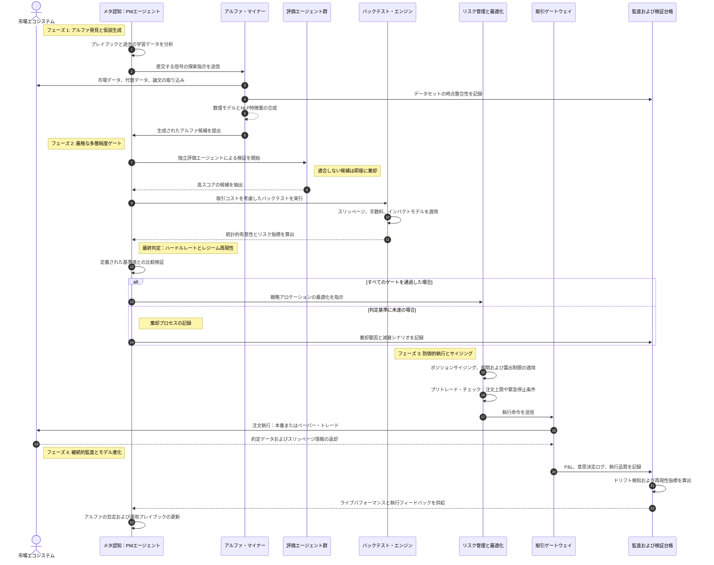

# 自律型クオンツ・ロジック・シーケンス

```mermaid
sequenceDiagram
    autonumber
    actor 市場 as 市場エコシステム
    participant メタ as メタ認知：PMエージェント
    participant マイナー as アルファ・マイナー
    participant 評価 as 評価エージェント群
    participant シミュレータ as バックテスト・エンジン
    participant リスク as リスク管理と最適化
    participant 執行 as 取引ゲートウェイ
    participant 監査 as 監査および検証台帳

    Note left of メタ: フェーズ 1: アルファ発見と仮説生成
    メタ->>メタ: プレイブックと過去の学習データを分析
    メタ->>マイナー: 直交する信号の探索指示を送信
    マイナー->>市場: 市場データ、代替データ、論文の取り込み
    マイナー->>監査: データセットの時点整合性を記録
    マイナー-->>マイナー: 数理モデルとNLP特徴量の合成
    マイナー->>メタ: 生成されたアルファ候補を提出

    Note left of メタ: フェーズ 2: 厳格な多層純度ゲート
    メタ->>評価: 独立評価エージェントによる検証を開始
    Note right of 評価: 適合しない候補は即座に棄却
    評価-->>メタ: 高スコアの候補を抽出
    
    メタ->>シミュレータ: 取引コストを考慮したバックテストを実行
    シミュレータ->>シミュレータ: スリッページ、手数料、インパクトモデルを適用
    シミュレータ-->>メタ: 統計的有意性とリスク指標を算出
    
    Note right of メタ: 最終判定：ハードルレートとレジーム再現性
    メタ->>メタ: 定義された基準値との比較検証
    
    alt すべてのゲートを通過した場合
        メタ->>リスク: 戦略アロケーションの最適化を指示
    else 判定基準に未達の場合
        Note right of メタ: 棄却プロセスの記録
        メタ->>監査: 棄却要因と減衰シナリオを記録
    end

    Note left of リスク: フェーズ 3: 防御的執行とサイジング
    リスク->>リスク: ポジションサイジング、相関および露出制限の適用
    リスク->>リスク: プリトレード・チェック：注文上限や緊急停止条件
    リスク->>執行: 執行命令を送信
    執行->>市場: 注文執行：本番またはペーパー・トレード
    市場-->>執行: 約定データおよびスリッページ情報の返却

    Note left of メタ: フェーズ 4: 継続的監査とモデル進化
    執行->>監査: P&L、意思決定ログ、執行品質を記録
    監査->>監査: ドリフト検知および再現性指標を算出
    監査-->>メタ: ライブパフォーマンスと執行フィードバックを供給
    メタ->>メタ: アルファの剪定および運用プレイブックの更新
```
