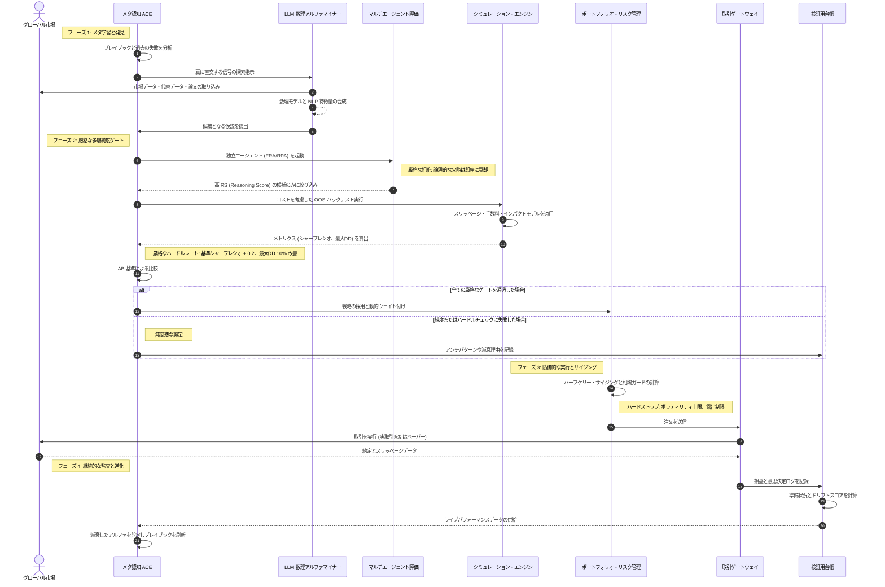

# 自律型クオンツ・ロジック・シーケンス

```mermaid
sequenceDiagram
    autonumber
    actor 市場 as グローバル市場
    participant メタ as メタ認知 ACE
    participant マイナー as LLM 数理アルファマイナー
    participant 評価 as マルチエージェント評価
    participant シミュレータ as シミュレーション・エンジン
    participant リスク as ポートフォリオ・リスク管理
    participant 実行 as 取引ゲートウェイ
    participant 監査 as 検証用台帳

    Note left of メタ: フェーズ 1: メタ学習と発見
    メタ->>メタ: プレイブックと過去の失敗を分析
    メタ->>マイナー: 真に直交する信号の探索指示
    マイナー->>市場: 市場データ・代替データ・論文の取り込み
    マイナー-->>マイナー: 数理モデルと NLP 特徴量の合成
    マイナー->>メタ: 候補となる仮説を提出

    Note left of メタ: フェーズ 2: 厳格な多層純度ゲート
    メタ->>評価: 独立エージェント (FRA/RPA) を起動
    Note right of 評価: 厳格な拒絶: 論理的な欠陥は即座に棄却
    評価-->>メタ: 高 RS (Reasoning Score) の候補のみに絞り込み
    
    メタ->>シミュレータ: コストを考慮した OOS バックテスト実行
    シミュレータ->>シミュレータ: スリッページ・手数料・インパクトモデルを適用
    シミュレータ-->>メタ: メトリクス (シャープレシオ、最大DD) を算出
    
    Note right of メタ: 厳格なハードルレート: 基準シャープレシオ + 0.2、最大DD 10% 改善
    メタ->>メタ: AB 基準による比較
    
    alt 全ての厳格なゲートを通過した場合
        メタ->>リスク: 戦略の採用と動的ウェイト付け
    else 純度またはハードルチェックに失敗した場合
        Note right of メタ: 無慈悲な剪定
        メタ->>監査: アンチパターンや減衰理由を記録
    end

    Note left of リスク: フェーズ 3: 防御的な実行とサイジング
    リスク->>リスク: ハーフケリー・サイジングと相場ガードの計算
    Note right of リスク: ハードストップ: ボラティリティ上限、露出制限
    リスク->>実行: 注文を送信
    実行->>市場: 取引を実行 (実取引またはペーパー)
    市場-->>実行: 約定とスリッページデータ

    Note left of メタ: フェーズ 4: 継続的な監査と進化
    実行->>監査: 損益と意思決定ログを記録
    監査->>監査: 準備状況とドリフトスコアを計算
    監査-->>メタ: ライブパフォーマンスデータの供給
    メタ->>メタ: 減衰したアルファを剪定しプレイブックを刷新
```
