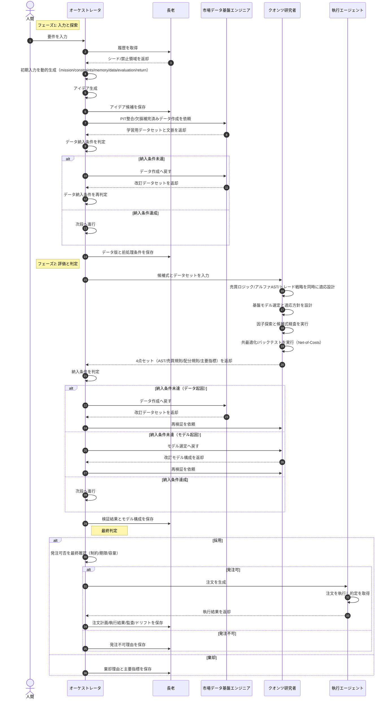

# 自律型クオンツ・ロジック・シーケンス（理想）

本図は現行実装の制約ではなく、到達目標となる理想アーキテクチャを記述する。

## アイデア
1. 要件と履歴を先にそろえて、探索の無駄を減らす。
2. アイデア候補は早い段階で保存し、再利用可能にする。
3. データ作成条件を保存し、検証の再現性を確保する。
4. クオンツ研究者は売買ロジック、アルファ、トレード戦略を同時に適応設計する。
5. 採否だけでなく理由と指標を保存し、次回探索に反映する。

## 不足面（理想達成に向けた必須明記）
1. 市場状態の定義粒度（レジーム遷移条件、閾値、更新頻度）が未定義。
2. 売買ロジックの制約（保有上限、回転率上限、流動性制約）が未定義。
3. 検証設計（学習/検証/前向き期間の分割規則、再現手順）が未定義。
4. 執行品質指標（約定率、実績スリッページ、執行遅延許容）が未定義。
