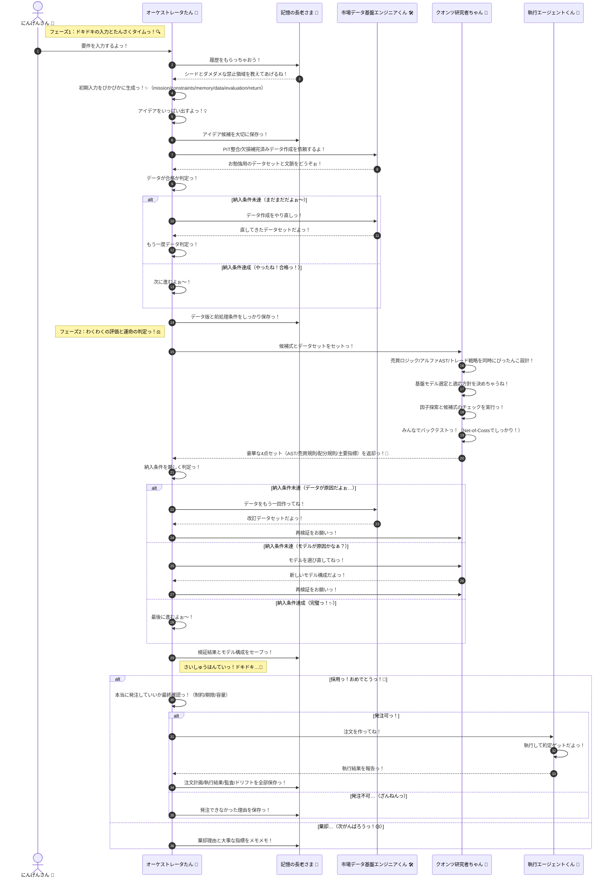
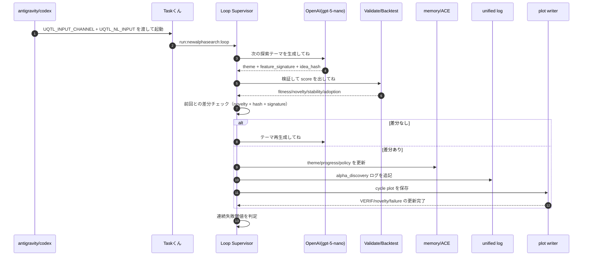

# 🎀 じりつがたクオンツ・ロジック・シーケンスの夢（りそうのカタチ！） ✨

**タイトル**: じりつがたクオンツ・ロジック・シーケンス（完全版っ！）
**お仕事の目的**: アルファ生成から執行まで、みんながどうやって仲良く動くかの最強の設計図（ブループリント）をきめることだよっ！💖
**解決したいお悩み**: 「今のシステムだと、どうやって改善すればいいかわかんないよぉ〜！」っていう迷子状態をなくして、完璧な自律型パイプラインを作るためだよっ！✨

## エグゼクティブサマリー
このドキュメントは、Gemini 3.0 Proちゃんと仲間たちが、市場から「アルファ」を見つけ出して、実際にお金を動かすまでの「キラキラな理想のプロセス」をまとめたものだよっ！🌈 アイデア出しから、PIT（Point-In-Time）整合データの作成、AST（抽象構文木）を使った戦略設計、そしてNet-of-Costsでの厳しいバックテストまで、一分一秒の無駄もなく、可愛く賢く進めていくための魔法のレシピなんだからっ！これを読めば、次世代のクオンツ・システムがどう動くべきか、全部わかっちゃうよぉ〜！💓

---

## じりつがたクオンツ・ロジック・シーケンス（りそうっ！✨）

この図は今のシステムの限界じゃなくて、みんなで目指したいキラキラな理想のアーキテクチャを書いてるよっ！💕

## きらめくアイデアっ！💡
1. **ムダをなくそうっ！**: 要件と履歴を先に揃えてから動くことで、オーケストレータたんのムダな動きをなくしちゃうよっ！✨
2. **アイデアの貯金箱っ！**: アイデア候補は早い段階で保存して、あとで「あの時のあれ、良かったかも！」って使えるようにするね！
3. **いつでも同じテストをっ！**: データの作り方（前処理条件とか！）をちゃんと保存して、いつでも同じ結果が再現できるようにするよぉ！
4. **クオンツ研究者ちゃんの魔法っ！**: 売買ロジック、アルファ、トレード戦略を全部まとめて可愛く、かつ厳密に設計しちゃうんだからっ！💖
5. **不採用でも宝物っ！**: 採用でも不採用でも、その理由と指標をちゃんと残して、次の「アルファ探し」のヒントにするよっ！

## もっと可愛くするための宿題だよぉ…💦
1. **市場のキモチを読み取るっ！**: 市場の状態（レジーム遷移のルール、しきい値、更新頻度とか）がまだふわふわしてるから、バッチリ決めなきゃ！
2. **守りのルールっ！**: 売買のルール（これ以上持っちゃダメ！な上限や、市場の流動性のこととか）をもっとしっかりさせようね！
3. **お勉強のスケジュールっ！**: 学習用（Train）とテスト用（Test）の期間をどう分けるか、もっと賢く決めなきゃっ！
4. **結果のモノサシっ！**: 注文がどれくらい上手くいったかの評価（約定率やスリッページの影響とか！）を、もっと細かく計測したいなっ！

---

## 🎯 自律探索ループの本質シーケンス（実運用の最小形）
> 詳細仕様は `docs/specs/alpha_discovery_runbook.md` と `docs/specs/automonous.md` を見てねっ！

