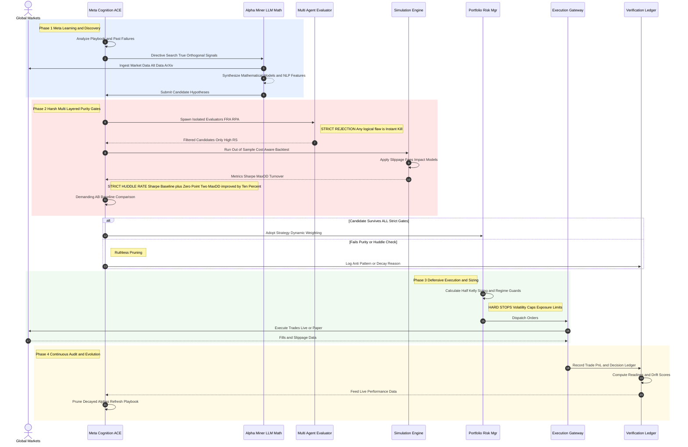

# Autonomous Quant Logic Sequence

```mermaid
sequenceDiagram
    autonumber
    actor Market as Global Markets
    participant Meta as Meta Cognition ACE
    participant Miner as Alpha Miner LLM Math
    participant Eval as Multi Agent Evaluator
    participant Backtest as Simulation Engine
    participant Risk as Portfolio Risk Mgr
    participant Exec as Execution Gateway
    participant Audit as Verification Ledger

    rect rgb(230, 240, 255)
        Note left of Meta: Phase 1 Meta Learning and Discovery
        Meta->>Meta: Analyze Playbook and Past Failures
        Meta->>Miner: Directive Search True Orthogonal Signals
        Miner->>Market: Ingest Market Data Alt Data ArXiv
        Miner-->>Miner: Synthesize Mathematical Models and NLP Features
        Miner->>Meta: Submit Candidate Hypotheses
    end

    rect rgb(255, 230, 230)
        Note left of Meta: Phase 2 Harsh Multi Layered Purity Gates
        Meta->>Eval: Spawn Isolated Evaluators FRA RPA
        Note right of Eval: STRICT REJECTION Any logical flaw is Instant Kill
        Eval-->>Meta: Filtered Candidates Only High RS
        
        Meta->>Backtest: Run Out of Sample Cost Aware Backtest
        Backtest->>Backtest: Apply Slippage Fees Impact Models
        Backtest-->>Meta: Metrics Sharpe MaxDD Turnover
        
        Note right of Meta: STRICT HUDDLE RATE Sharpe Baseline plus Zero Point Two MaxDD improved by Ten Percent
        Meta->>Meta: Demanding AB Baseline Comparison
    end
    
    alt Candidate Survives ALL Strict Gates
        Meta->>Risk: Adopt Strategy Dynamic Weighting
    else Fails Purity or Huddle Check
        Note right of Meta: Ruthless Pruning
        Meta->>Audit: Log Anti Pattern or Decay Reason
    end

    rect rgb(240, 250, 240)
        Note left of Risk: Phase 3 Defensive Execution and Sizing
        Risk->>Risk: Calculate Half Kelly Sizing and Regime Guards
        Note right of Risk: HARD STOPS Volatility Caps Exposure Limits
        Risk->>Exec: Dispatch Orders
        Exec->>Market: Execute Trades Live or Paper
        Market-->>Exec: Fills and Slippage Data
    end

    rect rgb(255, 250, 230)
        Note left of Meta: Phase 4 Continuous Audit and Evolution
        Exec->>Audit: Record Trade PnL and Decision Ledger
        Audit->>Audit: Compute Readines and Drift Scores
        Audit-->>Meta: Feed Live Performance Data
        Meta->>Meta: Prune Decayed Alphas Refresh Playbook
    end
```
