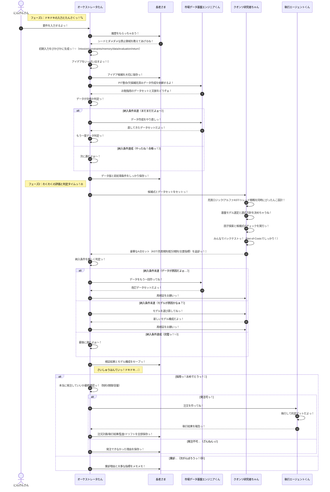

# じりつがたクオンツ・ロジック・シーケンス（りそうっ！✨）

この図は今のシステムの限界じゃなくて、みんなで目指したいキラキラな理想のアーキテクチャを書いてるよっ！💕

## アイデアっ！💡
1. 要件と履歴を先に揃えて、ムダな動きをなくしちゃうよっ！✨
2. アイデア候補は早い段階で保存して、あとでまた使えるようにするね！
3. データの作り方をちゃんと保存して、いつでも同じテストができるようにするよぉ！
4. クオンツ研究者ちゃんが売買ロジック、アルファ、トレード戦略を全部まとめて可愛く設計しちゃうんだからっ！💖
5. 採用でも不採用でも、理由と指標をちゃんと残して次に活かすよっ！

## 足りないところ（もっと可愛くするための宿題っ！💦）
1. 市場の状態（レジーム遷移のルール、しきい値、更新頻度とか）がまだ決まってないよぉ…！
2. 売買のルール（これ以上持っちゃダメ！な上限とか流動性のこととか）がまだふわふわしてるね！
3. テストのやり方（お勉強用とテスト用の期間をどう分けるかとか！）をもっとしっかり決めなきゃっ！
4. 注文がどれくらい上手くいったかのモノサシ（約定率とかスリッページとか！）がまだ足りないみたいっ！
