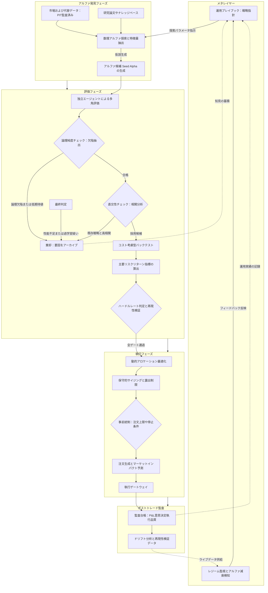

# 自律型クオンツアルファ生成パイプライン

```mermaid
flowchart TD
    subgraph メタレイヤー
        運用プレイブック["運用プレイブック：戦略指針"]
        監視["レジーム監視とアルファ減衰検知"]
        監視 --> |フィードバック反映| 運用プレイブック
    end

    subgraph アルファ発見フェーズ
        データソース["市場および代替データ：PIT監査済み"] --> 探索["数理アルファ探索と特徴量抽出"]
        論文["研究論文やナレッジベース"] --> 探索
        探索 --> |仮説生成| 候補案["アルファ候補 Seed Alpha の生成"]
        運用プレイブック --> |探索パラメータ指示| 探索
    end

    subgraph 評価フェーズ
        候補案 --> 独立評価["独立エージェントによる多角評価"]
        
        独立評価 --> 論理判定{"論理純度チェック：欠陥抽出"}
        論理判定 -- "論理欠陥または低期待値" --> 棄却["棄却：要因をアーカイブ"]
        
        論理判定 -- "合格" --> 直交判定{"直交性チェック：相関分析"}
        直交判定 -- "既存戦略と高相関" --> 棄却
        
        直交判定 -- "採用候補" --> バックテスト["コスト考慮型バックテスト"]
        バックテスト --> 指標算出["主要リスクリターン指標の算出"]
        
        指標算出 --> 採用判定{"ハードルレート判定と再現性検証"}
        最終判定 -- "性能不足または過学習疑い" --> 棄却
        
        棄却 -.-> |知見の蓄積| 運用プレイブック
    end

    subgraph 執行フェーズ
        採用判定 -- "全ゲート通過" --> アロケーション["動的アロケーション最適化"]
        アロケーション --> リスク統制["保守的サイジングと露出制限"]
        リスク統制 --> プリトレード{"事前統制：注文上限や停止条件"}
        プリトレード --> 注文生成["注文生成とマーケットインパクト予測"]
        注文生成 --> 取引ゲートウェイ["執行ゲートウェイ"]
    end

    subgraph ポストトレード監査
        取引ゲートウェイ --> 監査台帳["監査台帳：P&L意思決定執行品質"]
        監査台帳 --> 分析レポート["ドリフト分析と再現性検証データ"]
        分析レポート -.-> |ライブデータ供給| 監視
        監査台帳 -.-> |運用実績の記録| 運用プレイブック
    end

    アルファ発見フェーズ --> 評価フェーズ
    評価フェーズ --> 執行フェーズ
    執行フェーズ --> ポストトレード監査
```
