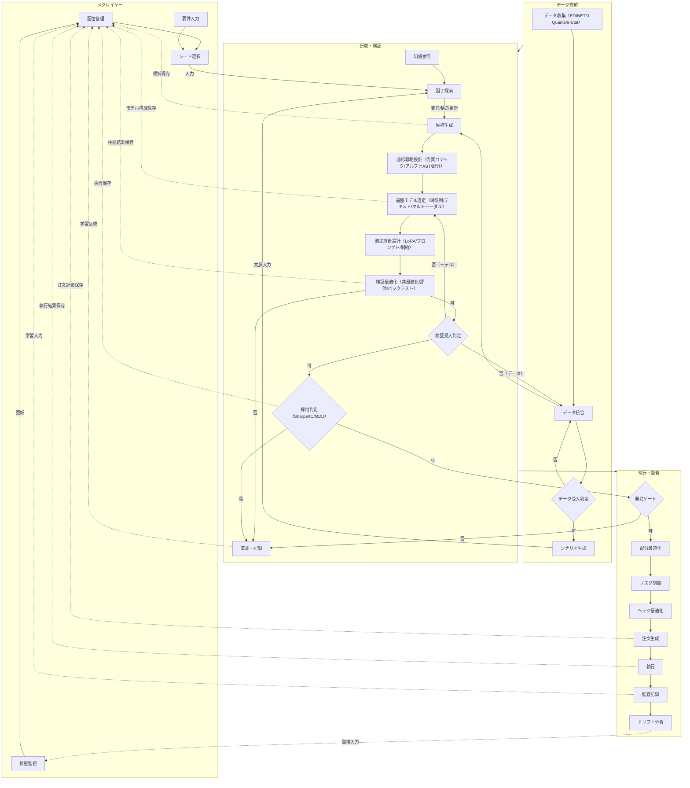

# 自律型クオンツアルファ生成パイプライン（理想）

本図は現行実装ではなく、到達目標となる理想フローを記述する。

## アイデア
1. 記憶管理を起点にして、探索・検証・執行を循環させる。
2. 発見フェーズで候補を保存し、探索の連続性を確保する。
3. 検証前に売買ロジック、アルファ、配分の同時設計を明示する。
4. 検証結果と採否を保存し、判断基準を蓄積する。
5. 注文計画と執行結果を保存し、運用改善に接続する。

## 不足面（理想達成に向けた必須明記）
1. データ受入判定の閾値定義（欠損率、遅延、リーク検知）が未定義。
2. 検証受入判定の数値基準（Sharpe/IC/MDD/コスト後収益）が未定義。
3. 配分最適化の制約（銘柄集中、セクター偏り、売買代金制約）が未定義。
4. ドリフト分析の再学習トリガー（再探索開始条件）が未定義。
