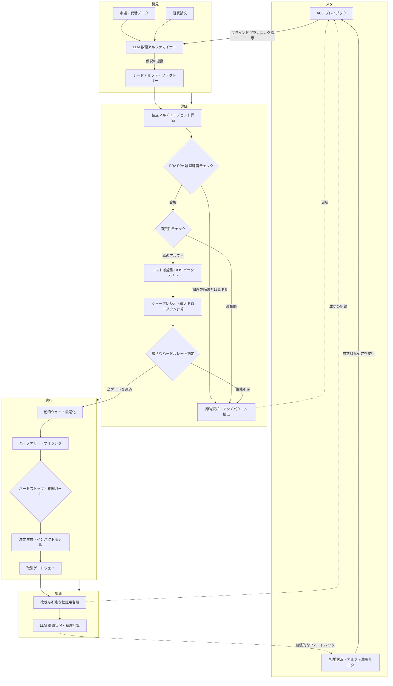

# 高度自律型クオンツ・ワークフロー

```mermaid
flowchart TD
    subgraph メタ
        ACEPlaybook["ACE プレイブック"]
        Monitor["相場状況・アルファ減衰モニタ"]
        Monitor --> |無慈悲な剪定を実行| ACEPlaybook
    end

    subgraph 発見
        MarketData["市場・代替データ"] --> Miner["LLM 数理アルファマイナー"]
        ArXiv["研究論文"] --> Miner
        Miner --> |仮説の提案| SAF["シードアルファ・ファクトリー"]
        ACEPlaybook --> |ブラインドプランニング指示| Miner
    end

    subgraph 評価
        SAF --> ISOEval["独立マルチエージェント評価"]
        
        ISOEval --> LogicGate{"FRA RPA 論理純度チェック"}
        LogicGate -- "論理欠陥または低 RS" --> RejectLogic["即時棄却・アンチパターン抽出"]
        
        LogicGate -- "合格" --> OrthoCheck{"直交性チェック"}
        OrthoCheck -- "高相関" --> RejectLogic
        
        OrthoCheck -- "真のアルファ" --> Backtest["コスト考慮型 OOS バックテスト"]
        Backtest --> Metrics["シャープレシオ・最大ドローダウン計算"]
        
        Metrics --> HuddleGate{"厳格なハードルレート判定"}
        HuddleGate -- "性能不足" --> RejectLogic
        
        RejectLogic -.-> |更新| ACEPlaybook
    end

    subgraph 実行
        HuddleGate -- "全ゲートを通過" --> DWA["動的ウェイト最適化"]
        DWA --> Risk["ハーフケリー・サイジング"]
        Risk --> HardStops{"ハードストップ・相関ガード"}
        HardStops --> OrderGen["注文生成・インパクトモデル"]
        OrderGen --> Gateway["取引ゲートウェイ"]
    end

    subgraph 監査
        Gateway --> Ledger["改ざん不能な検証用台帳"]
        Ledger --> Score["LLM 準備状況・精度計算"]
        Score -.-> |継続的なフィードバック| Monitor
        Ledger -.-> |成功の記録| ACEPlaybook
    end

    発見 --> 評価
    評価 --> 実行
    実行 --> 監査
```
