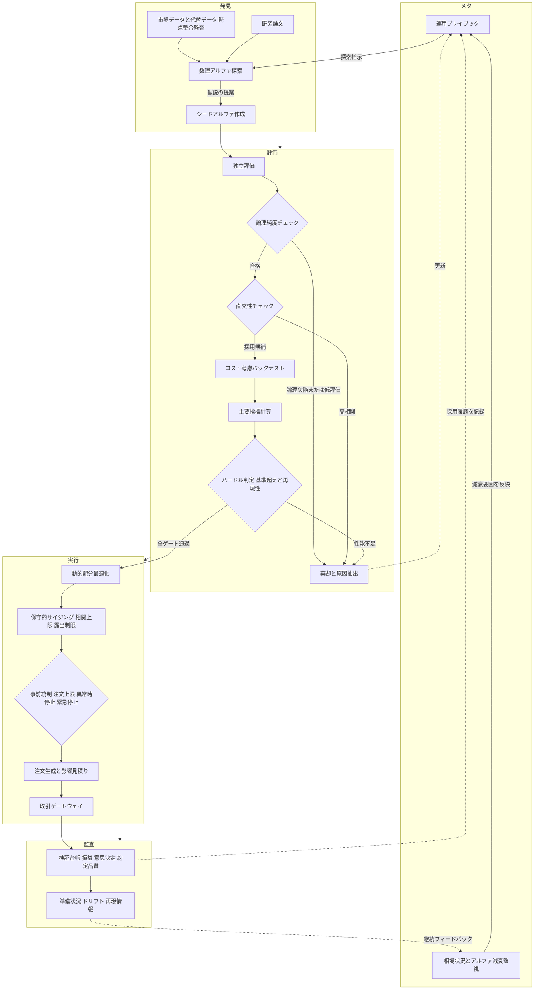

# 高度自律型クオンツ・ワークフロー

```mermaid
flowchart TD
    subgraph メタ
        運用帳["運用プレイブック"]
        監視["相場状況とアルファ減衰監視"]
        監視 --> |減衰要因を反映| 運用帳
    end

    subgraph 発見
        市場資料["市場データと代替データ 時点整合監査"] --> 探索["数理アルファ探索"]
        論文["研究論文"] --> 探索
        探索 --> |仮説の提案| 種作成["シードアルファ作成"]
        運用帳 --> |探索指示| 探索
    end

    subgraph 評価
        種作成 --> 独立判定["独立評価"]
        
        独立判定 --> 論理判定{"論理純度チェック"}
        論理判定 -- "論理欠陥または低評価" --> 棄却["棄却と原因抽出"]
        
        論理判定 -- "合格" --> 直交判定{"直交性チェック"}
        直交判定 -- "高相関" --> 棄却
        
        直交判定 -- "採用候補" --> 検証試験["コスト考慮バックテスト"]
        検証試験 --> 指標["主要指標計算"]
        
        指標 --> 採用判定{"ハードル判定 基準超えと再現性"}
        採用判定 -- "性能不足" --> 棄却
        
        棄却 -.-> |更新| 運用帳
    end

    subgraph 実行
        採用判定 -- "全ゲート通過" --> 配分["動的配分最適化"]
        配分 --> 統制["保守的サイジング 相関上限 露出制限"]
        統制 --> 停止判定{"事前統制 注文上限 異常時停止 緊急停止"}
        停止判定 --> 発注生成["注文生成と影響見積り"]
        発注生成 --> 発注窓口["取引ゲートウェイ"]
    end

    subgraph 監査
        発注窓口 --> 台帳["検証台帳 損益 意思決定 約定品質"]
        台帳 --> 評価結果["準備状況 ドリフト 再現情報"]
        評価結果 -.-> |継続フィードバック| 監視
        台帳 -.-> |採用履歴を記録| 運用帳
    end

    発見 --> 評価
    評価 --> 実行
    実行 --> 監査
```
