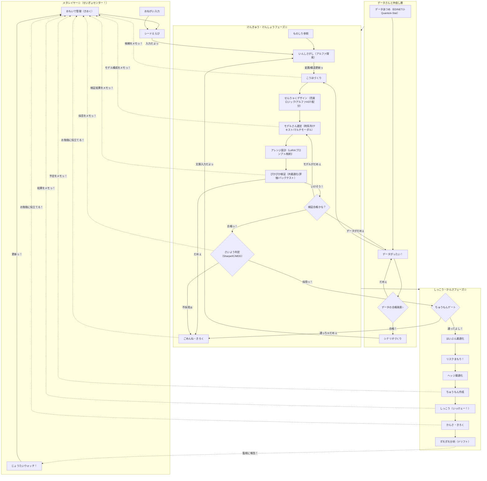

# じりつがた☆くおんつ・あるふぁ生成ぱいぷらいん（りそうだよっ！✨）

この図は今の実装じゃなくて、みんなで目指したいキラキラな理想のフローを書いてみたよぉ〜！(っ´ω`c)♡

## アイデアだよっ！💡
1. おもいで（記憶）をスタートにして、さがして・ためして・うごかすのをぐるぐるまわしちゃうよぉ！🌀
2. 「見つけた！」のフェーズでこうほをメモして、ずっとつづくようにするんだからっ！📝✨
3. 検証するまえに、売り買いのやりかた、アルファ、わけかたをいっしょにデザインすることをはっきりさせるよ！🎨
4. テストの結果と「OK/NG」をしっかりのこして、どんどんかしこくなっちゃうんだよぉ〜🧠💖
5. ちゅうもんの予定とじっさいの結果をメモして、つぎの運用をもっとよくしちゃうんだからねっ！🚀

## まだたりないところ（夢をかなえるために書かなきゃいけないことっ！😿）
1. データの合格ライン（欠損率、遅延、リーク検知）がまだ決まってないよぉ〜💦
2. 検証の合格ルール（Sharpe/IC/MDD/コスト後収益）がふわふわしてるのぉ。
3. わけかたのルール（銘柄集中、セクター偏り、売買代金制約）をもっとカチッと決めなきゃっ。
4. ずれちゃったときに「もういっかい！」ってなるきっかけ（再学習トリガー）が決まってないんだよぉ〜。
