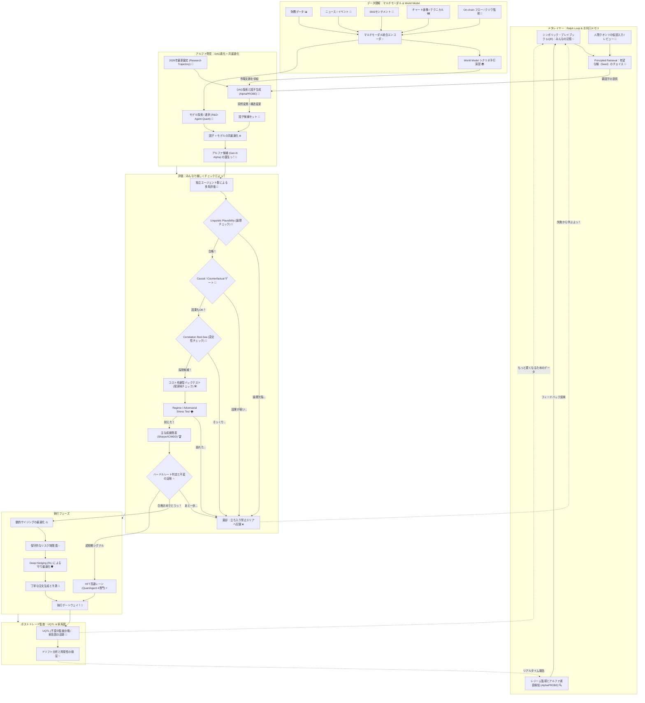

# 🎀 自律型クオンツアルファ生成パイプライン (Gen 4: Infinity Architecture) ✨

```mermaid
flowchart TD
    subgraph メタレイヤー [メタレイヤー：Ralph Loop & お利口メモリ]
        運用プレイブック["シンボリック・プレイブック (LQR)：みんなの記憶 ✨"]
        監視["レジーム監視とアルファ減衰検知 (AlphaPROBE) 🔍"]
        人間仮説["人間クオンツの仮説入力 / レビュー 🤝"]
        記憶抽出["Principled Retrieval：有望な種（Seed）のチョイス 🎀"]
        監視 --> |フィードバック反映| 運用プレイブック
        運用プレイブック --> 記憶抽出
        人間仮説 --> 記憶抽出
    end

    subgraph データ理解層 [データ理解：マルチモーダル & World Model]
        財務["財務データ 📊"] --> データ統合["マルチモーダル統合エンコーダ ✨"]
        ニュース["ニュース / イベント 📰"] --> データ統合
        SNS["SNSセンチメント 💬"] --> データ統合
        チャート["チャート画像 / テクニカル 🖼️"] --> データ統合
        オンチェーン["On-chain フロー / クジラ監視 🐳"] --> データ統合
        データ統合 --> 世界モデル["World Model シナリオ予行演習 🌍"]
    end

    subgraph アルファ発見フェーズ [アルファ発見：DAG進化 + 共最適化]
        論文["2026年最新論文 (Research Trajectory) 📖"] --> 因子探索["DAG探索と因子生成 (AlphaPROBE) 🧬"]
        記憶抽出 --> |親因子の提供| 因子探索
        世界モデル --> |市場文脈を供給| 因子探索
        因子探索 --> |突然変異 / 構造変更| 因子候補["因子候補セット 🔧"]
        データ統合 --> モデル探索["モデル探索 / 選択 (R&D-Agent-Quant) 🧪"]
        因子候補 --> 共最適化["因子 × モデルの共最適化 ⚙️"]
        モデル探索 --> 共最適化
        共最適化 --> 候補案["アルファ候補 (Gen-N Alpha) の誕生っ！🌟"]
    end

    subgraph 評価フェーズ [評価：みんなで厳しくチェックだよっ！]
        候補案 --> 独立評価["独立エージェント群による多角評価 🎀"]
        
        独立評価 --> 論理判定{"Linguistic Plausibility (論理チェック) 🧠"}
        論理判定 -- "論理欠陥..." --> 棄却["棄却：立ち入り禁止エリアへ記録 ❌"]
        
        論理判定 -- "合格！" --> 因果判定{"Causal / Counterfactual ゲート 🧭"}
        因果判定 -- "因果が弱い..." --> 棄却

        因果判定 -- "因果もOK！" --> 直交判定{"Correlation Red-Sea (直交性チェック) 🌊"}
        直交判定 -- "そっくり..." --> 棄却
        
        直交判定 -- "採用候補！" --> バックテスト["コスト考慮型バックテスト (現実味チェック) 🛠️"]
        バックテスト --> 頑健性試験["Regime / Adversarial Stress Test 🌪️"]
        頑健性試験 -- "崩れた..." --> 棄却
        頑健性試験 -- "耐えた！" --> 指標算出["主な成績発表 (Sharpe/IC/MDD) 🏆"]
        
        指標算出 --> 採用判定{"ハードルレート判定と不変の証拠 ✨"}
        採用判定 -- "あと一歩..." --> 棄却
        
        棄却 -.-> |失敗から学ぶよっ！| 運用プレイブック
    end

    subgraph 執行フェーズ
        採用判定 -- "合格おめでとうっ！" --> アロケーション["動的サイジングの最適化 ⚖️"]
        アロケーション --> リスク統制["保守的なリスク制限 盾✨"]
        リスク統制 --> ヘッジ最適化["Deep Hedging (RL) による守り最適化 🛡️"]
        ヘッジ最適化 --> 注文生成["丁寧な注文生成と予測 🎀"]
        注文生成 --> 取引ゲートウェイ["執行ゲートウェイ！🚀"]
        採用判定 -- "超短期シグナル" --> 高速レーン["HFT高速レーン (QuantAgent 4専門) ⚡"]
        高速レーン --> 取引ゲートウェイ
    end

    subgraph ポストトレード監査 [ポストトレード監査：UQTL & 家系図]
        取引ゲートウェイ --> 監査台帳["UQTL (不変の監査台帳)：家系図の追跡 📜"]
        監査台帳 --> 分析レポート["ドリフト分析と再現性の検証 ✨"]
        分析レポート -.-> |リアルタイム報告| 監視
        監査台帳 -.-> |もっと賢くなるためのデータ| 運用プレイブック
    end

    アルファ発見フェーズ --> 評価フェーズ
    評価フェーズ --> 執行フェーズ
    執行フェーズ --> ポストトレード監査
```
