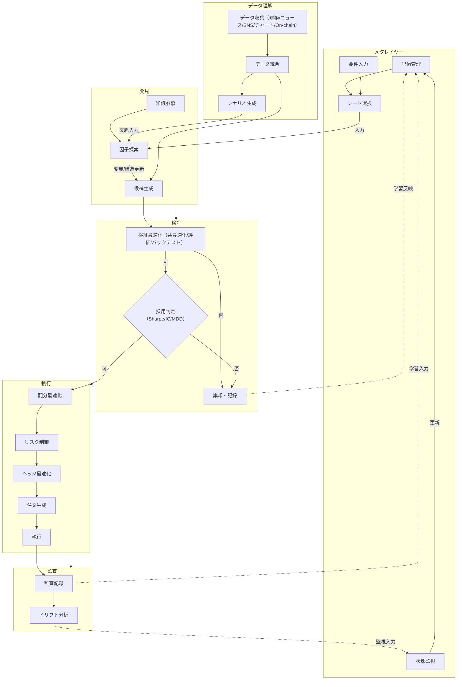

# 自律型クオンツアルファ生成パイプライン

```mermaid
flowchart TD
    subgraph メタレイヤー [メタレイヤー]
        記憶管理["記憶管理"]
        状態監視["状態監視"]
        要件入力["要件入力"]
        シード選択["シード選択"]
        状態監視 --> |更新| 記憶管理
        記憶管理 --> シード選択
        要件入力 --> シード選択
    end

    subgraph データ理解層 [データ理解]
        データ収集["データ収集（財務/ニュース/SNS/チャート/On-chain）"] --> データ統合["データ統合"]
        データ統合 --> シナリオ生成["シナリオ生成"]
    end

    subgraph アルファ発見フェーズ [発見]
        知識参照["知識参照"] --> 因子探索["因子探索"]
        シード選択 --> |入力| 因子探索
        シナリオ生成 --> |文脈入力| 因子探索
        因子探索 --> |変異/構造更新| 候補生成["候補生成"]
        データ統合 --> 候補生成
    end

    subgraph 検証フェーズ [検証]
        候補生成 --> 検証最適化["検証最適化（共最適化/評価/バックテスト）"]
        検証最適化 -- "可" --> 採用判定{"採用判定（Sharpe/IC/MDD）"}
        検証最適化 -- "否" --> 棄却["棄却・記録"]
        採用判定 -- "否" --> 棄却
        
        棄却 -.-> |学習反映| 記憶管理
    end

    subgraph 執行フェーズ [執行]
        採用判定 -- "可" --> 配分最適化["配分最適化"]
        配分最適化 --> リスク制御["リスク制御"]
        リスク制御 --> ヘッジ最適化["ヘッジ最適化"]
        ヘッジ最適化 --> 注文生成["注文生成"]
        注文生成 --> 執行["執行"]
    end

    subgraph ポストトレード監査 [監査]
        執行 --> 監査記録["監査記録"]
        監査記録 --> ドリフト分析["ドリフト分析"]
        ドリフト分析 -.-> |監視入力| 状態監視
        監査記録 -.-> |学習入力| 記憶管理
    end

    アルファ発見フェーズ --> 検証フェーズ
    検証フェーズ --> 執行フェーズ
    執行フェーズ --> ポストトレード監査
```
