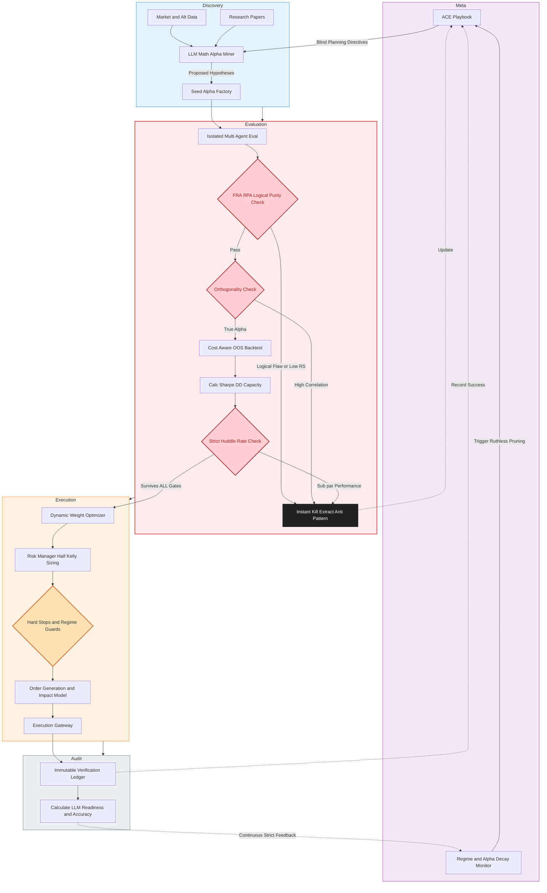

# Top Tier Autonomous Quant Workflow

```mermaid
flowchart TD
    subgraph Meta
        ACEPlaybook["ACE Playbook"]
        Monitor["Regime and Alpha Decay Monitor"]
        Monitor --> |Trigger Ruthless Pruning| ACEPlaybook
    end

    subgraph Discovery
        MarketData["Market and Alt Data"] --> Miner["LLM Math Alpha Miner"]
        ArXiv["Research Papers"] --> Miner
        Miner --> |Proposed Hypotheses| SAF["Seed Alpha Factory"]
        ACEPlaybook --> |Blind Planning Directives| Miner
    end

    subgraph Evaluation
        SAF --> ISOEval["Isolated Multi Agent Eval"]
        
        ISOEval --> LogicGate{"FRA RPA Logical Purity Check"}
        LogicGate -- "Logical Flaw or Low RS" --> RejectLogic["Instant Kill Extract Anti Pattern"]
        
        LogicGate -- "Pass" --> OrthoCheck{"Orthogonality Check"}
        OrthoCheck -- "High Correlation" --> RejectLogic
        
        OrthoCheck -- "True Alpha" --> Backtest["Cost Aware OOS Backtest"]
        Backtest --> Metrics["Calc Sharpe DD Capacity"]
        
        Metrics --> HuddleGate{"Strict Huddle Rate Check"}
        HuddleGate -- "Sub par Performance" --> RejectLogic
        
        RejectLogic -.-> |Update| ACEPlaybook
    end

    subgraph Execution
        HuddleGate -- "Survives ALL Gates" --> DWA["Dynamic Weight Optimizer"]
        DWA --> Risk["Risk Manager Half Kelly Sizing"]
        Risk --> HardStops{"Hard Stops and Regime Guards"}
        HardStops --> OrderGen["Order Generation and Impact Model"]
        OrderGen --> Gateway["Execution Gateway"]
    end

    subgraph Audit
        Gateway --> Ledger["Immutable Verification Ledger"]
        Ledger --> Score["Calculate LLM Readiness and Accuracy"]
        Score -.-> |Continuous Strict Feedback| Monitor
        Ledger -.-> |Record Success| ACEPlaybook
    end

    Discovery --> Evaluation
    Evaluation --> Execution
    Execution --> Audit

    style Meta fill:#f4e8f8,stroke:#9c27b0
    style Discovery fill:#e3f2fd,stroke:#1e88e5
    style Evaluation fill:#ffebee,stroke:#d32f2f,stroke-width:2px
    style LogicGate fill:#ffcdd2,stroke:#b71c1c,stroke-width:2px,color:#b71c1c
    style OrthoCheck fill:#ffcdd2,stroke:#b71c1c,stroke-width:2px,color:#b71c1c
    style HuddleGate fill:#ffcdd2,stroke:#b71c1c,stroke-width:2px,color:#b71c1c
    style RejectLogic fill:#212121,stroke:#000,stroke-width:1px,color:#fff
    style Execution fill:#fdf1e1,stroke:#f57c00
    style HardStops fill:#ffe0b2,stroke:#e65100,stroke-width:2px
    style Audit fill:#eceff1,stroke:#546e7a
```
