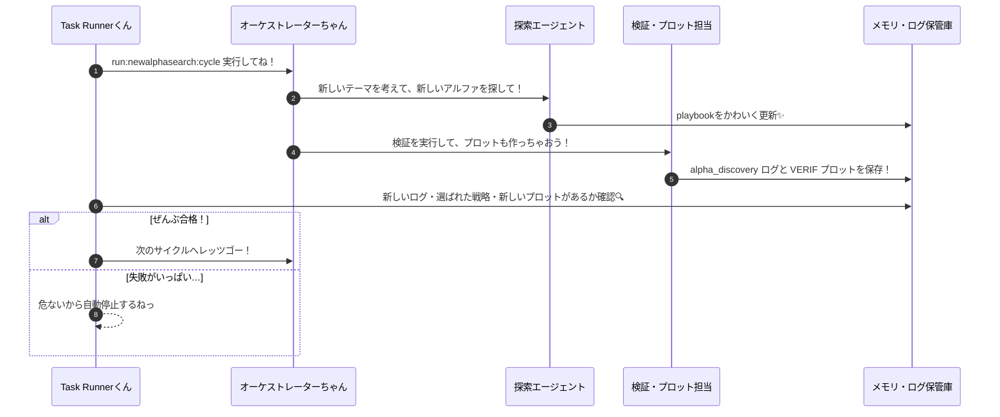

# ✨ アルファ発見のひみつ手帳 v2 (ぜんぶ自動！すご腕エージェントちゃん版) ✨

最終更新: 2026-03-01  
対象: `/home/kafka/finance/investor`

この手帳は、`docs/**` に書いてあるすごーい知識をぜんぶ使って、直交アルファ探索（だれも気づいてないお宝探し！）を無人でどんどん進化させるための、とーっても大事なルールだよっ！💖

この runbook は実行に必要なことをぎゅぎゅっとまとめた要約版だよ。もっと詳しい完全版が見たくなったら、こっちのファイルをチェックしてねっ✨：

- `/home/kafka/finance/investor/docs/diagrams/sequence.md`
- `/home/kafka/finance/investor/docs/diagrams/simpleflowchart.md`

## 🌟 1. このプロジェクトの目標（ごーる！）

- `task run` くんと `/.agent/workflows/newalphasearch.md` ちゃん、どっちの入り口からでも、おんなじ自律探索ループを完ぺきに実行しちゃうよっ！🐾
- 探索・評価・採用するかどうかのジャッジ・記録をぜーんぶ自動でぐるぐる回して、毎サイクルごとに自分でお利口さんになっていくよっ🧠💎
- 実行する道がバラバラだと迷っちゃうから、Taskfile くんを「正本」として、一元管理をぜったい守ってねっ💢✨

## 🚀 2. 魔法の入り口（エントリーポイントだよっ！）

- フルコースで実行！: `task run`
- 自律探索のスタンダード: `task run:newalphasearch`（ループが必須だよ！）
- 「ずっと回して！」の合図: `task run:newalphasearch:loop`
- workflow からの入り口: `task run:newalphasearch` か `task run:newalphasearch:loop` を呼ぶだけに限定してねっ！

`task run` はぜったいに `task run:newalphasearch` を仲間にいれて、探索をサボらないようにするのがお約束だよっ！オーケストレーション（指揮役）の正本は Taskfile くんだけ！一元管理、ぜったいだよっ！💖

## 🔄 3. ぐるぐる！自律ループのしくみ

1サイクルの固定じゅんばんだよっ：

1. `typecheck` (型チェックでバグを撃退！✨)
2. `pipeline:proof-layers`
3. `pipeline:verify`
4. `pipeline:discover` (お宝アルファを見つけるよっ！)
5. `pipeline:analyze`
6. `pipeline:verification-plot` (グラフにして見やすく！📈)
7. `pipeline:mine`

この 1 サイクルが成功したら、ループモードの時はすぐに次のサイクルへ GO！なんだもんっ🚀

## 🎀 3.1 最小シーケンス (いちばん大事なところ！)



## 🍭 3.2 最小フローチャート (見た目もかわいく！)

```mermaid
flowchart TD
    A[ループ開始っ！] --> B[run:newalphasearch:cycle]
    B --> C{新しいログはある？}
    C -- No --> F[失敗カウント +1]
    C -- Yes --> D{新しい戦略IDは見つかった？}
    D -- No --> F
    D -- Yes --> E{新しい検証グラフはある？}
    E -- No --> F
    E -- Yes --> G[大成功！ -> 次のサイクルへ✨]
    F --> H{失敗が多すぎるかな？}
    H -- Yes --> I[安全のために止まるね(泣)]
    H -- No --> G
```

## 📈 4. ずっと成長しちゃう！進化モード

`task run:newalphasearch:loop` は、こんな風に動くよっ！：

- 成功したとき：にこにこしながら次のサイクルへ進むよっ！✨
- 失敗したとき：失敗カウンターをぴたっと増やすよ。
- 失敗が続きすぎたら：危ないから自動でストップ（安全停止）するよっ。🛡️
- 止まった理由：ちゃんとお返事（標準出力）に書いておくね！
- 毎サイクル：`alpha_discovery` ログがちゃんと増えてるかチェックするよ。増えてなきゃ「失敗」なんだもんっ！💢

制御パラメータ（魔法の数字だよ！）：

- `ALPHA_LOOP_MAX_CYCLES` (初期値: `3`, 最小: `1`)
- `ALPHA_LOOP_SLEEP_SEC` (初期値: `0`)
- `ALPHA_LOOP_MAX_FAILURES` (初期値: `3`)

## 🤝 5. エージェントちゃんたちのお仕事分担

- **Supervisor (監督)**: サイクルのコントロールと、止まるかどうかの判定をするよっ！
- **Hypothesis Generator (アイデアマン)**: 新しい仮説をどんどん作るよ (`pipeline:discover`) ✨
- **Evaluator (目利き役)**: 数字で厳しく評価するよ (`pipeline:analyze`) 📊
- **Registry Curator (整理整頓係)**: playbook に入れるかどうか決めるよっ。
- **Audit Reporter (監査役)**: 正式なログと、証拠のグラフ（verification artifact）を作るよ！🔍

## 💎 6. ぜったい必要な宝物 (アーティファクト)

各サイクルが終わるたびに、これらが新しくなってなきゃダメだよっ！：

- `logs/unified/alpha_discovery_*.json`
- `ts-agent/data/standard_verification_data.json`
- `ts-agent/data/VERIF_*.png` (かっこいい検証プロット！)
- `ts-agent/data/playbook.json`

## ✅ 7. 合格のごほうび基準 (合格ラインだよ！)

これらをぜーんぶクリアしたら、自律探索ループは大成功！って認めてあげるねっ💖：

1. `task --list-all` を見たときに、`run:newalphasearch` と `run:newalphasearch:loop` がちゃんと並んでることっ！
2. `task run` をしたときに、ちゃんと `run:newalphasearch` が呼ばれること！
3. workflow (`newalphasearch`) が Task 経由で同じ道を通ること！
4. サイクルごとに `alpha_discovery` のログがちゃんと残ること。
5. 失敗が続きすぎたら、自分でお休み（自動停止）できること。🛡️
6. サイクルごとに `selected` に「今まで見たことない新しい戦略ID」が1つ以上あること。知ってるIDばっかりだったら、新しいお宝が見つかってないから失敗だよっ！💢
7. サイクルごとに `VERIF_*.png` が新しく更新されること（グラフは必須だよっ！📊）

## 🛡️ 8. あんしん・あんぜんの守り

- 「止まって！」って思ったら、`loop` タスクを終了させてねっ。
- 止まったあとにまたやりたくなったら、もう一度同じコマンドを実行すればOKだよっ！
- もし失敗が続いちゃったら、データの質や API のつながり、周りの環境をまず確認してあげてねっ✨

## 🙅‍♀️ 9. やらないことリスト

- 勝手にお金を動かして注文しちゃうこと（API接続はしないよ！）。
- ブローカーさんへの発注を勝手にやること。

この runbook のお仕事は、研究・探索と、誰が見ても「これならOK！」って言える監査用の記録を作るところまでだよっ！

それじゃあ、最強のアルファをいっぱい見つけちゃおうねっ！えいえいおーっ！🌈✨
