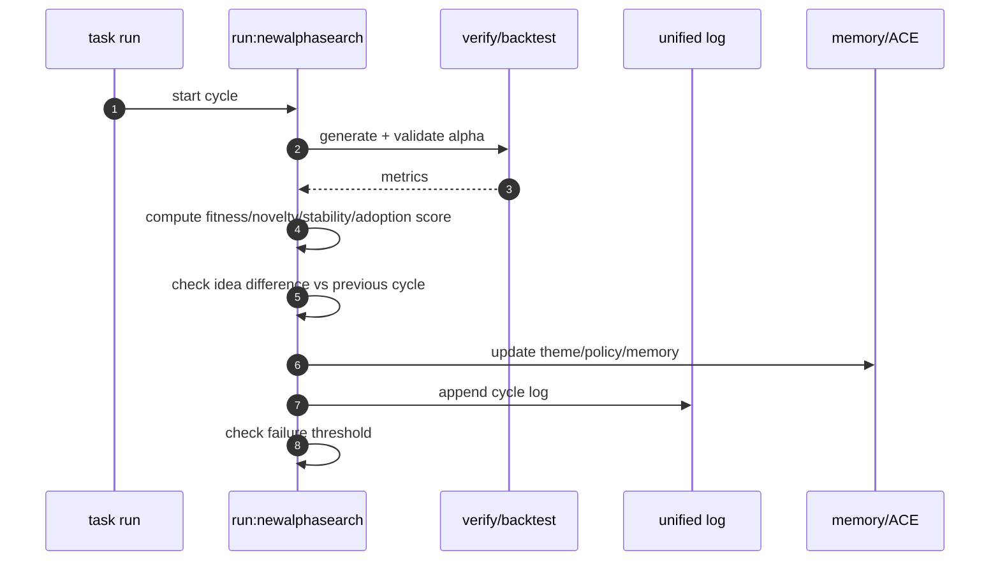
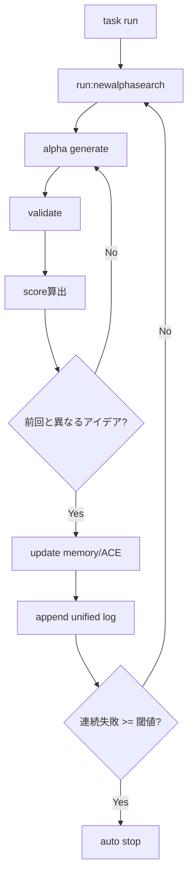

# 🎀 automonous しようしょ（自律ループ定義）✨

## 0. このドキュメントの役割
このファイルは、`newalphasearch` の**自律探索ループ**を成立させるための、いちばんシンプルな定義だよっ！
詳細な手順や図の中身は、つぎの正本を参照してねっ。

- `docs/specs/alpha_discovery_runbook.md`
- `docs/diagrams/sequence.md`
- `docs/diagrams/simpleflowchart.md`

> ここでは「何を満たしたら自律ループ成立か」を明確にするよっ ✨

---

## 1. 自律ループの目的
`newalphasearch` は、つぎを**止まらずに繰り返す**ことを目的にするよっ。

1. 自律探索: 新しいアルファ候補を毎サイクル生成する
2. 自律検証: 候補を毎サイクル検証する
3. 自律改善: 検証結果にもとづいてテーマ・重み・探索方針を更新する
4. 自律記録: すべてを unified log / memory / ACE に記録する

---

## 2. 成立判定（Definition of Done）
以下を**すべて満たしたときだけ**、自律探索ループ成立と判定するよっ。

1. `task --list-all` に `run:newalphasearch` と `run:newalphasearch:loop` が表示される
2. `task run` 実行時に `run:newalphasearch` が実行される
3. workflow (`.agent/workflows/newalphasearch.md`) が Task 経由で**同じ実行経路**を使う
4. 各サイクルで `alpha_discovery` の unified log が残る
5. 連続失敗閾値に到達したら自動停止する
6. 停止しないサイクルでは、毎回「新しい検証」と「新しい記録」を必ず残す
7. 停止しないサイクルでは、前サイクルと異なる「次の探索アイデア」を必ず採択する

---

## 3. 一元管理（Single Source of Truth）
自律ループは、つぎの一元管理ルールに従うよっ。

1. 実行導線の一元化: Task を唯一の入口にする（直接実行を標準運用にしない）
2. 状態管理の一元化: サイクル状態は unified context（memory/ACE を含む）で管理する
3. 監査記録の一元化: 各サイクルの結果は unified log に追記する

### 3.1 自然言語入力の一元化
`antigravity` や `codex` から自然言語入力を受けても、入口は Task で統一するよっ。

1. `task run:newalphasearch:nl NL_INPUT="..."`
2. もしくは `UQTL_NL_INPUT` / `UQTL_NL_INPUT_FILE` を使って `task run:newalphasearch`
3. `UQTL_INPUT_CHANNEL` で入力元を明示して監査ログに残す

---

## 4. ACE と memory 更新の実現方針
`docs/diagrams/sequence.md` と `docs/diagrams/simpleflowchart.md` の流れに合わせて、各サイクルで必ず以下を実施するよっ。

1. `theme_proposed`: 新規テーマ提案を memory に保存
2. `hypothesis_validated`: 検証結果（勝率、PF、ドローダウン等）を ACE に反映
3. `policy_updated`: 次サイクルの探索方針（探索温度、除外条件、優先データ）を memory に反映
4. `cycle_committed`: unified log に cycle summary を追記

これで、**探索→検証→改善→記録**が毎回閉ループになるよっ ✨

---

## 5. OpenAI API / gpt-5-nano の位置づけ
内部コードでの LLM 呼び出し（OpenAI API, `gpt-5-nano` など）は、つぎの方針にするよっ。

1. 必須責務: 「テーマ生成」「仮説の再記述」「失敗要因の圧縮要約」は LLM 層に集約
2. 非LLM責務: データ取得・検証計算・採択判定・停止判定は deterministic 実装で担当
3. 入口統一: LLM 呼び出しは provider 層に集約し、パイプライン本体から直接バラ呼びしない

> つまり、LLM は“思考補助”、判定は“ルールと数値”で一元管理するよっ。

---

## 6. ループ制御（停止条件つき）

### 6.1 継続条件
- サイクルが成功、または改善可能失敗である
- 連続失敗回数 `< failure_threshold`

### 6.2 停止条件
- 連続失敗回数 `>= failure_threshold`
- 重大エラー（入力欠損、検証不能、監査ログ書き込み失敗）

### 6.3 停止時の必須記録
- `stop_reason`
- `last_success_cycle`
- `consecutive_failures`
- `next_resume_hint`

---

## 7. 可視化（plot 必須）
各サイクル後に、最低でも次の plot を生成・保存するよっ。

1. `cycle_performance.png`: サイクルごとの主要指標推移
2. `alpha_novelty.png`: 新規テーマの採択率と重複率
3. `failure_streak.png`: 失敗連鎖と停止閾値の可視化

保存先は運用ルールに従って `ts-agent/data/` または `logs/` 配下へ統一すること。

### 7.1 score 記録（必須）
各サイクルで、最低でも次の score を unified log に保存するよっ。

1. `fitness_score`: 検証パフォーマンス総合点（例: Sharpe, PF, DD の合成）
2. `novelty_score`: 前回採択テーマとの差分点（0.0-1.0）
3. `stability_score`: OOS 一貫性の点数
4. `adoption_score`: 採択可否に使う最終点

### 7.2 「毎回異なる探索アイデア」の判定
次の条件を同時に満たしたときだけ、「異なる探索アイデア」と判定するよっ。

1. `novelty_score >= novelty_threshold`
2. `idea_hash != previous_idea_hash`
3. `feature_signature` が前回と一致しない

もし満たせない場合は、同一サイクル内でテーマ再生成を行い、再検証すること。

---

## 8. 最小シーケンス（本質だけ）

---

## 9. 最小フローチャート（本質だけ）

---

## 10. 運用メモ
- 詳細仕様と運用の正本は `docs/specs/alpha_discovery_runbook.md`
- 図の詳細は `docs/diagrams/sequence.md` と `docs/diagrams/simpleflowchart.md`
- この `automonous.md` は「本質の定義」を短く維持すること

---

## 11. Agentic Loop 定義（最小）
`agentic loop` は、以下の 1 サイクルを繰り返す自律制御ループだよっ。

1. Theme Generate: LLM で仮説テーマを作る
2. Validate: バックテスト/検証で数値化する
3. Score: `fitness/novelty/stability/adoption` を算出
4. Decide: しきい値で採択/棄却を決定
5. Update: ACE と memory を更新
6. Log: unified log と plot を保存
7. Loop Control: 失敗閾値未満なら次サイクルへ

この 7 ステップが毎回完了し、かつ「次の探索アイデアが前回と異なる」ことを満たした場合に、`agentic loop` が正常稼働中とみなすよっ。
