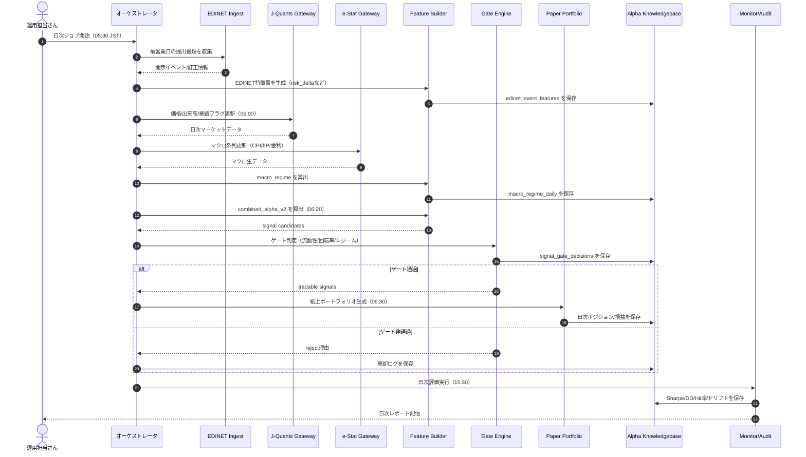

# 🎀 EDINET活用グランドデザイン v1 仕様書 🎀

最終更新: 2026-03-01  
対象: `ts-agent`（デイリー〜週次・紙上運用）

---

## 0. 既存コードとの統合方針（ここ大事っ！）🧩

この仕様は、**いま repo にある実装を起点**に段階的に拡張する前提だよっ！

### 0.1 いま存在する主要実装
- EDINET特徴量生成: `ts-agent/src/experiments/generate_10k_features.ts`
- KB構築: `ts-agent/src/experiments/build_alpha_knowledgebase.ts`
- KBバックテスト: `ts-agent/src/experiments/run_kb_signal_backtest.ts`
- KB可視化: `ts-agent/src/experiments/plot_kb_signal_backtest.py`
- KBスキーマ管理: `ts-agent/src/context/alpha_knowledgebase.ts`
- マクロ検証の入口: `ts-agent/src/experiments/generate_macro_features.ts`, `ts-agent/src/experiments/macro_lead_lag_verification.ts`

### 0.2 既存コマンド（package.jsonで実在）
- `bun run experiments:10k-features`
- `bun run experiments:kb-build`
- `bun run experiments:kb-backtest`
- `bun run experiments:kb-plot`

### 0.3 この仕様での扱い
- まずは上の既存コマンドで運用しながら、`macro_regime` と `gate_decisions` を追加していく。
- 新コマンド名は最終形の目標。実装完了までは「既存コマンド + 引数拡張」で吸収する。

---

## 1. はじめにっ！✨
この仕様書は、EDINETを使って「日本株のアルファ」を安定して作るための、
**かわいくて強い運用設計図**だよっ！

今回のゴールは、次の3つだよ〜！

1. **収益性を上げる**（運用収益最大化）
2. **再現できる研究にする**（誰がやっても同じ結果）
3. **監査できる状態にする**（なぜ採用/棄却したか残す）

---

## 2. スコープ（今回やること / やらないこと）

### ✅ 今回やること
- EDINETイベント特徴量の生成
- J-Quants価格/業績データとの結合
- e-Statマクロレジームの導入
- シグナル生成・ゲート判定・紙上バックテスト
- 採否理由と監査ログの保存

### ❌ 今回やらないこと
- 実注文APIへの接続（ブローカー発注）
- 本番執行の自動化

> 実注文は次フェーズ（v1.5）で設計するよっ！

---

## 3. 全体アーキテクチャ（にっこり5層）

### Layer 1: Ingest（集める）
- EDINET: 開示イベント・訂正情報
- J-Quants: 価格、出来高、業績フラグ
- e-Stat: CPI, IIP, 金利系などマクロ系列

### Layer 2: Feature（つくる）
- `risk_delta`
- `pead_1d`, `pead_5d`
- `correction_count_90d`, `correction_flag`
- `macro_regime`（RISK_ON / NEUTRAL / RISK_OFF）

### Layer 3: Signal（判断する）
- `combined_alpha_v2` を算出
- Gate Engineで「トレード可能か」を日次判定

### Layer 4: Portfolio（組む）
- Long/Short同数
- 等金額配分
- 回転率・流動性・集中制約を適用

### Layer 5: Audit & Learn（覚える）
- 採否理由
- ゲート通過/非通過
- 指標推移とドリフト

---

## 3.1 必須シーケンス図（Daily Run）🧭



---

## 4. 主要シグナル定義（v2）

### 4.1 リスク関連
```text
risk_score_t = (1 - sentiment_t)
             + ln(1 + ai_exposure_t)/6
             + ln(1 + kg_centrality_t)/8

risk_delta_t = risk_score_t - risk_score_prev_filing
```

### 4.2 PEAD近似
```text
pead_1d_t = close_(t+1) / close_t - 1
pead_5d_t = close_(t+5) / close_t - 1
```

### 4.3 ガバナンス・訂正ペナルティ
```text
governance_penalty_t = min(1, correction_count_90d / 3)
revision_intensity_penalty_t = 1 if correction_flag_t = 1 else 0
```

### 4.4 総合アルファ
```text
combined_alpha_v2_t = -risk_delta_t
                    + 0.3 * pead_1d_t
                    + 0.2 * pead_5d_t
                    - 0.2 * governance_penalty_t
                    - 0.3 * revision_intensity_penalty_t
```

---

## 5. データモデル（Alpha Knowledgebase拡張）

> ここは「最終形」の設計だよっ。  
> 実装順は、まず既存 `signals` 系を使い続けて、次に `edinet_event_features` → `macro_regime_daily` → `signal_gate_decisions` の順で増やす。

### 5.1 `edinet_event_features`
- `event_id` TEXT PRIMARY KEY
- `symbol` TEXT NOT NULL
- `filed_at` TEXT NOT NULL
- `doc_id` TEXT NOT NULL
- `risk_delta` REAL NOT NULL
- `sentiment` REAL NOT NULL
- `ai_exposure` REAL NOT NULL
- `kg_centrality` REAL NOT NULL
- `correction_flag` INTEGER NOT NULL DEFAULT 0
- `correction_count_90d` INTEGER NOT NULL DEFAULT 0
- `feature_version` TEXT NOT NULL
- `created_at` TEXT NOT NULL DEFAULT datetime('now')

### 5.2 `macro_regime_daily`
- `date` TEXT PRIMARY KEY
- `regime_id` TEXT NOT NULL
- `inflation_z` REAL NOT NULL
- `iip_z` REAL NOT NULL
- `yield_slope_z` REAL NOT NULL
- `risk_on_score` REAL NOT NULL
- `created_at` TEXT NOT NULL DEFAULT datetime('now')

### 5.3 `signal_gate_decisions`
- `signal_id` TEXT NOT NULL
- `date` TEXT NOT NULL
- `gate_name` TEXT NOT NULL
- `passed` INTEGER NOT NULL
- `threshold` TEXT NOT NULL
- `actual_value` REAL
- `reason` TEXT NOT NULL
- PRIMARY KEY(`signal_id`, `gate_name`)

---

## 6. Gate Engine（通過条件）

### 6.1 データ受入判定
- 欠損率 `<= 5%`
- 提出日と価格日付の整合率 `>= 99%`
- PITリーク検知違反 `0件`

### 6.2 検証受入判定
- 分割: `Train 24M / Validate 12M / Forward 6M`（ローリング）
- Forward Sharpe `>= 0.6`
- `|Sharpe(Validate) - Sharpe(Forward)| <= 0.5`
- コスト控除後で判定（片道 10bps）

### 6.3 ポートフォリオ制約
- 単銘柄ウェイト `<= 10%`
- セクター偏差 `<= 20%`（TOPIX-33基準）
- 日次回転率 `<= 40%`
- 最低シグナル数 `minSignalsPerDay >= 4`
- 最低流動性 `>= 1e8 JPY`

### 6.4 レジーム制御
- `RISK_ON`: 通常運用
- `NEUTRAL`: ポジション半分
- `RISK_OFF`: 新規建て停止

---

## 7. 日次オペレーション（JST）

### 05:30
- EDINETイベント収集（前営業日提出分）
- `metadata-only` でカバレッジ確保
- 主要銘柄のみ `indexed-only` で品質補強

### 06:00
- J-Quants 日次更新
- e-Stat マクロ更新
- `macro_regime_daily` 再計算

### 06:20
- `combined_alpha_v2` 算出
- `signal_gate_decisions` 生成

### 06:30
- 通過銘柄で紙上ポートフォリオ生成

### 15:30
- 日次評価（Sharpe, DD, Hit率, Turnover）
- 棄却理由・逸脱ログ保存

---

## 8. CLI設計（運用コマンド）

```bash
# 1) EDINETイベント特徴量作成（既存）
bun run experiments:10k-features -- \
  --from=2023-01-01 --to=2025-12-31 --metadata-only --indexed-only

# 2) KB構築（既存）
bun run experiments:kb-build -- \
  --limit=3000

# 3) KBバックテスト（既存）
bun run experiments:kb-backtest -- \
  --top-k=5 --min-signals-per-day=4 --trade-lag-days=2

# 4) 可視化（既存）
bun run experiments:kb-plot -- \
  --top-k=5 --min-signals-per-day=4
```

### 8.1 マクロ統合の暫定運用（統合中フェーズ）
```bash
# マクロ特徴量生成（既存入口）
bun src/experiments/generate_macro_features.ts

# リードラグ検証（既存入口）
bun src/experiments/macro_lead_lag_verification.ts
```

### 8.2 最終的に追加するコマンド（未実装）
- `experiments:build-edinet-event-features`
- `experiments:build-macro-regime`
- `experiments:run-edinet-regime-backtest`

> 未実装の間は、既存の `10k-features / kb-build / kb-backtest` にオプション追加して同等機能を実現するよっ。

---

## 9. テスト計画（ぜったい守るやつ）

### 9.1 単体テスト
- `risk_delta` 計算境界
- ゲート閾値境界（ちょうど閾値、1ティック上/下）
- 日付正規化/PITリーク検知

### 9.2 結合テスト
- `feature -> regime -> backtest` E2E
- 欠損データ注入時の棄却ログ生成

### 9.3 回帰テスト
- `EDINET_RISK_DELTA_PEAD_HYBRID(v1)` と `v2` 比較
- 比較指標: `Sharpe`, `MaxDD`, `tradableDays`, `turnover`

### 9.4 監査テスト
- 任意 `signal_id` から以下を逆引き可能であること
  - `source_doc_id`
  - `feature_version`
  - `gate_decisions`

---

## 10. 受入基準（Definition of Done）

- 紙上運用を90日分回せること
- `tradableDays` が現状比 +30%以上
- コスト控除後 Sharpe `>= 0.8`
- Max Drawdown が `-15%` より悪化しない
- 採否理由が100%保存されること

---

## 11. かわいい運用メモ 🎀
- まずは**カバレッジ優先**で `metadata-only` を回して、あとから品質強化しようねっ！
- LLMは万能魔法じゃないので、**主シグナルはルール/統計で堅く**いくのが勝ち筋だよっ！
- 迷ったら「再現できるか？」を最優先っ。再現できない勝ちは、長続きしないのっ！

---

## 12. 将来拡張（v1.5以降）
- 実注文ゲート（ブローカーAPI）
- 執行品質（約定率、実績スリッページ）監視
- セクター中立・ベータ中立の自動最適化
- Explainabilityダッシュボード（意思決定の見える化）

---

## 13. 実装ステップ（既存統合ベース）🛠️

### Step A（いま着手）
- `generate_10k_features.ts` の出力に訂正関連特徴量（`correction_flag`, `correction_count_90d`）を追加
- `build_alpha_knowledgebase.ts` で `combined_alpha_v2` の計算を切替可能にする

### Step B
- `alpha_knowledgebase.ts` に `edinet_event_features` を追加
- 既存 `signals` を維持しつつ二重書き込み（後方互換）する

### Step C
- `macro_regime_daily` と `signal_gate_decisions` を追加
- `run_kb_signal_backtest.ts` にゲート適用を段階導入（フラグでON/OFF）

### Step D
- シーケンス図どおりに日次ジョブ化
- 指標監視と棄却理由のレポートを定例化

---

## 14. 現状実装との差分トラッカー（迷子防止マップ）🗺️

| 仕様項目 | 現状 | 差分 | 対応ファイル | 優先度 |
|---|---|---|---|---|
| EDINETイベント特徴量保存 | 実装済み | なし | `ts-agent/src/context/alpha_knowledgebase.ts`, `ts-agent/src/experiments/build_alpha_knowledgebase.ts` | High |
| マクロレジーム保存 | 実装済み | なし | `ts-agent/src/experiments/build_macro_regime.ts` | High |
| ゲート判定保存 | 実装済み | なし | `ts-agent/src/experiments/run_kb_signal_backtest.ts` | High |
| `kb-backtest` でのゲート運用 | 実装済み（`--with-gates`） | ドキュメント例の充実 | `ts-agent/src/experiments/run_kb_signal_backtest.ts` | High |
| 日次ジョブの定時オーケストレーション | 部分実装 | cron/task化の明文化 | `Taskfile.yml`（拡張予定） | Medium |
| 監査逆引きの自動レポート | 未実装 | 監査CLI追加 | `ts-agent/src/experiments/*`（追加予定） | Medium |
| 回帰テスト自動化（v1 vs v2） | 部分実装 | CI組み込み | GitHub Actions（追加予定） | Medium |

---

## 15. DoDの判定方法（数値 + 測定手順を固定）📏

### 15.1 KPI一覧（判定キー固定）
- Sharpe: `summary.backtest.metrics.sharpe >= 0.8`
- Max Drawdown: `summary.backtest.metrics.maxDrawdown >= -0.15`
- Tradable Days: `summary.backtest.sample.tradableDays` がベースライン比 `+30%`
- 監査保存率: `signal_gate_decisions` の保存率 `100%`（対象シグナル比）

### 15.2 測定コマンド（標準）
```bash
# 1) ゲート付きバックテスト実行
bun run experiments:kb-backtest -- \
  --with-gates --top-k=5 --min-signals-per-day=4 --trade-lag-days=2

# 2) 出力JSONを保存（例）
bun run experiments:kb-backtest -- \
  --with-gates --top-k=5 --min-signals-per-day=4 --trade-lag-days=2 \
  > logs/verification/edinet_kb_backtest_latest.json
```

### 15.3 判定の原則
- 判定は必ず**同一期間・同一コスト設定**で比較すること。
- 比較対象（baseline run id / commit hash）をログに残すこと。

---

## 16. 障害時Runbook（すぐ復旧する用）🚑

### 16.1 症状: EDINET取得が失敗
1. `--metadata-only` で再実行してカバレッジ優先で復旧。
2. `--indexed-only` を外して一時運用。
3. 復旧後に再取得し、差分だけ再計算。

### 16.2 症状: マクロ更新が失敗
1. `build_macro_regime.ts` を前日データで再実行。
2. `macro_regime_daily` の当日行が欠損なら `NEUTRAL` 扱いで暫定運用。
3. 復旧後に当日行を上書き。

### 16.3 症状: ゲート通過ゼロ
1. `--min-liquidity-jpy` と `--max-correction-90d` を確認。
2. `--allow-regimes` に `NEUTRAL` を含める。
3. それでもゼロなら当日はノートレード（監査ログ必須）。

---

## 17. Gate仕様（機械可読YAML）⚙️

```yaml
alpha:
  edinet:
    gates:
      minSignalsPerDay: 4
      minLiquidityJpy: 100000000
      maxCorrection90d: 2
      regimeAllowlist:
        - RISK_ON
        - NEUTRAL
```

- 本YAMLは `ts-agent/src/config/default.yaml` と同値で運用すること。
- 仕様変更時は「この章」と「実設定」を同時更新すること。

---

## 18. テスト実行テンプレ（コマンド単位）🧪

| テスト種別 | 実行コマンド | 期待結果 | 失敗時の主原因 |
|---|---|---|---|
| 単体（型・静的） | `task check` | format/lint/typecheck 全通過 | 型不整合、import崩れ |
| 結合（E2E） | `bun run experiments:kb-build` → `bun run experiments:kb-backtest -- --with-gates` | `tradableDays > 0` | データ欠損、閾値過厳 |
| 回帰（v1 vs v2） | `--with-gates` なし/ありを同期間比較 | v2でDoD基準内 | パラメータ不一致 |
| 監査 | 任意 `signal_id` をDB逆引き | lineage + gate決定を追跡可能 | 保存漏れ |

---

## 19. 監査トレーサビリティ導線（逆引き図）🔍


- 監査は `signal_id` 起点で必ず逆引きできること。
- 監査不可のシグナルは運用採用しないこと。

---

## 20. リリース段階定義（Phase制）🚦

### Phase A: 研究
- 目的: 特徴量とゲートの妥当性確認
- 必須: `task check` 通過、再現実行可能

### Phase B: 紙上運用
- 目的: 日次オペレーション安定化
- 必須: 90日連続運用、DoDの主要KPI達成

### Phase C: 準本番
- 目的: 実注文接続前の最終ゲート
- 必須: 監査逆引き100%、障害Runbookの実運用検証

---

**Owner**: Antigravity Quant Team  
**Status**: Draft v1.1（実装ガイドとして利用可）
