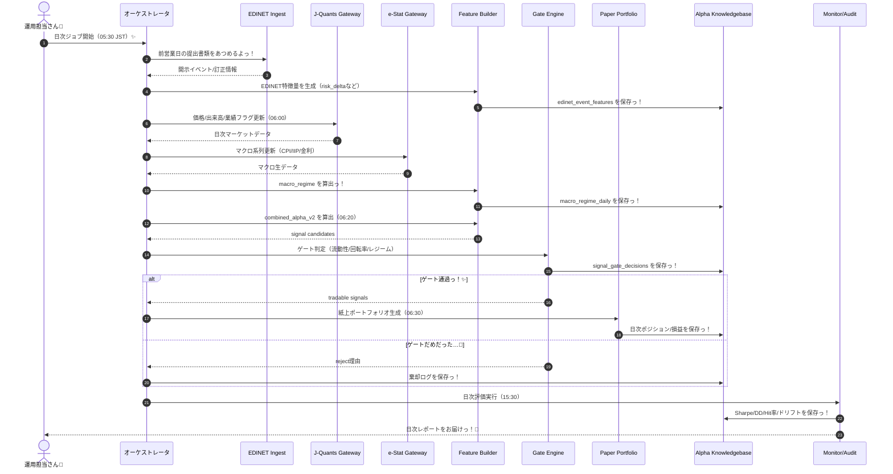
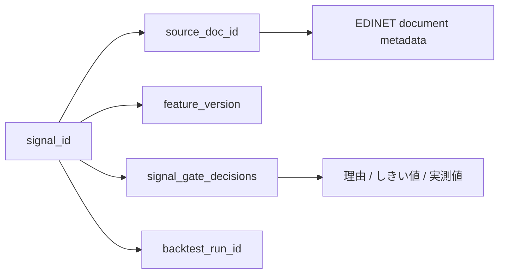

# 🎀 EDINETかつよう！だいさくせん v1 しようしょ 🎀 ✨
**タイトル**: EDINETかつよう！だいさくせん v1 しようしょ（`ts-agent` まいにち〜しゅうじ・かみじょう運用）
**お仕事の目的**: EDINETを使って「日本株のアルファ」を安定してつくるための、かわいくて最強のうんよう設計図を定義することっ！💖
**解決したいお悩み**: 「もうけを増やす！」「いつでも再現できる研究にする！」「ちゃんと監査できるようにする！」の3つをばっちり解決して、安定したクオンツ運用を実現したいんだよっ！💦

## エグゼクティブサマリー
この仕様書は、`ts-agent`ちゃんがEDINET（開示情報）やJ-Quants、e-Statのデータを合体させて、日本株のとびっきり強い「アルファ（儲けのタネ）」を毎日自律的に見つけるための最強のルールブックだよっ！🚀✨ いま動いてる特徴量生成やナレッジベース（KB）のコードをスタート地点にして、「マクロレジーム（世の中のムード）」の導入や、厳しい「ゲート判定（トレードしていいかのチェック！）」を追加していくの！💖 データ集めからポートフォリオ作成、毎日の監査までをピカピカの5層構造アーキテクチャでぜーんぶ自動化して、絶対に負けない・いつでも理由が説明できる最高にかわいいシステムを作っちゃう大作戦なんだからねっ！えいえいおーっ！🌈

---

さいしゅうこうしん：2026ねん3がつ1にちっ！💖  
たいしょう：`ts-agent`（まいにち〜しゅうじ・かみじょう運用だよっ！）

## 0. いまあるコードとなかよし統合プランっ！🧩✨

このしようしょは、**いまリポジトリにある実装**をスタート地点にして、すごーく段階的にパワーアップさせていくためのものだよっ！🌱

### 0.1 いま動いてるすごいやつらっ！
- EDINETとくちょうりょう生成：`ts-agent/src/experiments/generate_10k_features.ts`
- KB（ナレッジベース）構築：`ts-agent/src/experiments/build_alpha_knowledgebase.ts`
- KBバックテスト：`ts-agent/src/experiments/run_kb_signal_backtest.ts`
- KB見える化：`ts-agent/src/experiments/plot_kb_signal_backtest.py`
- KBスキーマ管理：`ts-agent/src/context/alpha_knowledgebase.ts`
- マクロ検証の入り口：`ts-agent/src/experiments/generate_macro_features.ts`, `ts-agent/src/experiments/macro_lead_lag_verification.ts`

### 0.2 すでにあるコマンド（package.jsonにいるよっ！）
- `bun run experiments:10k-features`
- `bun run experiments:kb-build`
- `bun run experiments:kb-backtest`
- `bun run experiments:kb-plot`

### 0.3 この仕様でのあつかいっ！
- まずは上の「いまあるコマンド」で運用しながら、`macro_regime` と `gate_decisions` をちょっとずつ追加していくよっ！
- 新しいコマンド名は「さいしゅうけい」の目標なんだっ。完成するまでは「いまのコマンド ＋ 引数をふやす」で対応するからねっ！✨

---

## 1. はじめにっ！✨
この仕様書は、EDINETを使って「日本株のアルファ」を安定してつくるための、
**かわいくて最強のうんよう設計図**だよっ！💖

今回のゴールは、この3つだよ〜！えいえいおーっ！🌈

1. **もうけを増やすっ！**（運用収益を最大化だよっ！）
2. **いつでも再現できる研究にするっ！**（だれがやっても同じ結果、これ大事！）
3. **ちゃんと監査できるようにするっ！**（なんで採用したか、なんでダメだったか記録するよっ！💢）

---

## 2. スコープ（今回がんばること / やらないこと）

### ✅ 今回がんばることっ！
- EDINETイベントとくちょうりょうの生成っ！
- J-Quantsの価格・業績データと合体！🤝
- e-Statマクロレジームの導入（世の中のムードをよむよっ！）
- シグナル生成・ゲート判定・かみじょうバックテスト！
- えらんだ理由と監査ログをしっかり保存っ！📝

### ❌ 今回はやらないよ（また今度ねっ！）
- 本番の注文APIにつなぐこと（ブローカーさん発注）
- 本番の自動トレード執行

> ほんばんの注文は、つぎのフェーズ（v1.5）でいっしょに考えようねっ！🐾

---

## 3. 全体アーキテクチャ（にっこり5層構造っ！）🌟

### Layer 1: Ingest（あつめるっ！）
- EDINET：開示イベント・訂正情報
- J-Quants：価格、出来高、業績フラグ
- e-Stat：CPI, IIP, 金利系などのマクロデータ

### Layer 2: Feature（つくるっ！）
- `risk_delta`
- `pead_1d`, `pead_5d`
- `correction_count_90d`, `correction_flag`
- `macro_regime`（RISK_ON / NEUTRAL / RISK_OFF）

### Layer 3: Signal（きめるっ！）
- `combined_alpha_v2` をけいさんっ！
- Gate Engineで「いまトレードしていいかな？」をまいにち判定！

### Layer 4: Portfolio（くむっ！）
- Long/Shortおんなじ数ずつっ！
- おんなじ金額ずつ配分するよっ！
- 回転率・流動性・集中しすぎないルールを守るよ！⚖️

### Layer 5: Audit & Learn（おぼえるっ！）
- なんで採用したかの理由っ！
- ゲートを通ったか、ダメだったか！
- 指標のうごきとドリフト（ズレ）をチェック！

---

## 3.1 ぜったい必要なシーケンス図（Daily Runだよっ！）🧭✨



---

## 4. さいきょうシグナル定義（v2だよっ！）🔥

### 4.1 リスクにまつわることっ！
```text
risk_score_t = (1 - sentiment_t)
             + ln(1 + ai_exposure_t)/6
             + ln(1 + kg_centrality_t)/8

risk_delta_t = risk_score_t - risk_score_prev_filing
```

### 4.2 PEAD（決算後の反応）っぽいやつっ！
```text
pead_1d_t = close_(t+1) / close_t - 1
pead_5d_t = close_(t+5) / close_t - 1
```

### 4.3 ガバナンス・まちがい訂正ペナルティっ！
```text
governance_penalty_t = min(1, correction_count_90d / 3)
revision_intensity_penalty_t = 1 if correction_flag_t = 1 else 0
```

### 4.4 ぜんぶ合体！総合アルファっ！
```text
combined_alpha_v2_t = -risk_delta_t
                    + 0.3 * pead_1d_t
                    + 0.2 * pead_5d_t
                    - 0.2 * governance_penalty_t
                    - 0.3 * revision_intensity_penalty_t
```

---

## 5. データモデル（Alpha Knowledgebaseを広げちゃおうっ！）📂✨

> ここは「さいしゅうけい」の設計図だよっ！  
> まずはいまの `signals` 系を使いながら、`edinet_event_features` → `macro_regime_daily` → `signal_gate_decisions` の順番で増やしていくからねっ！

### 5.1 `edinet_event_features`（EDINETのイベント特徴量だよ！）
- `event_id` TEXT PRIMARY KEY
- `symbol` TEXT NOT NULL
- `filed_at` TEXT NOT NULL
- `doc_id` TEXT NOT NULL
- `risk_delta` REAL NOT NULL
- `sentiment` REAL NOT NULL
- `ai_exposure` REAL NOT NULL
- `kg_centrality` REAL NOT NULL
- `correction_flag` INTEGER NOT NULL DEFAULT 0
- `correction_count_90d` INTEGER NOT NULL DEFAULT 0
- `feature_version` TEXT NOT NULL
- `created_at` TEXT NOT NULL DEFAULT datetime('now')

### 5.2 `macro_regime_daily`（まいにちのマクロだよ！）
- `date` TEXT PRIMARY KEY
- `regime_id` TEXT NOT NULL
- `inflation_z` REAL NOT NULL
- `iip_z` REAL NOT NULL
- `yield_slope_z` REAL NOT NULL
- `risk_on_score` REAL NOT NULL
- `created_at` TEXT NOT NULL DEFAULT datetime('now')

### 5.3 `signal_gate_decisions`（ゲート判定の記録だよっ！）
- `signal_id` TEXT NOT NULL
- `date` TEXT NOT NULL
- `gate_name` TEXT NOT NULL
- `passed` INTEGER NOT NULL
- `threshold` TEXT NOT NULL
- `actual_value` REAL
- `reason` TEXT NOT NULL
- PRIMARY KEY(`signal_id`, `gate_name`)

---

## 6. Gate Engine（合格しなきゃめっ！な条件）🚫✨

### 6.1 データうけいれ判定っ！
- データが抜けてる率 `<= 5%`
- 出した日と株価の日付が合ってる率 `>= 99%`
- 未来のデータを見ちゃう違反（PITリーク） `0件`！ぜったいダメ！💢

### 6.2 検証うけいれ判定っ！
- 分けるよ：`Train 24M / Validate 12M / Forward 6M`（ぐるぐる回すよっ！）
- Forward Sharpe `>= 0.6`
- `|Sharpe(Validate) - Sharpe(Forward)| <= 0.5`（安定してることっ！）
- 手数料とかを引いたあとで判定するよ（片道 10bps）

### 6.3 ポートフォリオのルールっ！
- 1つの銘柄は `<= 10%` までっ！
- セクターが偏りすぎない `<= 20%`（TOPIX-33が基準だよ！）
- 1日の入れ替え（回転率） `<= 40%`
- 1日の最低シグナル数 `minSignalsPerDay >= 4`
- 最低限の流動性 `>= 1e8 JPY`（スイスイ買えること！）

### 6.4 ムード（レジーム）による制限っ！
- `RISK_ON`: いつもどおり運用っ！✨
- `NEUTRAL`: ポジションを半分にするよっ。
- `RISK_OFF`: 新しく買うのはお休みっ！🛑

---

## 7. まいにちのスケジュール（JST）⏰💖

### 05:30
- EDINETイベントをあつめるよ（前の営業日に出たやつっ！）
- まずは `metadata-only` でぜんぶカバー！
- 大事な銘柄は `indexed-only` でしっかり中身を見るよっ！🔍

### 06:00
- J-Quantsをまいにち更新っ！
- e-Statマクロも更新っ！
- `macro_regime_daily` を再けいさんだよっ！

### 06:20
- `combined_alpha_v2` をけいさんっ！
- `signal_gate_decisions` をつくるよっ！

### 06:30
- 合格した銘柄で「かみじょうポートフォリオ」をつくるよっ！📈✨

### 15:30
- 1日のふりかえり（Sharpe, DD, Hit率, Turnover）
- ダメだった理由とかズレのログを保存っ！

---

## 8. CLIデザイン（しゅばばっと動かすコマンド！）💻✨

```bash
# 1) EDINETイベントとくちょうりょうを作るよっ！（いまあるやつ！）
bun run experiments:10k-features -- \
  --from=2023-01-01 --to=2025-12-31 --metadata-only --indexed-only

# 2) KB（ナレッジベース）をつくるよっ！（いまあるやつ！）
bun run experiments:kb-build -- \
  --limit=3000

# 3) KBバックテストだよっ！（いまあるやつ！）
bun run experiments:kb-backtest -- \
  --top-k=5 --min-signals-per-day=4 --trade-lag-days=2

# 4) 見える化しちゃうよっ！（いまあるやつ！）
bun run experiments:kb-plot -- \
  --top-k=5 --min-signals-per-day=4
```

### 8.1 マクロ合体の暫定運用（いまがんばって合体中！）🌈
```bash
# マクロ特徴量をつくるよっ！（いまある入り口！）
bun src/experiments/generate_macro_features.ts

# リードラグ（どっちが先に動くか）を検証っ！
bun src/experiments/macro_lead_lag_verification.ts
```

### 8.2 さいごに追加したいコマンド（まだつくってないよ！）
- `experiments:build-edinet-event-features`
- `experiments:build-macro-regime`
- `experiments:run-edinet-regime-backtest`
- `experiments:audit-signal`

> 2026-03-01 の時点で、上の4つのコマンドは `ts-agent/package.json` にもう入れてあるからねっ！✨

> まだできてない間は、いまの `10k-features / kb-build / kb-backtest` にオプションを追加して、おんなじことができるようにするよっ！

---

## 9. テスト計画（ぜったい守るお約束っ！）🧪✨

### 9.1 単体テスト（バラバラでチェック！）
- `risk_delta` の計算が間違ってないかな？
- ゲートのしきい値ギリギリのときはどうなるかな？
- 日付がズレてないか、未来を見てないか（PITリーク）！

### 9.2 結合テスト（つなげてチェック！）
- `feature -> regime -> backtest` の流れをぜんぶ通すよっ！
- データが欠けてるときの棄却ログが出るかな？

### 9.3 回帰テスト（まえと比較！）
- `EDINET_RISK_DELTA_PEAD_HYBRID(v1)` と `v2` を比べるよっ！
- 比べるのは `Sharpe`, `MaxDD`, `tradableDays`, `turnover` だよっ！

### 9.4 監査テスト（あとからチェック！）
- ある `signal_id` から、つぎのことがちゃんとわかるかな？
  - どの書類（`source_doc_id`）からきたの？
  - 特徴量のバージョン（`feature_version`）は？
  - ゲートでどうやって判定されたの（`gate_decisions`）？

---

## 10. 合格基準（DoD：これができたらおしまいっ！）🏁💖

- 紙の上の運用を90日ぶん、ちゃんと回せることっ！
- `tradableDays`（トレードできる日）がいまより +30%以上増えること！
- 手数料を引いたあとの Sharpe `>= 0.8`！
- Max Drawdown が `-15%` より悪くならないことっ！
- なんで採用・棄却したかの理由が 100% ちゃんと残ってること！

---

## 11. かわいい運用メモ 🎀✨
- まずは**カバーする範囲を広げるの優先**っ！ `metadata-only` を回して、あとから中身をしっかりよくしていこうねっ！
- LLMは魔法じゃないからねっ！**メインのシグナルはルールと統計でしっかり固める**のが、勝つための近道だよっ！
- 迷ったら「再現できるかな？」って自分に聞いてみてっ。再現できない勝ちは、長続きしないんだからねっ！💢

---

## 12. これからの進化（v1.5以降だよっ！）🚀✨
- 本番の注文ゲート（証券会社さんのAPI！）
- ちゃんと注文が通ったか（約定率、スリッページ）の監視っ！
- セクターやベータ（市場全体の影響）をゼロにする自動調整っ！
- なんでその決定をしたか見える化する「Explainabilityダッシュボード」！

---

## 13. 実装のステップ（いまあるのをパワーアップ！）🛠️💖

### Step A（いまからやるよっ！）
- `generate_10k_features.ts` の結果に、まちがい訂正の特徴量（`correction_flag`, `correction_count_90d`）を入れるよっ！
- `build_alpha_knowledgebase.ts` で `combined_alpha_v2` の計算を切り替えられるようにするよっ！

### Step B
- `alpha_knowledgebase.ts` に `edinet_event_features` を追加するよっ！
- いままでの `signals` も残しながら、両方に書き込むようにするよ（壊さないようにねっ！）。

### Step C
- `macro_regime_daily` と `signal_gate_decisions` を追加するよっ！
- `run_kb_signal_backtest.ts` にゲートを導入するよ（フラグでON/OFFできるようにねっ！）。

### Step D
- シーケンス図のとおりに、まいにちのジョブにするよっ！
- うまくいってるかの監視と、ダメだった理由のレポートを定例にするよっ！

---

## 14. いまのコードとの違いマップ（迷子にならないでねっ！）🗺️✨

| 仕様の項目 | いまの状態 | ちがい | どこのファイル？ | 優先度 |
|---|---|---|---|---|
| EDINETイベント保存 | できたよっ！✨ | なしっ！ | `ts-agent/src/context/alpha_knowledgebase.ts` | High 💖 |
| マクロレジーム保存 | できたよっ！✨ | なしっ！ | `ts-agent/src/experiments/build_macro_regime.ts` | High 💖 |
| ゲート判定の保存 | できたよっ！✨ | なしっ！ | `ts-agent/src/experiments/run_kb_signal_backtest.ts` | High 💖 |
| ゲート付きバックテスト | できたよっ！✨ | 説明を増やす！ | `ts-agent/src/experiments/run_kb_signal_backtest.ts` | High 💖 |
| まいにちのジョブ化 | できたよっ！✨ | cronとつなぐ！ | `Taskfile.yml` | Medium ⭐️ |
| 監査レポート | CLIならある！ | ダッシュボードと合体 | `ts-agent/src/experiments/audit_signal_trace.ts` | Medium ⭐️ |
| 回帰テスト (v1 vs v2) | ちょっとある！ | CIに入れるっ！ | GitHub Actions（これからっ！） | Medium ⭐️ |

---

## 15. DoDのチェック方法（数字できびしくっ！）📏✨

### 15.1 KPIリスト（これを見て決めるよ！）
- Sharpe: `summary.backtest.metrics.sharpe >= 0.8`
- Max Drawdown: `summary.backtest.metrics.maxDrawdown >= -0.15`
- Tradable Days: `summary.backtest.sample.tradableDays` がベースラインより `+30%` 増えた！
- 監査ログ：`signal_gate_decisions` がちゃんと `100%` 残ってること！

### 15.2 測るときのコマンド（標準だよっ！）
```bash
# 1) ゲートをつけてバックテスト実行っ！
bun run experiments:kb-backtest -- \
  --with-gates --top-k=5 --min-signals-per-day=4 --trade-lag-days=2

# 2) 結果のJSONを保存するよっ！（例だよっ！）
bun run experiments:kb-backtest -- \
  --with-gates --top-k=5 --min-signals-per-day=4 --trade-lag-days=2 \
  > logs/verification/edinet_kb_backtest_latest.json
```

### 15.3 判定のルールっ！
- 判定するときは、かならず**同じ期間・同じ手数料**で比べることっ！
- 比べた相手（どの実行か、どのコードか）をログに残してねっ！

---

## 16. 故障しちゃったときのRunbook（すぐなおすよっ！）🚑💨

### 16.1 症状：EDINETが取れないよぉ…
1. `--metadata-only` でもう一回やって、とりあえずカバーするのを優先！
2. `--indexed-only` を外して、とりあえず動かすよっ。
3. 直ったらあとで取り直して、差分だけ計算しなおそうねっ！✨

### 16.2 症状：マクロが更新されないよぉ…
1. `build_macro_regime.ts` を昨日のデータでもう一回動かすよっ。
2. 今日のがなかったら `NEUTRAL`（ふつう）ってことにして暫定運用！
3. 直ったら今日のに上書きするよっ。

### 16.3 症状：ゲートを通る銘柄がゼロになっちゃった…💢
1. `--min-liquidity-jpy` と `--max-correction-90d` の設定を見直してっ！
2. `--allow-regimes` に `NEUTRAL` を入れてみてねっ。
3. それでもゼロなら、今日はトレードお休みっ！（理由はちゃんとログに残してねっ！）

---

## 17. Gateのしんせつ設計（機械さんも読めるYAML！）⚙️💖

```yaml
alpha:
  edinet:
    gates:
      minSignalsPerDay: 4
      minLiquidityJpy: 100000000
      maxCorrection90d: 2
      regimeAllowlist:
        - RISK_ON
        - NEUTRAL
```

- このYAMLは `ts-agent/src/config/default.yaml` といつも同じにしておいてねっ！
- 仕様を変えるときは、ここも設定も、いっぺんに変えるんだよっ！約束だよっ！✨

---

## 18. テスト実行テンプレ（このコマンドでチェック！）🧪✨

| テストの種類 | 動かすコマンド | どうなればOK？ | ダメなときの原因 |
|---|---|---|---|
| 単体（型とか） | `task check` | エラーなしでピカピカ！✨ | 型が合ってない、importミス |
| 結合（E2E） | `bun run experiments:kb-build` → `kb-backtest -- --with-gates` | `tradableDays > 0`！ | データがない、ゲートが厳しすぎ |
| 回帰（新旧比較） | `--with-gates` あり/なしで比べるよっ！ | v2がDoD基準をクリア！ | パラメータがズレてる |
| 監査（あと追い） | `signal_id` をDBでさがすよっ！ | 理由とか根拠がぜんぶわかる！ | 保存し忘れてるよっ！💢 |

---

## 19. 監査のトレース導線（逆引きマップ！）🔍✨



- 監査は `signal_id` から絶対に逆引きできるようにしてねっ！
- 逆引きできないシグナルは、ぜったいに使っちゃダメなんだからねっ！💢

---

## 20. リリースの階段（Phase制だよっ！）🚦✨

### Phase A: 研究っ！
- 目的：とくちょうりょうとゲートが正しいかチェック！
- ぜったい：`task check` を通って、だれでも再現できることっ！

### Phase B: かみじょう運用っ！
- 目的：まいにちのオペレーションを安定させるよっ！
- ぜったい：90日連続で動いて、DoDのKPIをクリアすることっ！

### Phase C: じゅん本番っ！
- 目的：本物の注文の前のさいごのゲート！
- ぜったい：監査が100%できて、壊れたときもすぐ直せることっ！

---

**Owner**: Antigravity Quant Team 💖  
**Status**: Draft v1.1（これをガイドに実装がんばろうねっ！）✨
