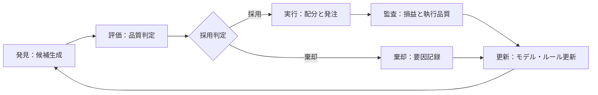
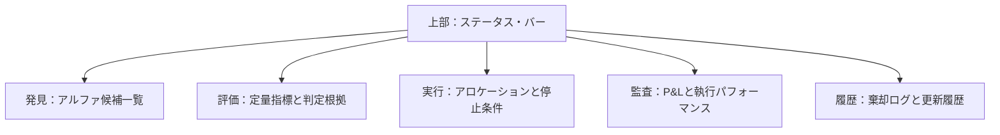
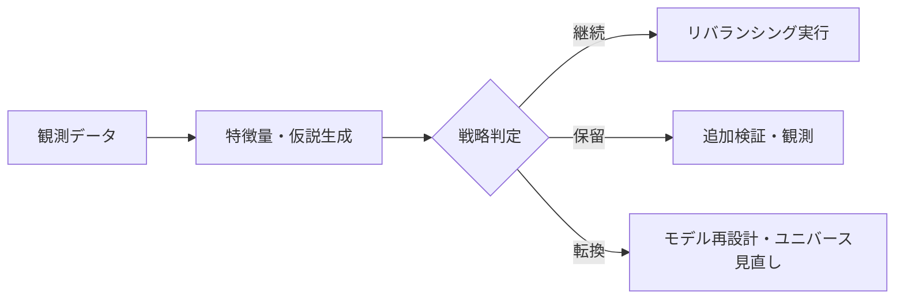

# 運用統制画面（Control Panel）仕様書

## 1. 目的
本画面は、自律型運用における意思決定の質と安全性を担保するため、以下の3点を提供します。

- **迅速な採用判定**: 生成されたアルファ候補を即座に評価・選別する。
- **安全な実行制御**: 定義された制約条件に基づき、取引の可否を厳格に判定する。
- **証跡の監査性**: 全ての意思決定プロセスを、監査可能な状態で記録・保存する。

## 2. 対象ユーザー
- 運用責任者（PM/Risk Manager）
- トレーディング・デスク（Execution Trader）
- コンプライアンス・監査担当者

## 3. 基本方針
- **俯瞰性**: 単一のビューでシステム全体の稼働状態を把握可能とする。
- **ワークフローの固定**: 「発見 → 評価 → 実行 → 監査」の順序を強制し、工程の飛び越しを防止する。
- **根拠の明示**: 定量的な事実とモデルによる推論を分離して提示する。
- **棄却理由の記録**: 不採用とした候補については、その理由（要因）を必ず保存する。
- **プリトレード・チェック**: 執行前にリスク制限および停止条件の充足を確認する。
- **トレーサビリティ**: 画面上の全ての指標から、根拠となる生データへドリルダウン可能とする。

## 4. 全体ワークフロー

## 5. 画面構成

## 6. 各セクションの要件

### 6.1 ステータス・バー（総覧帯）
- システム全体の稼働状態（稼働中/緊急停止中）を常時表示する。
- 異常検知アラートおよび最終更新時刻をリアルタイムで更新する。

### 6.2 アルファ発見ビュー（発見面）
- 候補ごとの期待収益（Alpha）とデータの鮮度（Recency）を表示する。
- 候補を独自のスコアリング順にソートし、データ欠損がある場合は警告を出す。

### 6.3 定量評価ビュー（評価面）
- 主要指標（Sharpe, MDD等）を標準化された尺度で比較表示する。
- モデルの基準値（Benchmark）と実測値を併記する。

### 6.4 執行管理ビュー（実行面）
- 銘柄ごとの最適配分案（Allocation）を提示する。
- ポジション上限・リスク制限を超える注文の送信を自動ブロックする。
- 緊急停止（Kill Switch）を常に即時実行可能な位置に配置する。

### 6.5 パフォーマンス監査ビュー（監査面）
- 日次損益（P&L）および累積リターンを時系列で表示する。
- 執行品質（スリッページ、約定率）を定量的に可視化する。

### 6.6 変更履歴ビュー（履歴面）
- 棄却されたアルファの要因を時系列でアーカイブする。
- 運用パラメータやモデルの更新履歴を、変更責任者とともに記録する。

## 7. 主要機能一覧
1. **候補スコアリング**: 発見面でアルファ候補を期待値順にランク付けする。
2. **ベンチマーク比較**: 評価面で目標指標と予測値を対比表示する。
3. **棄却要因管理**: 不採用候補の理由を構造化データとして保存する。
4. **動的配分案提示**: リスク予算に基づいた最適なアロケーションを表示する。
5. **プリトレード制御**: リスク制限違反時の発注をシステムで制御する。
6. **緊急停止（Kill Switch）**: 全注文のキャンセルと新規発注停止を即時実行する。
7. **P&L監査**: 実現損益と未実現損益を時系列でトラッキングする。
8. **執行品質解析**: 約定価格と市場価格の乖離（スリッページ）を算出する。
9. **データ・トレーサビリティ**: 算出指標から根拠となる監査ログへ遷移する。
10. **パラメータ更新ログ**: 運用ルールの変更内容を欠落なく記録する。
11. **ステータス管理**: 戦略の状態を「継続・保留・転換」の3段階で明示する。
12. **記録区分管理**: 確定済みデータ、追記データ、未確定分を厳密に分離する。

## 8. 監視指標（KPI）
- 見込み優位（Expected Alpha）
- 実現損益（Realized P&L）
- 最大下落率（Maximum Drawdown）
- ボラティリティ（Volatility）
- アロケーション比率（Allocation Ratio）
- スリッページ（Implementation Shortfall）
- 回転率（Turnover）

## 9. UI/UX原則
- **3クリック・ルール**: 主要な操作は3ステップ以内で完結させる。
- **モーダルレス確認**: 画面遷移を伴わずに判定根拠の詳細を確認可能とする。
- **セーフティ・ファースト**: 停止操作を最上位レイヤーに固定配置する。

## 10. データガバナンス
- **リアルタイム性**: データ遅延を1分以内に抑える。
- **データ完全性**: 欠損時は代替値を使用せず、欠損状態を明示する。
- **イミュータビリティ**: 一度記録された過去値の上書きを禁止する。

## 11. 受入基準（Acceptance Criteria）
- 候補の抽出から採用判定までのプロセスが一画面で完結していること。
- 棄却された全候補について、その要因が追跡可能であること。
- 執行前にリスク制限のチェックが強制されていること。
- 全ての表示指標から根拠となるログへ遷移可能であること。
- 戦略のステータス（継続・保留・転換）が適切に管理されていること。

## 12. 戦略評価ロジック

## 13. 実装ロードマップ
1. ダッシュボード核となる「総覧・発見・評価」のプロトタイプ作成。
2. リスク制限に基づく執行制御（発注ゲートウェイ）の実装。
3. パフォーマンス監査および変更履歴管理の実装。
4. 受入基準に基づく統合テストの実施。
