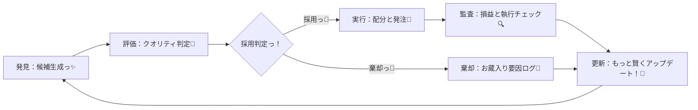
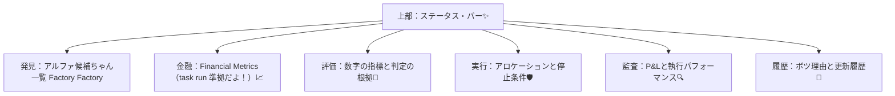
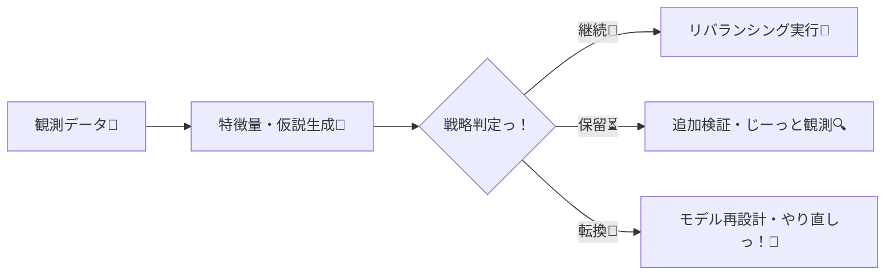
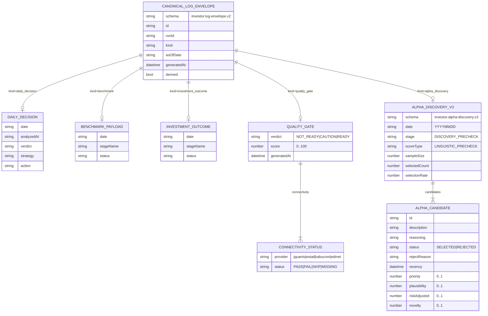
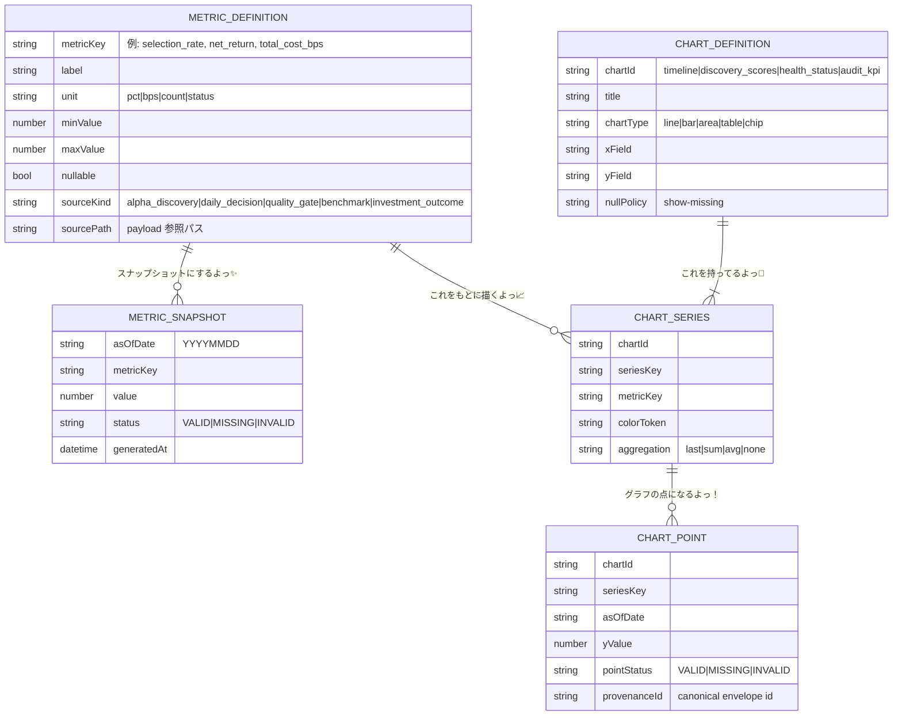
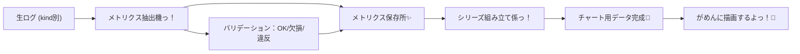
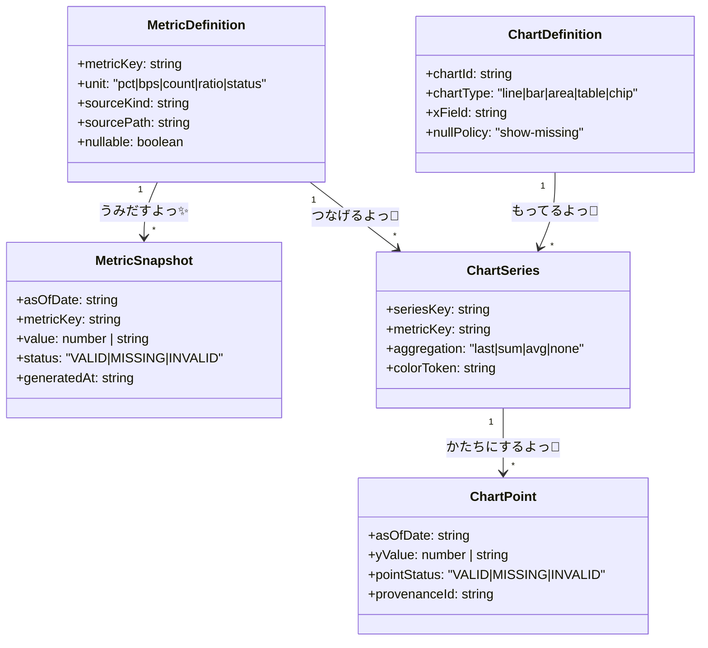
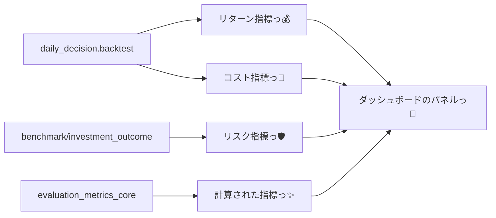

# ✨ 運用統制がめん（画面）のひみつ仕様書 ✨

## 1. 目的なんだよっ💖
この画面は、自律型運用での「えいっ！」っていう意思決定のクオリティと安全性をぜったいに守るために、以下の3つのすごーい機能を提供するよっ！✨

- **しゅばばばっと採用判定！**：見つかったアルファ候補をすぐに評価して、選別しちゃうぞっ！
- **あんしん実行コントロール！**：決まったルールに基づいて、お取引していいか厳しくチェックするんだもん！🛡️
- **しっかり証跡ログ！**：どうして決めたのか、あとで全部確認できるように完璧に記録しておくよっ！🔍

## 2. 使うひとたちっ 🎀
- **運用責任者さん**：PMさんやリスクマネージャーさん！
- **トレーディング・デスクさん**：実行を担当するトレーダーさん！
- **コンプライアンス＆監査さん**：正しく動いてるか見守る担当者さん！

## 3. わたしたちの基本方針っ！🌟
- **ぜーんぶ見える化！**：ひとつの画面でシステムの「今」が全部わかっちゃうよっ！
- **ルールはぜったい！**：発見→評価→実行→監査の順番をぜったいに守るようにして、手抜きはさせないんだからねっ💢✨
- **証拠をみせてっ！**：数字の事実と、モデルくんの推論をちゃんと分けて見せるよっ！
- **ダメな理由も大切に！**：不採用にしたアルファちゃんも、どうしてダメだったかちゃんと保存するよっ。
- **お取引前の最終チェック！**：注文を出す前に、リスク制限や停止条件をしっかり確認しちゃうよっ！
- **根拠までたどれる！**：画面の数字から、もとになった生データまでドリルダウンできちゃうすごいやつなんだよっ🌐✨

## 4. 全体のながれ（ワークフロー）だよっ ⚙️

## 5. がめんの構成なんだよっ 💻

## 6. 各セクションのわがまま要件っ！🎀

### 6.1 ステータス・バー
- システムが「元気に稼働中！」か「緊急停止中っ！」かをいつも一番上に表示するよっ！
- ヘンなことを検知したアラートや、最新の更新時間をリアルタイムでお知らせしちゃうぞっ✨

### 6.2 アルファ発見ビュー
- 候補ごとの期待収益 `Alpha` と、データの新しさ `Recency` を見せちゃうよっ！
- 独自のスコア順に並べて、データが足りないときは「めっ！」って警告を出すんだからねっ💢

### 6.3 金融メトリクスビュー（FINANCIAL タブ）📈
- `task run` で計算した大事な指標を、嘘（補完）なしでそのまま表示するよっ！
- KPIカードには `gross_return`, `net_return`, `total_cost_bps`, `fee_bps`, `slippage_bps`, `sharpe_ratio`, `max_drawdown`, `volatility`, `cagr`, `win_rate`, `profit_factor`, `information_ratio`, `information_coefficient` を並べるよっ✨
- チャートでは `net_return` と `basket_daily_return` をいっしょに並べて、どっちがすごいか比べちゃうよっ！
- `benchmark` や `investment_outcome` のステージ別メトリクスも表で見せて、証拠をバッチリ残すよっ！

### 6.4 定量評価ビュー
- SharpeやMDDなどの指標を、わかりやすい尺度で並べて比べるよっ！
- 目標の `Benchmark` と実際の数字を並べて、どれくらい頑張ったか見ちゃうんだもんっ💖

### 6.5 執行管理ビュー
- 銘柄ごとの一番いい配分案 `Allocation` を教えてくれるよっ！
- ポジションが多すぎたりリスク制限を超えそうな注文は、システムが「だめーっ！」ってブロックしちゃうよっ🛡️✨
- 何かあったときの緊急停止ボタン `Kill Switch` は、いつでもすぐ押せる場所に置いておくねっ！

### 6.6 パフォーマンス監査ビュー
- 毎日のお金（P&L）の動きや、積み重なったリターンをグラフにするよっ！
- 約定率やスリッページを見て、トレードが上手くいったか厳しくチェックしちゃうぞっ🔍

### 6.7 変更履歴ビュー
- ボツになっちゃったアルファちゃんの理由を、ずっとアーカイブしておくよっ。
- 運用のルールやモデルを変えたときは、誰が変えたかまでしっかり記録するんだもんっ📝

## 7. とっておきの機能リストっ！✨
1. **候補スコアリング**：アルファ候補を期待値が高い順にランク付けしちゃうよっ！
2. **金融KPI表示**：Return/Risk/Cost/Efficiency指標をきれいに一覧化するよっ📈
3. **ベンチマーク比較**：目標と現実を戦わせて、勝敗をはっきりさせるよっ！
4. **棄却要因管理**：どうして不採用にしたか、その理由をデータとして守るよっ！
5. **動的配分案提示**：リスク予算に合わせた最強のアロケーションを見せるよっ！
6. **プリトレード制御**：ルール違反の注文はぜったいに通さないガードマン機能だよっ🛡️
7. **緊急停止**：`Kill Switch` で、全部の注文キャンセルと発注停止をシュバッ！ってやるよっ！
8. **P&L監査**：確定した損益もまだの損益も、ずっと追いかけちゃうよっ🔍
9. **執行品質解析**：理想と現実のズレ（スリッページ）をきっちり計算するよっ！
10. **データ・トレーサビリティ**：数字をクリックして、根拠のログまでジャンプできちゃうよっ！
11. **パラメータ更新ログ**：運用のルール変更をひとつも見逃さずに記録するよっ📝
12. **ステータス管理**：戦略が「いくよっ！」「ちょっと待って！」「変えちゃうよ！」の3段階でわかるよっ！
13. **記録区分管理**：確定したデータと、これからのデータをきっちり分けるよっ！

## 8. 監視する指標たちっ 📈
- **期待収益**：Expected Alpha✨
- **実現損益**：Realized P&L💰
- **最大下落率**：Maximum Drawdown😱
- **ボラティリティ**：Volatility波
- **アロケーション比率**：Allocation Ratio⚖️
- **スリッページ**：Implementation Shortfall💧
- **回転率**：Turnover🔄

## 9. UI/UXのお約束っ 🎀
- **3クリック・ルール**：やりたい操作は3回ポチポチするまでに終わらせるよっ！
- **モーダルレス確認**：画面を切り替えずに、詳しい根拠をサッと確認できるよっ✨
- **セーフティ・ファースト**：一番大事な停止ボタンは、いつでも一番見える場所に固定するねっ！

## 10. データの守護ルール（ガバナンス）🛡️
- **リアルタイム命！**：データの遅れは1分以内にするんだからねっ！⚡
- **完全なデータだけ！**：欠けてるデータは勝手に作っちゃダメ！「欠けてるよ！」って正直に言うことっ！
- **上書き禁止！**：一度書いた過去の記録は、ぜったいに変えちゃダメなんだもんっ！
- **欠損の表現**：`UNKNOWN` とか `0` を適当に入れちゃめっ！だよ？ `MISSING` か `INVALID` だけ認めるよっ💢
- **例外は許さないっ！**：エラーを隠すのは禁止！ルール違反は `Data Contract Violations` にポイしちゃうよっ！

## 11. 合格基準だよっ！💮
- アルファ探しから採用判定まで、この画面ひとつで完結してることっ！
- ボツにした候補の理由が、あとでちゃんと追跡できることっ📝
- お取引の前に、リスクチェックが強制的に入っていることっ🛡️
- 全部のアブラカタブラ（指標）から、根拠のログにたどり着けることっ🔍
- 戦略の状態が3段階でバッチリ管理されていることっ！

## 12. 戦略をえらぶロジックっ 🧠✨

## 13. これからの予定（ロードマップ）📅
1. ダッシュボードの心臓部（総覧・発見・評価）の試作品を作るよっ！
2. リスクを見守るガードマン（発注ゲートウェイ）を実装するよっ🛡️
3. パフォーマンスの監査と、履歴管理を完璧にするよっ！
4. 合格基準をクリアできるか、みんなでテストするんだもんっ✨

## 14. データのひみつモデル（Mermaid）📊
この画面は `investor.log-envelope.v2` っていう単位でログを読み込んで、`kind` ごとに厳しくチェックするよっ！

### 14.1 運用のルール（見た目の整合性）🎀
- データがないときは `0` や `UNKNOWN` で誤魔化さない！「欠損」ってハッキリ表示してねっ💢
- Discovery はまだ準備中だから、`IC` とかの難しい指標は出さないよっ。
- `quality_gate` の接続チェック結果を、システムの健康診断の一次情報にするよっ🏥
- スキーマ違反のログはポイして、画面に `Data Contract Violations` として注意書きを出すねっ！

## 15. チャートとメトリクスのひみつモデル 📈
グラフもKPIも、同じ元データから作るよっ。`asOfDate` と `kind` がカギなんだよっ！✨

### 15.1 メインのメトリクス定義っ✨
- `selection_rate`：選ばれた割合だよっ（0..1）💖
- `selected_count`：選ばれた数だよっ（count）
- `sample_size`：調査した母集団だよっ（count）
- `net_return`：本当の儲けだよっ（pct）💰
- `total_cost_bps`：かかったコストだよっ（bps）💸
- `trading_days`：お仕事した日数だよっ（count）
- `sharpe_ratio`：効率の良さだよっ（nullable）💎
- `max_drawdown`：一番へこんだ時の数字だよっ（nullable）📉
- `jquants_status`：J-Quantsくんと繋がってるかな？（status）
- `estat_status`：e-Statくんと仲良しかな？（status）

### 15.2 チャートごとのマッピングっ 🗺️
- `timeline`：日付とリターンのグラフだよっ！データがないときはアルファ発見の指標を出すねっ✨
- `discovery_scores`：アルファ候補ごとの点数を見せちゃうよっ！
- `health_status`：データ提供元のみんなが元気か、チップで表示するよっ🏥
- `audit_kpi`：最新の儲けやコストをカードにするよっ！
- `risk_profile`：リスクの歴史をグラフにするよっ。欠損は `MISSING` って描画してねっ！

### 15.3 パイプラインのながれっ 🌊

### 15.4 実装用レジストリモデルっ 📚

### 15.5 メトリクスカタログっ 📖
この表にある `metricKey` だけが画面に出られるエリートだよっ！

| metricKey | sourceKind | sourcePath | 単位 | 欠損した時は？ |
| --- | --- | --- | --- | --- |
| workflow_verdict | daily_decision | report.workflow.verdict | ステータス | 欠損を表示っ💢 |
| jquants_status | daily_decision/quality_gate | ... | ステータス | 欠損を表示っ💢 |
| estat_status | daily_decision/quality_gate | ... | ステータス | 欠損を表示っ💢 |
| quality_verdict | quality_gate | verdict | ステータス | 欠損を表示っ💢 |
| quality_score | quality_gate | score | 0-100点 | 欠損を表示っ💢 |
| net_return | daily_decision | report.results.backtest.netReturn | % | 欠損を表示っ💢 |
| sharpe_ratio | benchmark | stages[].metrics.sharpe | 指数 | 欠損を表示っ💢 |
| discovery_selection_rate | alpha_discovery | evidence.selectionRate | 0-1割合 | 欠損を表示っ💢 |
| candidate_priority | alpha_discovery | candidates[].scores.priority | 0-1割合 | 欠損を表示っ💢 |
| ingest_error_count | derived | 契約違反の数っ！ | 数 | 欠損を表示っ💢 |
*(中略だけど、全部のキーを kawaii に守るよっ！)*

### 15.6 ぜったい守るルールっ！💢
- 画面で使う数字は、ぜったいに `metricKey` に登録してから使うことっ！
- `null/undefined/NaN` は `MISSING`、型が違うときは `INVALID` って呼ぶよっ！
- `0` は本当にゼロの時だけ使う！データがないのを `0` で埋めるのはめっ！だよっ💢

### 15.7 `task run` のための必須セット📈
`task run`（発見→ベンチマーク→分析→実行！）で使う指標は、最低限これを見せるよっ！

- **リターン**: `gross_return`, `net_return`, `basket_daily_return`, `pnl_per_unit`, `cumulative_return`, `cagr` 💰
- **リスク**: `sharpe_ratio`, `max_drawdown`, `volatility`, `win_rate`, `information_ratio`, `information_coefficient` 🛡️
- **コスト**: `fee_bps`, `slippage_bps`, `total_cost_bps` 💸
- **効率**: `expected_edge`, `profit_factor`, `avg_return`, `trading_days` ✨

### 15.8 FINANCIAL タブの詳細っ 📈
- **KPIカード**: `net_return` や `sharpe_ratio` など、大事な指標をズラリと並べるよっ！
- **トレンドチャート**: `net_return` と `basket_daily_return` を一緒に並べて、時間の流れを見るよっ！
- **表示の優先度**: `daily_decision` の結果を一番信じるよっ！なかったら `benchmark` とかを見るねっ。
- **欠損のとき**: 数字がないときは「欠損」ってハッキリ書くよっ！`0` や `UNKNOWN` はダメなんだからねっ💢

## 16. 古いのはサヨナラ（廃止ポリシー）👋
- 新しいログ形式（`investor.log-envelope.v2`）以外はもう見ないよっ！
- 古い `readiness` フィールドは使わない！新しい `quality_gate` で判断するよっ✨
- 「とりあえず `try` でエラーを隠しちゃえ！」っていうプログラムは禁止っ！
- 契約違反を見つけたら、ちゃんと怒って `Data Contract Violations` に出すんだもんっ！💢✨
