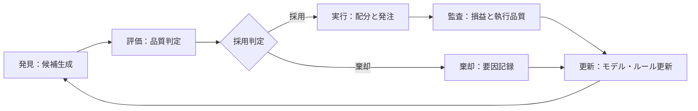
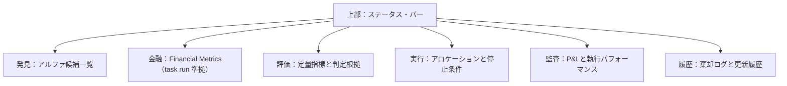
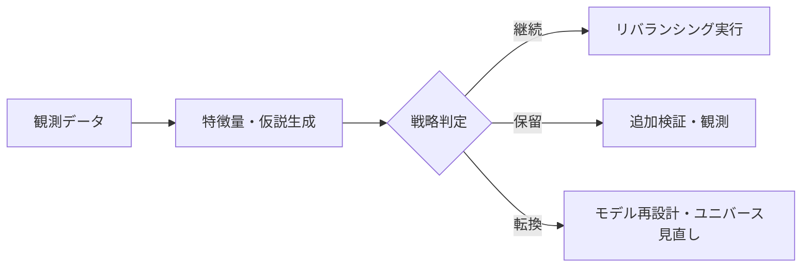
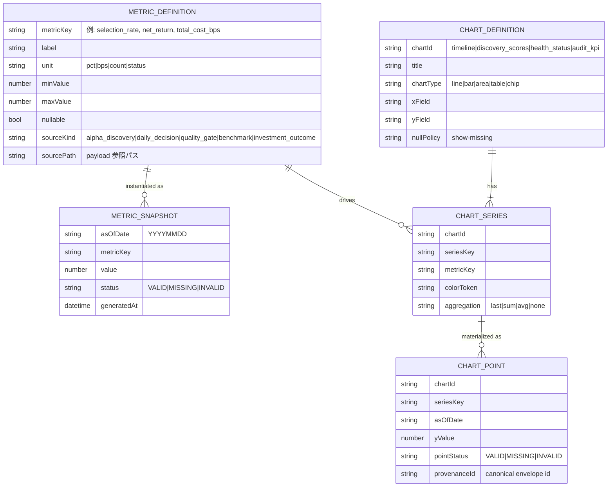
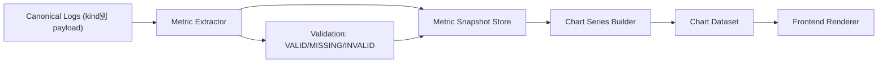
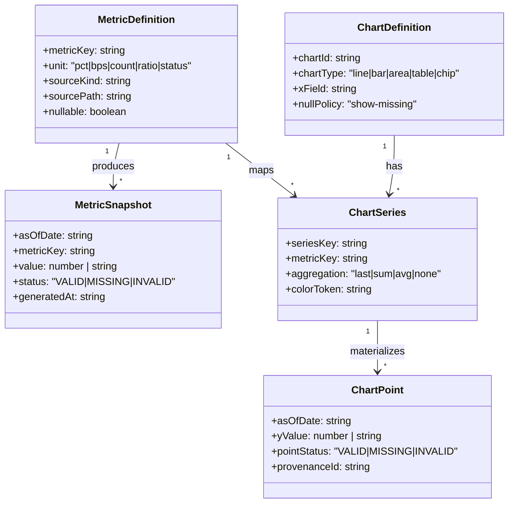
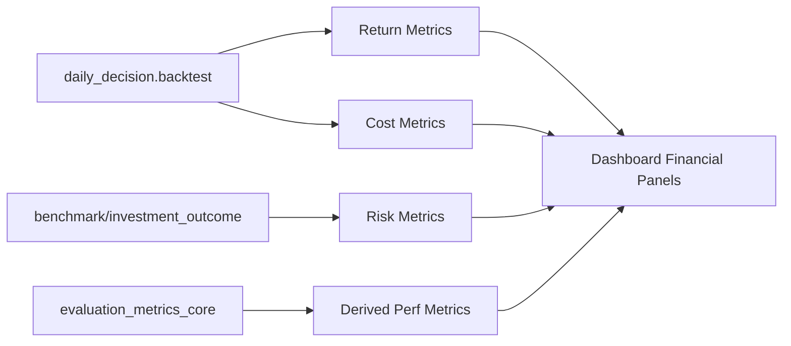

# 運用統制画面仕様書

## 1. 目的
本画面は、自律型運用における意思決定の質と安全性を担保するため、以下の3点を提供します。

- 迅速な採用判定：生成されたアルファ候補を即座に評価し選別する
- 安全な実行制御：定義された制約条件に基づき、取引の可否を厳格に判定する
- 証跡の監査性：全ての意思決定プロセスを監査可能な状態で記録し保存する

## 2. 対象ユーザー
- 運用責任者：PMおよびリスクマネージャー
- トレーディング・デスク：執行トレーダー
- コンプライアンスおよび監査担当者

## 3. 基本方針
- 俯瞰性：単一のビューでシステム全体の稼働状態を把握可能とする
- ワークフローの固定：発見から評価、実行、監査の順序を強制し、工程の飛び越しを防止する
- 根拠の明示：定量的な事実とモデルによる推論を分離して提示する
- 棄却理由の記録：不採用とした候補については、その理由や要因を必ず保存する
- プリトレード・チェック：執行前にリスク制限および停止条件の充足を確認する
- トレーサビリティ：画面上の全ての指標から、根拠となる生データへドリルダウン可能とする

## 4. 全体ワークフロー

## 5. 画面構成

## 6. 各セクションの要件

### 6.1 ステータス・バー
- システム全体の稼働状態である稼働中または緊急停止中を常時表示する
- 異常検知アラートおよび最終更新時刻をリアルタイムで更新する

### 6.2 アルファ発見ビュー
- 候補ごとの期待収益であるAlphaとデータの鮮度を示すRecencyを表示する
- 候補を独自のスコアリング順にソートし、データ欠損がある場合は警告を出す

### 6.3 金融メトリクスビュー（FINANCIAL タブ）
- `task run` 系で算出する金融指標を、欠損補完なしでそのまま表示する
- KPIカードは `gross_return`, `net_return`, `total_cost_bps`, `fee_bps`, `slippage_bps`, `sharpe_ratio`, `max_drawdown`, `volatility`, `cagr`, `win_rate`, `profit_factor`, `information_ratio`, `information_coefficient` を対象とする
- トレンドチャートは `net_return` と `basket_daily_return` を同一時系列で比較表示する
- `benchmark` / `investment_outcome` の `stages[].metrics` をテーブル表示し、stage別のメトリクス証跡を保持する

### 6.4 定量評価ビュー
- SharpeやMDDなどの主要指標を標準化された尺度で比較表示する
- モデルの基準値であるBenchmarkと実測値を併記する

### 6.5 執行管理ビュー
- 銘柄ごとの最適配分案であるAllocationを提示する
- ポジション上限やリスク制限を超える注文の送信を自動ブロックする
- 緊急停止用のKill Switchを常に即時実行可能な位置に配置する

### 6.6 パフォーマンス監査ビュー
- 日次損益のP&Lおよび累積リターンを時系列で表示する
- 執行品質であるスリッページや約定率を定量的に可視化する

### 6.7 変更履歴ビュー
- 棄却されたアルファの要因を時系列でアーカイブする
- 運用パラメータやモデルの更新履歴を、変更責任者とともに記録する

## 7. 主要機能一覧
1. 候補スコアリング：発見面でアルファ候補を期待値順にランク付けする
2. 金融KPI表示：task run準拠のReturn/Risk/Cost/Efficiency指標を一覧化する
3. ベンチマーク比較：評価面で目標指標と予測値を対比表示する
4. 棄却要因管理：不採用候補の理由を構造化データとして保存する
5. 動的配分案提示：リスク予算に基づいた最適なアロケーションを表示する
6. プリトレード制御：リスク制限違反時の発注をシステムで制御する
7. 緊急停止：Kill Switchにより全注文のキャンセルと新規発注停止を即時実行する
8. P&L監査：実現損益と未実現損益を時系列でトラッキングする
9. 執行品質解析：約定価格と市場価格の乖離であるスリッページを算出する
10. データ・トレーサビリティ：算出指標から根拠となる監査ログへ遷移する
11. パラメータ更新ログ：運用ルールの変更内容を欠落なく記録する
12. ステータス管理：戦略の状態を、継続・保留・転換の3段階で明示する
13. 記録区分管理：確定済みデータ、追記データ、未確定分を厳密に分離する

## 8. 監視指標
- 期待収益：Expected Alpha
- 実現損益：Realized P&L
- 最大下落率：Maximum Drawdown
- ボラティリティ：Volatility
- アロケーション比率：Allocation Ratio
- スリッページ：Implementation Shortfall
- 回転率：Turnover

## 9. UI/UX原則
- 3クリック・ルール：主要な操作は3ステップ以内で完結させる
- モーダルレス確認：画面遷移を伴わずに判定根拠の詳細を確認可能とする
- セーフティ・ファースト：停止操作を最上位レイヤーに固定配置する

## 10. データガバナンス
- リアルタイム性：データ遅延を1分以内に抑える
- データ完全性：欠損時は代替値を使用せず、欠損状態を明示する
- イミュータビリティ：一度記録された過去値の上書きを禁止する
- 欠損表現：`UNKNOWN` や `0` の代入は不可。`MISSING` または `INVALID` のみ許可する
- 例外処理方針：`try` による握りつぶし禁止。契約違反は `Data Contract Violations` に送出する

## 11. 受入基準
- 候補の抽出から採用判定までのプロセスが一画面で完結していること
- 棄却された全候補について、その要因が追跡可能であること
- 執行前にリスク制限のチェックが強制されていること
- 全ての表示指標から根拠となるログへ遷移可能であること
- 戦略のステータスが継続・保留・転換の3段階で適切に管理されていること

## 12. 戦略評価ロジック

## 13. 実装ロードマップ
1. ダッシュボードの核となる総覧、発見、評価のプロトタイプ作成
2. リスク制限に基づく執行制御である発注ゲートウェイの実装
3. パフォーマンス監査および変更履歴管理の実装
4. 受入基準に基づく統合テストの実施

## 14. データモデル（Mermaid）
本画面は `investor.log-envelope.v2` を単位としてログを読み込み、`kind` ごとに厳密なスキーマ検証を行う。

### 14.1 運用ルール（表示整合性）
- 欠損データは `0` や `UNKNOWN` に置換せず、欠損として明示する
- Discovery は事前検証フェーズとして扱い、`IC` や相関など未計測指標を表示しない
- `quality_gate` の接続性ステータスを `System Health` の一次情報とする
- スキーマ違反ログは取り込まず、画面に `Data Contract Violations` として提示する

## 15. Chart / Metrics データモデル
チャート表示とKPI表示は同じ元データを共有し、`asOfDate` と `kind` をキーに構成する。

### 15.1 主要メトリクス定義
- `selection_rate`：`alpha_discovery.payload.evidence.selectionRate`（0..1）
- `selected_count`：`alpha_discovery.payload.evidence.selectedCount`（count）
- `sample_size`：`alpha_discovery.payload.evidence.sampleSize`（count）
- `net_return`：`daily_decision.payload.report.results.backtest.netReturn`（pct）
- `total_cost_bps`：`daily_decision.payload.report.results.backtest.totalCostBps`（bps）
- `trading_days`：`daily_decision.payload.report.results.backtest.tradingDays`（count）
- `sharpe_ratio`：`benchmark.payload.stages[].metrics.sharpe`（ratio, nullable）
- `max_drawdown`：`benchmark.payload.stages[].metrics.mdd`（pct, nullable）
- `jquants_status`：`quality_gate.payload.connectivity.jquants.status`（status）
- `estat_status`：`quality_gate.payload.connectivity.estat.status`（status）

### 15.2 チャート別マッピング
- `timeline`：`asOfDate` × (`net_return` or `selection_rate`)。`daily_decision` がなければ `alpha_discovery` 指標で表示
- `discovery_scores`：候補ID × (`priority`, `plausibility`, `riskAdjusted`, `novelty`)
- `health_status`：provider × (`jquants_status`, `estat_status`, `kabucom_status`, `edinet_status`)
- `audit_kpi`：`net_return`, `trading_days`, `total_cost_bps` の最新スナップショット
- `risk_profile`：`asOfDate` × (`sharpe_ratio`, `max_drawdown`)。値欠損時は `MISSING` を描画する

### 15.3 Chart / Metrics 生成パイプライン

### 15.4 フロント実装用レジストリモデル

### 15.5 網羅メトリクスカタログ
下表を `metricKey` の正本とし、未定義キーは画面表示に使わない。

| metricKey | sourceKind | sourcePath | unit | nullPolicy |
| --- | --- | --- | --- | --- |
| workflow_verdict | daily_decision | report.workflow.verdict | status | show-missing |
| jquants_status | daily_decision/quality_gate | report.evidence.jquants.status / connectivity.jquants.status | status | show-missing |
| estat_status | daily_decision/quality_gate | report.evidence.estat.status / connectivity.estat.status | status | show-missing |
| jquants_listed_count | daily_decision/quality_gate | report.evidence.jquants.listedCount / connectivity.jquants.listedCount | count | show-missing |
| estat_has_stats_data | daily_decision/quality_gate | report.evidence.estat.hasStatsData / connectivity.estat.hasStatsData | bool | show-missing |
| quality_verdict | quality_gate | verdict | status | show-missing |
| quality_score | quality_gate | score | score_0_100 | show-missing |
| quality_components_* | quality_gate | components.<key> | score_0_100 | show-missing |
| connectivity_kabucom | quality_gate | connectivity.kabucom.status | status | show-missing |
| connectivity_edinet | quality_gate | connectivity.edinet.status | status | show-missing |
| decision_strategy | daily_decision | report.decision.strategy | text | show-missing |
| decision_action | daily_decision | report.decision.action | text | show-missing |
| decision_top_symbol | daily_decision | report.decision.topSymbol | symbol | show-missing |
| decision_reason | daily_decision | report.decision.reason | text | show-missing |
| decision_experiment | daily_decision | report.decision.experimentValue | text | show-missing |
| expected_edge | daily_decision | report.results.expectedEdge | pct | show-missing |
| basket_daily_return | daily_decision | report.results.basketDailyReturn | pct | show-missing |
| result_status | daily_decision | report.results.status | status | show-missing |
| result_mode | daily_decision | report.results.mode | status | show-missing |
| net_return | daily_decision | report.results.backtest.netReturn | pct | show-missing |
| gross_return | daily_decision | report.results.backtest.grossReturn | pct | show-missing |
| fee_bps | daily_decision | report.results.backtest.feeBps | bps | show-missing |
| slippage_bps | daily_decision | report.results.backtest.slippageBps | bps | show-missing |
| total_cost_bps | daily_decision | report.results.backtest.totalCostBps | bps | show-missing |
| trading_days | daily_decision | report.results.backtest.tradingDays | count | show-missing |
| pnl_per_unit | daily_decision | report.results.paperPnlPerUnit | pct | show-missing |
| selected_symbols_count | daily_decision | report.results.selectedSymbols.length | count | show-missing |
| risk_kelly_fraction | daily_decision | report.risks.kellyFraction | ratio_0_1 | show-missing |
| risk_stop_loss_pct | daily_decision | report.risks.stopLossPct | pct | show-missing |
| risk_max_positions | daily_decision | report.risks.maxPositions | count | show-missing |
| execution_order_count | daily_decision | report.execution.orders.length | count | show-missing |
| execution_notional_sum | daily_decision | sum(report.execution.orders[].notional) | jpy | show-missing |
| execution_fill_price_avg | daily_decision | avg(report.execution.orders[].fillPrice) | jpy | show-missing |
| analysis_symbol_count | daily_decision | report.analysis.length | count | show-missing |
| analysis_alpha_score | daily_decision | report.analysis[].alphaScore | score | show-missing |
| analysis_profit_margin | daily_decision | report.analysis[].finance.profitMargin | ratio | show-missing |
| analysis_daily_return | daily_decision | report.analysis[].factors.dailyReturn | pct | show-missing |
| analysis_prev_daily_return | daily_decision | report.analysis[].factors.prevDailyReturn | pct | show-missing |
| analysis_intraday_range | daily_decision | report.analysis[].factors.intradayRange | ratio | show-missing |
| analysis_close_strength | daily_decision | report.analysis[].factors.closeStrength | ratio | show-missing |
| analysis_liquidity_per_share | daily_decision | report.analysis[].factors.liquidityPerShare | jpy | show-missing |
| discovery_sample_size | alpha_discovery | evidence.sampleSize | count | show-missing |
| discovery_selected_count | alpha_discovery | evidence.selectedCount | count | show-missing |
| discovery_selection_rate | alpha_discovery | evidence.selectionRate | ratio_0_1 | show-missing |
| discovery_quality_completeness | alpha_discovery | quality.completeness | status | show-missing |
| discovery_missing_fields_count | alpha_discovery | quality.missingFields.length | count | show-missing |
| candidate_count | alpha_discovery | candidates.length | count | show-missing |
| candidate_priority | alpha_discovery | candidates[].scores.priority | ratio_0_1 | show-missing |
| candidate_plausibility | alpha_discovery | candidates[].scores.plausibility | ratio_0_1 | show-missing |
| candidate_risk_adjusted | alpha_discovery | candidates[].scores.riskAdjusted | ratio_0_1 | show-missing |
| candidate_novelty | alpha_discovery | candidates[].scores.novelty | ratio_0_1 | show-missing |
| candidate_recency | alpha_discovery | candidates[].recency | datetime | show-missing |
| candidate_status | alpha_discovery | candidates[].status | status | show-missing |
| candidate_reject_reason | alpha_discovery | candidates[].rejectReason | text | show-missing |
| benchmark_stage_status | benchmark | stages[].status | status | show-missing |
| benchmark_stage_metric_* | benchmark | stages[].metrics.<key> | numeric_or_text | show-missing |
| sharpe_ratio | benchmark | stages[].metrics.sharpe | ratio | show-missing |
| max_drawdown | benchmark | stages[].metrics.mdd | pct | show-missing |
| outcome_stage_status | investment_outcome | stages[].status | status | show-missing |
| outcome_stage_metric_* | investment_outcome | stages[].metrics.<key> | numeric_or_text | show-missing |
| cumulative_return | derived | evaluate(strategyReturn series).cumulativeReturn | pct | show-missing |
| cagr | derived | evaluate(strategyReturn series).cagr | pct | show-missing |
| win_rate | derived | evaluate(strategyReturn series).winRate | ratio_0_1 | show-missing |
| avg_return | derived | evaluate(strategyReturn series).avgReturn | pct | show-missing |
| volatility | derived | evaluate(strategyReturn series).volatility | ratio | show-missing |
| profit_factor | derived | evaluate(strategyReturn series).profitFactor | ratio | show-missing |
| information_ratio | derived | evaluate(strategyReturn series).informationRatio | ratio | show-missing |
| information_coefficient | derived | evaluate(predicted, actual).informationCoefficient | ratio_-1_1 | show-missing |
| confidence_score | derived | computeConfidence(expected_edge, basket_daily_return, quality_score) | ratio_0_1 | show-missing |
| entropy_score | derived | 1 - confidence_score | ratio_0_1 | show-missing |
| ingest_error_count | derived | Data Contract Violations 件数 | count | show-missing |

### 15.6 網羅性ルール
- 画面で使用する数値・状態は必ず `metricKey` に登録してから利用する
- `*_metric_*` は可変キー群を許可するが、採用キーは別紙でホワイトリスト管理する
- `null/undefined/NaN` は `MISSING`、型不一致は `INVALID` として区別する
- `0` は実測値としてのみ扱い、欠損補完には絶対に使わない

### 15.7 task run 準拠の金融メトリクス必須セット
`task run`（`discovery -> benchmark:foundation -> model-analysis -> pipeline:mine`）で扱う金融指標は、最低限以下を表示対象とする。

- Return Metrics: `gross_return`, `net_return`, `basket_daily_return`, `pnl_per_unit`, `cumulative_return`, `cagr`
- Risk Metrics: `sharpe_ratio`, `max_drawdown`, `volatility`, `win_rate`, `information_ratio`, `information_coefficient`
- Cost Metrics: `fee_bps`, `slippage_bps`, `total_cost_bps`
- Efficiency Metrics: `expected_edge`, `profit_factor`, `avg_return`, `trading_days`

### 15.8 FINANCIAL タブのチャート/メトリクス仕様
- KPIカード: `gross_return`, `net_return`, `total_cost_bps`, `fee_bps`, `slippage_bps`, `sharpe_ratio`, `max_drawdown`, `volatility`, `cagr`, `win_rate`, `profit_factor`, `information_ratio`, `information_coefficient`
- トレンドチャート: `net_return`（主系列）と `basket_daily_return`（比較系列）を同一 `asOfDate` 軸で表示する
- ステージテーブル: `benchmark.stages[].metrics` および `investment_outcome.stages[].metrics` を `source/stage/key/value` で表示する
- 表示値の優先順位: `daily_decision.results.backtest` を最優先し、欠損時のみ `benchmark/investment_outcome` の stage metrics へフォールバックする
- 欠損時の表示: 数値欠損は `欠損` とし、`0` 埋めや `UNKNOWN` 置換を禁止する

## 16. Legacy 廃止ポリシー
- canonical ログ（`investor.log-envelope.v2`）以外の旧スキーマ読み込みを禁止する
- `readiness` 系フィールドは互換表示に使わない。ゲーティングは `quality_gate.verdict` と金融メトリクスで判断する
- `daily/readiness/alpha/benchmarks` 前提の分岐を新規実装に持ち込まない
- unknown/zero/try ベースの救済ロジックを禁止し、契約違反は明示的にエラーとして処理する
